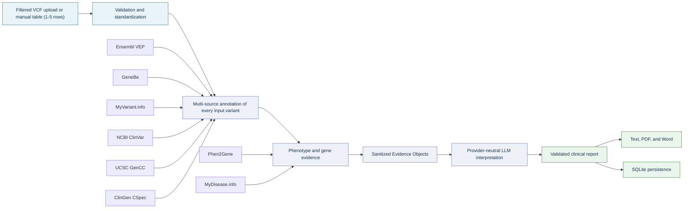

<div align="center">

# 🧬 Clinical Variant Interpretation

### Evidence-centered variant analysis, phenotype correlation, and clinical reporting

Clinical variant interpretation MVP built with Python and Streamlit.

Secure, provider-neutral, evidence-bound, and designed for an explainable
professor-facing workflow.

[](#stage-16-mvp-preparation-complete)
[](#environment)
[](#stage-11-streamlit-frontend-complete)
[](#tests)
[](#tests)
[](#stage-15-security-complete)

</div>

> [!IMPORTANT]
> This application provides clinical decision support only. Its output is not
> a diagnosis or treatment recommendation and must be reviewed by a qualified
> healthcare professional.

---

## Explore the project

| Start here | Implementation | Quality and safety |
|---|---|---|
| [Environment](#environment) | [Annotation](#stage-5-annotation-complete) | [Comprehensive testing](#stage-13-comprehensive-testing-complete) |
| [Run the frontend](#stage-11-streamlit-frontend-complete) | [Phenotype and HPO](#stage-6-phenotype-and-hpo-complete) | [Logging and error handling](#stage-14-logging-and-error-handling-complete) |
| [Run tests](#tests) | [Evidence and LLM](#stage-7-evidence-object-complete) | [Security](#stage-15-security-complete) |
| [MVP demo](docs/STAGE_16_MVP_DEMO_RUNBOOK.md) | [Reports and persistence](#stage-9-clinical-report-generation-complete) | [MVP release](#stage-16-mvp-preparation-complete) |

## How the system works



| Capability | What the MVP provides |
|---|---|
| **Variant input** | Professor-filtered `.vcf`/`.vcf.gz` upload or a manual VCF-style table, limited to 1–5 rows |
| **Clinical evidence** | Isolated Ensembl VEP, GeneBe, MyVariant.info, NCBI ClinVar, UCSC GenCC, and ClinGen CSpec integrations |
| **Phenotype correlation** | Local HPO matching, Phen2Gene prioritization metadata, and bounded MyDisease.info gene-disease-phenotype context |
| **LLM boundary** | Provider-neutral two-layer routing after confirmed human review |
| **Reporting** | Editable evidence Output A, confirmed packages, and downloadable final-interpretation-only Output B |
| **Safety** | Data minimization, bounded storage, secret scanning, safe errors, and security acceptance gates |

---

## API-first continuation

Stages 27–39 are implemented and tested. Stage 40 and later remain planned
until the code and tests for each stage are completed. The repository
audit and the exact `KEEP`, `MODIFY`, `BYPASS`, `VERIFY`, and `NEW` boundaries
are recorded in
[`docs/STAGE_19_REPOSITORY_REALITY_CHECK.md`](docs/STAGE_19_REPOSITORY_REALITY_CHECK.md).

The API-first contract retains up to five independently interpreted variants
in input order and provides separate evidence and interpretation report views.

---

## Current implementation status

- Central configuration is loaded from `.env` through `config.py`.
- `.vcf` and `.vcf.gz` files are validated and must contain 1–5 data rows.
- Multi-allelic records are split into one object per ALT allele.
- VCF sample, genotype, and patient columns are ignored and never enter the
  public pipeline result.
- Manual input uses five table-style rows of native Streamlit controls with a
  standard primary chromosome dropdown (`1`–`22`, `X`, `Y`, or `MT`), REF,
  ALT, optional QUAL, and optional FILTER fields.
- Each POS field is disabled until its row's CHROM is selected. It then shows
  the exact assembly-aware range as its placeholder and uses native numeric
  minimum/maximum validation, so an out-of-range entry is marked invalid and
  cannot be analyzed.
- Selecting CHROM determines only the valid POS range for the configured
  GRCh37 or GRCh38 assembly. REF and ALT are checked as allele syntax, QUAL
  remains an optional non-negative score without a chromosome-specific upper
  bound, and FILTER remains optional text.
- Filtering, optimization, and clinical ranking are performed upstream and
  are intentionally outside this application's responsibility.
- Every supplied variant proceeds directly to multi-source annotation in the
  original input order.
- Annotation phase one connects filtered variants to Ensembl VEP in bounded batches.
- Annotation phase two requests independent GeneBe batch annotation and
  automated ACMG evidence without overwriting VEP.
- Annotation phase three queries exact MyVariant.info records and standardizes
  population-frequency evidence.
- Annotation phase four queries NCBI ClinVar directly and standardizes
  germline classification and review evidence.
- Annotation phase five queries ClinGen-submitted GenCC records through
  the UCSC European REST API and standardizes exact gene-disease validity
  claims.
- Annotation phase six queries the ClinGen CSpec Registry for released
  VCEP specification metadata matching the gene and available MONDO disease
  context. It does not apply CSpec rules.
- External-source failures are isolated so evidence from another source is
  preserved.
- Frontend analyses run in cancellable background jobs; cancellation clears
  partial session output, temporary uploads, and newly generated drafts.
- Stage 6 provides local HPO search, normalization, gene and disease
  associations, and explainable phenotype scoring for annotated variants.
- Stage 27 submits the canonical HPO set to Phen2Gene once per analysis and
  attaches bounded gene score, provider rank metadata, status, provenance,
  and explicit missingness to every variant without reordering variants.
- Stage 28 queries MyDisease.info by annotated gene symbol, validates every
  primary disease through an exact MONDO material-basis HGNC relation, and
  attaches bounded disease/HPO context with explicit upstream provenance and
  missingness without changing pathogenicity.
- Stages 29–31 provide bounded Evidence Object V2, evidence lineage, shared
  upstream-source collapsing, and deterministic pre/post-review conflict
  auditing without assigning a final classification.
- Stage 32 conditionally queries exact normalized alleles through the direct
  gnomAD GraphQL API and performs bounded LitVar2, Europe PMC, and PubMed
  literature enrichment before Output A.
- Stage 33 creates one full-access editable evidence report per variant while
  preserving the original machine evidence and append-only edit history.
- Stage 34 requires explicit human confirmation, stores the validated package
  in pipeline state, reruns the deterministic conflict audit, and invalidates
  confirmation whenever the reviewed draft changes. The LLM remains skipped.
- Stage 35 routes confirmed packages without meaningful conflict to `LLM-1`
  and meaningful conflicts to `LLM-2`. Prompts are versioned, responses are
  bounded, `unresolved` conflicts are supported, and provider/model provenance
  is retained without allowing one model failure to remove other results.
- Stage 36 builds Output B from Stage 35 results in original input order. It
  contains only final interpretation text or an explicit per-variant failure,
  makes unresolved conflict explicit, excludes raw evidence and ranking, and
  is viewable and downloadable as bounded UTF-8 text.
- Stage 37 separates the workflow into a pausable evidence-collection Phase A
  and a confirmed-interpretation Phase B. Resumption requires confirmation for
  every variant, preserves the same analysis identity, isolates LLM failures
  per variant, and aggregates provider, enrichment, and model warnings.
- Stage 38 centralizes the Phen2Gene, Monarch, gnomAD, literature, and two-layer
  LLM settings in `config.py`. Strict feature flags can disable deep gnomAD or
  literature requests without code edits, and configured provider keys are
  redacted from application logs.
- Stage 39 migrates SQLite to schema version `2` with bounded, validated
  Pipeline V2 snapshots. Phase A Drafts preserve review history and provenance,
  can be loaded later, and are replaced by Confirmed state after Phase B.
- Generated clinical reports can be downloaded as text, PDF, or Word.
  PDF and Word files are created locally in memory from the validated
  text report, without additional provider calls or clinical data.
- VCF processing tests are stored in `tests/test_pipeline.py`.

`data/samples/mvp_demo.vcf` is a one-row public demonstration table that
matches the current filtered-input contract.

<a id="environment"></a>

## 🚀 Environment

Create an isolated Python environment and install the pinned project
dependencies:

```powershell
python -m venv .venv
.\.venv\Scripts\python.exe -m pip install -r requirements.txt
```

### Start the application

On Windows, double-click:

```text
run_app.bat
```

If the virtual environment is already active, the shortest terminal command
is:

```powershell
python app.py
```

Running `app.py` directly now launches it through Streamlit automatically.
The conventional command remains supported:

```powershell
.\.venv\Scripts\python.exe -m streamlit run app.py
```

<a id="stage-5-annotation-complete"></a>

## 🧬 Stage 5 annotation: complete

`backend/annotation.py` currently integrates Ensembl VEP, GeneBe,
MyVariant.info, NCBI ClinVar, ClinGen-submitted UCSC GenCC evidence, and the
ClinGen CSpec Registry:

- explicit GRCh37/GRCh38 assembly configuration;
- POST batching with Ensembl's 200-variant maximum;
- exact MyVariant chromosome, position, REF, ALT, and assembly matching;
- direct ClinVar ESearch and ESummary queries using exact assembly-specific
  HGVS identifiers;
- NCBI E-utility requests limited to fewer than three requests per second;
- request timeout plus bounded automatic retries for failed
  variant/provider pairs, including failures that occur after response
  validation, while successful variant results are preserved;
- structured per-variant error output without stopping the whole pipeline;
- cleaned transcript, gene, consequence, impact, HGVSc, HGVSp, canonical,
  MANE Select, MANE Plus Clinical, and available SIFT/PolyPhen fields;
- explicit VEP provider, assembly, retrieval time, and nullable provider
  version metadata for success, missing, and failure outcomes;
- GeneBe batch requests with optional Basic authentication, explicit
  hg19/hg38 input assembly, response-count validation,
  representation/transcript mismatch metadata, and cleaned consequence,
  automated ACMG, population, predictor, and ClinVar-derived fields;
- standardized gnomAD, ExAC, and exact-ALT dbSNP population frequencies;
- standardized ClinVar VCV/RCV/SCV accessions, germline clinical
  significance, review status, evaluation date, conditions, direct-source
  provenance, and explicit aggregate conflict status;
- exact UCSC assembly, coordinate, ClinGen submitter, and gene-symbol
  matching with standardized disease, classification, inheritance,
  criteria URL, PMID, and report fields;
- direct CSpec gene and MONDO disease queries with released VCEP
  specification ID, version, approval, DOI, scope-match, and provenance
  metadata retained as context only;
- unified multi-source output with independent failure isolation;
- no raw API response is passed to later pipeline stages.

The live API panel reports automatic retry rounds without requiring user
interaction. LLM generation also uses its own bounded retry budget configured
by `LLM_MAX_RETRIES`.

The Stage 22 verification and exact schema additions are recorded in
[`docs/STAGE_22_VEP_ANNOTATION_HARDENING.md`](docs/STAGE_22_VEP_ANNOTATION_HARDENING.md).

The Stage 23 GeneBe contract and source-independence rules are recorded in
[`docs/STAGE_23_GENEBE_INTEGRATION.md`](docs/STAGE_23_GENEBE_INTEGRATION.md).

The Stage 24 direct ClinVar query, missingness, provenance, and conflict
contract is recorded in
[`docs/STAGE_24_DIRECT_CLINVAR_INTEGRATION.md`](docs/STAGE_24_DIRECT_CLINVAR_INTEGRATION.md).

The Stage 25 ClinGen context and CSpec availability contract is recorded in
[`docs/STAGE_25_CLINGEN_CSPEC_UPGRADE.md`](docs/STAGE_25_CLINGEN_CSPEC_UPGRADE.md).

Run live Ensembl VEP, GeneBe, MyVariant.info, NCBI ClinVar, ClinGen, and CSpec
checks through the production annotation path:

```powershell
.\.venv\Scripts\python.exe tests\manual_annotation_smoke.py
```

An optional manual variant can be supplied in `CHROM:POS:REF:ALT` format.

<a id="stage-6-phenotype-and-hpo-complete"></a>

## 🧩 Stage 6 phenotype and HPO: complete

Stage 6 uses the official Human Phenotype Ontology OBO release stored at:

```text
data/hpo/hp.obo
data/hpo/phenotype_to_genes.txt
data/hpo/phenotype.hpoa
```

The local loader keeps only active term IDs, alternate IDs, and names in its
lookup index. Obsolete, malformed, and unknown terms are not accepted.
`search_hpo_terms()` provides deterministic local suggestions from canonical
names, synonyms, or HPO identifiers for physician-entered phenotype phrases.
`normalize_phenotypes()` validates multiple selected terms, resolves alternate
IDs, removes canonical duplicates, and preserves the user's selection order.
The phenotype-to-gene loader validates the official table, deduplicates gene
symbols, and returns a deterministic gene list for each existing HPO term.
`calculate_hpo_similarity()` provides an explainable MVP score: the fraction
of the patient's unique HPO terms that are directly associated with a gene.
`match_phenotypes()` adds that score, the canonical patient terms, and the
matched terms to each annotated variant without modifying source evidence.
The disease-annotation loader returns unique disease identifiers and names
while excluding negated findings and non-phenotypic annotation branches.

The backend provides `update_hpo_data()` for a future user-triggered frontend
update button. It downloads the ontology, phenotype-to-gene table, and disease
annotations from the same official release, validates all three before
installation, rejects downgrades, preserves the previous files, and rolls back
a partial installation. This keeps phenotype terms, gene associations, and
disease annotations release-compatible.

<a id="stage-27-phen2gene-integration-complete"></a>

## Stage 27 Phen2Gene integration: complete

`enrich_with_phen2gene()` sends the canonical patient HPO set to the official
Phen2Gene REST API once per analysis. It retains only the entered variants'
annotated genes from the provider response and records the normalized gene,
gene identifier, provider rank, score, and status. Provider rank remains
metadata and never reorders variants or changes pathogenicity.

Each variant receives `available`, `partial`, or `unavailable` missingness,
nullable provider-version provenance, retrieval time, cache state, and bounded
warnings. No hit is explicitly not interpreted as an unrelated phenotype.
Requests use the central timeout, bounded automatic retries, an in-process
normalized-response cache, and provider failure isolation. The Streamlit
phenotype table and external API panel expose the new evidence without
displaying raw API payloads.

The exact contract and verification evidence are recorded in
[`docs/STAGE_27_PHEN2GENE_INTEGRATION.md`](docs/STAGE_27_PHEN2GENE_INTEGRATION.md).

<a id="stage-28-mydisease-context-complete"></a>

## Stage 28 MyDisease.info context: complete

`enrich_with_mydisease()` uses the official `GET /v1/query` service with a
fielded MONDO synonym query and accepts primary diseases only when
`mondo.has_material_basis_in_germline_mutation_in` contains the exact
annotation-provider HGNC identifier. It normalizes disease identifiers,
disease-associated HPO terms, exact patient-HPO matches, provider build
metadata, upstream lineage, and explicit result status.

Successful zero-result queries are labelled `no_association`, not failed or
negative relationships. Timeout, network, HTTP, and invalid-response failures
remain distinct from valid empty results. Gene request failures are isolated.
Annotation, local HPO, Phen2Gene evidence, and variant order remain intact.
Raw MyDisease payloads and provider search scores do not enter the pipeline
result, LLM prompt, report, or database.

The Streamlit phenotype view shows bounded MyDisease summary counts and direct
disease context. CTD pathway inference is labelled context-only and is not
treated as causal evidence. Historical Monarch evidence remains displayable
as legacy, inactive, read-only provenance.

The exact contract and verification evidence are recorded in
[`docs/STAGE_28_MYDISEASE_CONTEXT.md`](docs/STAGE_28_MYDISEASE_CONTEXT.md).

Run the bounded live MyDisease diagnostic separately from the mocked
test suite:

```powershell
.\.venv\Scripts\python.exe tests\manual_mydisease_diagnostic.py
```

<a id="stage-7-evidence-object-complete"></a>

## 🧱 Stage 7 evidence object: complete

`backend/report.py` defines the versioned `EvidenceObject` contract and its
validation boundary. The schema keeps only standardized variant, annotation,
clinical, phenotype, provenance, and warning fields. Exact-field validation
rejects raw VCF fields, raw API payloads, and unapproved personal data, while
missing evidence remains explicit through `None`, empty lists, and source
statuses. `build_evidence_object()` and `build_evidence_objects()` now convert
Stage 5 and Stage 6 annotated variants into that contract without mutating the source
objects. They deliberately select only approved fields and reduce nested
ClinVar and ClinGen evidence to compact representations.
`sanitize_evidence_object()` removes control characters, normalizes
whitespace, bounds nested evidence and provenance lists, records visible
truncation warnings, and enforces a 64 KiB serialized-size ceiling. Automated
boundary integration and a complete local smoke test verify the Stage 5,
Stage 6, and Stage 7 handoff without exposing genotype or raw source payloads.

<a id="stage-8-llm-interpretation-complete"></a>

## 🤖 Stage 8 LLM interpretation: complete

`backend/llm.py` is the only application-facing LLM boundary. Stage 8 step 1
defines immutable provider-neutral request, response, message, and token-usage
contracts; a single `LLMClient`; the public `call_llm()` function; and
standard configuration, validation, request, authentication, rate-limit,
timeout, and response errors. Application modules must not import a provider
SDK or construct provider-specific request payloads.

Provider selection and connection values are centralized in `.env` through
`LLM_PROVIDER`, `LLM_BASE_URL`, `LLM_API_KEY`, `LLM_MODEL`, and `LLM_TIMEOUT`.
Stage 8 step 2 implements the `openai_compatible` adapter using a non-streaming
`/chat/completions` request. It applies the configured timeout, uses
deterministic temperature by default, converts provider output into the
standard response contract, and maps authentication, permission, rate-limit,
timeout, connection, HTTP, malformed JSON, and malformed response failures to
the public error hierarchy. Changing between OpenAI-compatible services now
requires only changing the `.env` base URL, API key, and model.

The Streamlit interface also provides a per-analysis interpretation-model
selector. It uses `LLM_MODEL` as the default, presents an approved AvalAI model
catalog with concise quality, speed, and cost guidance, and passes the selected
model through the provider-neutral LLM boundary without changing global
settings. The generated report continues to record the model returned by the
provider. The six primary models remain pinned at the top, additional
cost/quality alternatives include premium and budget tiers, and the selector
supports name filtering for quick model search.

Stage 8 step 3 adds a versioned clinical-interpretation prompt builder in
`backend/report.py`. It accepts only a complete Stage 7 Evidence Object,
validates and sanitizes it again, serializes it deterministically as bounded
JSON, and places it between explicit data delimiters. The fixed system rules
prohibit outside medical knowledge, invented evidence, independent ACMG/AMP
classification, definitive diagnosis, treatment advice, and unsupported
citations. They require explicit uncertainty, source attribution, limitations,
and qualified professional review. Values inside the Evidence Object are
treated as untrusted data rather than instructions.

Stage 8 step 4 connects that prompt to the provider-neutral client through
`generate_clinical_interpretation()`. The production path always validates the
Evidence Object before making an LLM request and fixes interpretation
temperature at `0.0`. Automated tests cover successful standardized responses,
invalid evidence before network access, provider authentication, rate-limit,
timeout, request and response failures, partial source evidence, and rejection
of provider-specific response payloads.

Stage 8 step 5 provides configuration-only, basic live connectivity, and full
synthetic clinical-interpretation smoke modes in `tests/manual_llm_smoke.py`.
The clinical mode sends no raw VCF, genotype, patient identifier, or real
patient record. It verifies all required interpretation sections and rejects
URLs and selected identifier expansions that were not present in the supplied
Evidence Object. It also requires the fixed clinical decision-support notice.

For another OpenAI-compatible service, restart the application after changing
only these `.env` values:

```env
LLM_PROVIDER=openai_compatible
LLM_BASE_URL=https://provider.example/v1
LLM_API_KEY=your-api-key
LLM_MODEL=model-name
LLM_MODEL_LIGHT=light-model-name
LLM_MODEL_STRONG=strong-model-name
LLM_TIMEOUT=30
```

Conditional enrichment can be changed without editing provider code:

```env
MONARCH_BASE_URL=https://api-v3.monarchinitiative.org/v3/api
ENABLE_GNOMAD_DEEP_LOOKUP=true
ENABLE_LITERATURE_ENRICHMENT=true
```

<a id="stage-9-clinical-report-generation-complete"></a>

## 📄 Stage 9 clinical report generation: complete

Stage 9 step 1 defines a versioned, JSON-safe `ClinicalReport` contract in
`backend/report.py`. It fixes the nine-section display order for case summary,
variant summary, gene and consequence, clinical evidence, phenotype
correlation, interpretation, limitations, references, and medical disclaimer.
Exact-field validation excludes raw VCF sample fields and unapproved patient
data. The contract records evidence and prompt versions, model provenance,
assembly, the minimal variant, bounded traceable references, warnings, and the
approved medical disclaimer without adding timestamps or storage concerns.

Stage 9 step 2 treats LLM Markdown as untrusted input. It normalizes line
endings and hidden control characters, enforces the exact seven-section LLM
output structure and fixed decision-support notice, rejects empty or oversized
sections, code fences, and raw HTML, and blocks URLs plus HPO, MONDO, ClinVar,
and PMID identifiers that are absent from the validated Evidence Object. The
live `--clinical` smoke mode now passes provider output through this same
production validator.

Stage 9 step 3 composes the validated `ClinicalReport` and renders deterministic
structured plain text. Case, variant, gene, consequence, clinical evidence, phenotype,
source status, warnings, references, and disclaimer content are built directly
from the sanitized Evidence Object. Only the validated interpretation and
limitations narratives come from the LLM. References are normalized and
deduplicated, missing evidence is explicit, evidence values are safely
normalized, and nested unsafe headings, code fences, or raw HTML are rejected.

Stage 9 step 4 saves rendered reports as deterministic UTF-8 `.txt` files under
the configured `REPORT_DIR`. Filenames contain bounded assembly and variant slugs
plus a SHA-256 content identifier. Publication uses a fully written temporary
file and an atomic no-overwrite link, so repeated saves are idempotent while a
different pre-existing file is never replaced. Paths cannot escape the report
directory, output size is bounded, and failed publication removes temporary
files.

Stage 9 step 5 provides `generate_and_save_clinical_report()` as the complete
Evidence Object to saved-report boundary for the future pipeline. Offline
integration tests cover candidate conversion, LLM interpretation, validation,
composition, rendering, idempotent storage, sensitive-field exclusion, and
failure before file creation. The live `--report` smoke mode performs the same
path with bundled synthetic evidence and saves the result under `REPORT_DIR`.

<a id="stage-10-complete-pipeline-integration-complete"></a>

## 🔄 Stage 10 complete pipeline integration: complete

Stage 10 step 1 defines the public analysis-input and frontend-result contracts
in `backend/pipeline.py`. Exactly one filtered VCF path or manual variant table
is accepted, while phenotype selections are bounded and normalized without
touching the filesystem. The versioned result retains variants, annotations,
phenotype results, Evidence Objects, report path, warnings, and structured
errors. Stable stage ordering and progress states are JSON-safe and exclude
exception objects and stack traces.

Stage 10 step 2 connects mutually exclusive filtered VCF or manual-table input
to the VCF processor. Both input paths enforce a maximum of five source rows.
All standardized allele-specific variants are retained in their original input
order and advance directly to annotation. No filtering, random sampling,
optimization, or ranking is performed inside the application.

Stage 10 step 3 connects every supplied variant to the existing Ensembl VEP,
GeneBe, MyVariant.info, NCBI ClinVar, and ClinGen/GenCC annotation boundary,
then passes the standardized annotations into local HPO gene matching, one
analysis-level Phen2Gene request, and bounded per-gene MyDisease context
queries. Source-level
annotation warnings remain visible without discarding other source results.
When no phenotypes are supplied, local matching and Phen2Gene are skipped,
while MyDisease can still attach gene-disease-phenotype context before the
variants continue to the Evidence Object stage.

Stage 10 step 4 adds the public `run_analysis()` happy path. It builds and
retains one bounded Evidence Object per enriched variant, sends only the first
input variant's sanitized Evidence Object through the provider-neutral LLM
boundary, validates the response, and atomically saves its deterministic
text report. The result then exposes the saved report path and reaches
100 percent completion. Input order is supplied by the upstream clinical
filtering workflow; this application does not claim that the first row was
ranked.

Stage 10 step 5 makes `run_analysis()` a frontend-safe execution boundary.
Expected input, VCF, annotation, Evidence Object, LLM, and report failures are
converted into bounded structured issues without exposing exception objects or
stack traces. Completed stage outputs remain available, later stages are
explicitly marked as skipped, and recoverable failures return partial results.
HPO data or matching failures are recoverable: annotation continues into
evidence and reporting without phenotype scores. Annotation source warnings
also remain visible and produce an explicit partial result.

Stage 10 step 6 finalizes the integration with a complete offline end-to-end
test that crosses the real processing, annotation,
phenotype-matching, Evidence Object, LLM, and report boundaries while mocking
only remote services. A live `--pipeline` smoke mode exercises the same public
`run_analysis()` entry point with configured production services and verifies
the saved report.

<a id="stage-11-streamlit-frontend-complete"></a>

## 🖥️ Stage 11 Streamlit frontend: complete

Stage 11 establishes the complete Streamlit execution and result-presentation
boundary. The root `app.py` delegates rendering to
`frontend/ui.py`, which configures the
page, loads local responsive styles, displays the clinical decision-support
notice, and presents the analysis workflow without duplicating backend logic.
The interface now accepts either a filtered `.vcf`/`.vcf.gz` upload or a
manual five-row VCF-style table, supports local HPO term search and phenotype
selection, and exposes the coordinated HPO dataset update operation. Input
submission now starts a cancellable background call to the public
`run_analysis()` boundary, provides live stage-by-stage progress, retains
frontend-safe completion or error state across reruns, and removes temporary
uploaded VCF data after execution. A cancel control stops at the next safe
pipeline boundary, discards partial in-memory output, and removes temporary
uploads plus newly generated draft reports. The result
dashboard displays the filtered input variants, standardized annotations, optional HPO
scores, sanitized Evidence Objects, source statuses, references, and warnings
without exposing VCF genotype fields or raw provider payloads. A generated
plain-text clinical report is loaded only from the configured `REPORT_DIR`,
rendered in the application, and offered as a bounded download without
exposing its server path.

Stage 11 step 6 completes the frontend with automated application tests and
interactive browser verification. The verified paths cover VCF and manual
input selection, empty-input validation, local HPO search and phenotype
selection, the coordinated HPO update control, pipeline result persistence,
variant and evidence presentation, safe report rendering and download, and
responsive layouts without horizontal overflow at desktop, tablet, and mobile
widths. Remote annotation and LLM calls remain outside the offline UI test
suite and must be checked separately with the live Stage 10 smoke mode.

Run the frontend with the one-click `run_app.bat` launcher or directly:

```powershell
python app.py
```

<a id="stage-12-sqlite-persistence-complete"></a>

## 🗄️ Stage 12 SQLite persistence: complete

Stage 12 step 1 adds the versioned SQLite persistence foundation in
`backend/database.py`. `DATABASE_PATH` is configured through `.env`, while
connection creation enables foreign-key enforcement and a bounded busy
timeout. `initialize_database()` creates or validates the versioned analysis,
candidate-variant, Evidence Object, and report tables without overwriting an
unknown or newer schema. Database files and SQLite sidecar files remain
excluded from Git under `storage/database/`.

Stage 12 step 2 adds `save_analysis()` for bounded analysis metadata. It
generates a unique analysis ID and UTC execution time, accepts only known
pipeline statuses, normalizes bounded warnings, and replaces an uploaded VCF
name with an analysis-scoped alias before storage. Manual-variant analyses
store no filename. Parameterized SQL and explicit transactions prevent input
text from changing the database structure, and an existing record is never
silently overwritten.

Stage 12 step 3 adds atomic candidate and Evidence Object persistence.
`save_variants()` stores only bounded chromosome, position, allele, quality,
and filter fields; VCF genotype data is deliberately excluded.
`save_evidence_objects()` passes every item through the existing Stage 7
validation and sanitization boundary before deterministic JSON storage. Both
operations require an existing analysis, reject unknown fields and oversized
collections, preserve collection order, and roll back the complete operation
when any item is invalid.

Stage 12 step 4 adds `save_report()` for secure report references. The
database stores only a portable filename rather than an absolute server path.
The referenced file must be a regular, non-symlinked, bounded UTF-8 text
report directly inside the configured `REPORT_DIR` and must follow the
generated clinical-report filename convention. Missing parent analyses,
outside paths, nested files, duplicate references, empty files, invalid UTF-8,
and oversized reports are rejected without modifying existing records.

Stage 12 step 5 adds `get_analysis()` as the validated retrieval boundary. It
reconstructs metadata, ordered genotype-free candidates, sanitized Evidence
Objects, warnings, and the optional report reference from an analysis ID.
Stored JSON and metadata are revalidated instead of trusted, collection limits
are re-applied during reads, and the portable report filename is resolved only
after confinement and file-integrity checks. Missing analyses and corrupted
records return explicit database errors rather than partial or unsafe data.

Stage 12 step 6 integrates persistence into the public `run_analysis()`
boundary. Every terminal result from valid input is saved as one atomic
transaction containing analysis metadata, genotype-free filtered variants, sanitized
Evidence Objects, and the optional report reference. The returned pipeline
result exposes its application-generated `analysis_id`. If local persistence
fails, the completed clinical output remains available, internal database
details are not exposed, and a successful result is safely downgraded to
partial with a bounded warning. The live `--pipeline` smoke mode also retrieves
the saved analysis and verifies its report and Evidence Objects.

Stage 39 extends this foundation with a transactionally migrated
`pipeline_states` table. `run_analysis()` saves the editable Phase A Draft,
while `load_pipeline_state()`, `save_pipeline_state()`, and
`resume_saved_analysis()` provide validated pause-and-resume persistence through
human confirmation and final interpretation. The complete snapshot is bounded
and revalidated on read; queryable review/workflow metadata is cross-checked
against it instead of trusted independently.

<a id="stage-13-comprehensive-testing-complete"></a>

## ✅ Stage 13 comprehensive testing: complete

Stage 13 step 1 completes the unit-test coverage audit. Central configuration
now has explicit tests for environment parsing, numeric limits, path
resolution, directory creation, URL and genome-assembly validation, and
initialization order. The existing unit suites cover filtered VCF processing,
annotation parsing, phenotype matching, Evidence Objects, and LLM error
handling. `pytest-cov` provides a repeatable coverage measurement,
with an initial project-wide minimum of 80%.

Stage 13 step 2 adds explicit offline integration tests for the three required
handoffs: VCF processing through multi-source annotation, annotation through
Evidence Object and clinical-report generation, and the complete VCF pipeline
through HPO matching, LLM interpretation, report storage, atomic database
persistence, and validated retrieval. Provider responses and the LLM are
deterministic test doubles, so the integration suite never depends on live
network services.

Stage 13 step 3 enforces mocked service isolation for the complete automated
suite. An automatic test guard fails immediately if any test attempts an
unmocked HTTP request. A degraded-network pipeline test verifies that
GeneBe, MyVariant.info, ClinVar, and ClinGen/GenCC connection failures remain
isolated: validated VEP evidence still reaches a partial clinical report,
source statuses remain explicit, and private transport exception details do not enter
user-facing pipeline output.

Stage 13 step 4 adds `tests/manual_stage13_validation.py` for repeatable live
validation. Its non-identifying matrix covers a known manual variant, missing
phenotype input, and the bundled one-row filtered demonstration VCF. It
validates report creation, analysis persistence, and retrieval, then
writes a compact JSON record under `output/`. A temporary timeout override
supports degraded-network testing. Multiple LLM providers are tested by
changing only the provider settings in `.env` and rerunning the same command.

Stage 13 step 5 establishes the final regression and acceptance gate. Eleven
critical checks are marked across public VCF parsing, HPO validation,
multi-source annotation, provider-neutral LLM transport, prompt-injection
containment, report generation, degraded-network behavior, complete pipeline
persistence, database retrieval, and frontend startup.
`tests/run_stage13_acceptance.py` compiles the project, runs this focused
regression set, and then requires the complete offline suite to pass with at
least 80% coverage. Live provider checks remain explicitly separate from the
deterministic acceptance gate.

<a id="stage-14-logging-and-error-handling-complete"></a>

## 🧭 Stage 14 logging and error handling: complete

Stage 14 step 1 adds the central logging boundary in
`backend/logging_config.py`. The Streamlit entry point configures one
idempotent application logger with UTC console output and a bounded rotating
UTF-8 log file. `LOG_LEVEL`, `LOG_PATH`, `LOG_MAX_BYTES`, and
`LOG_BACKUP_COUNT` are configurable through `.env`; generated logs remain
excluded from Git. Every application handler redacts the configured LLM API
key, labelled credentials, bearer tokens, nested message arguments, and
exception text before output. Existing annotation logging now uses the central
application logger.

Stage 14 step 2 adds correlated analysis lifecycle logging. Each complete
pipeline run receives a non-identifying application-generated run ID, records
the safe input mode and phenotype count, logs every stage start and terminal
status, and records the final pipeline status and persisted analysis ID.
Context-local run IDs keep concurrent analyses distinguishable and are reset
after completion. Variant coordinates, alleles, HPO identifiers, genes, raw
VCF data, and stage error messages are deliberately excluded from lifecycle
logs.

Stage 14 step 3 adds structured external API telemetry for Ensembl VEP,
GeneBe, MyVariant.info, NCBI ClinVar, UCSC GenCC, Phen2Gene, and MyDisease.info.
Every request
records only the service, bounded operation name, attempt number, outcome, elapsed
milliseconds, HTTP status, and configured timeout. Timeout, connection, HTTP,
and API-error retries record their safe reason, next attempt, and bounded
delay. URLs, query parameters, coordinates, alleles, genes, provider payloads,
and transport exception text are never logged.

Stage 14 step 4 adds safe operational outcome logging. Filtered variant
processing records only the input-derived variant count; Evidence Object
construction records only its count. Provider-neutral LLM calls record
duration, outcome, message count, token limit, optional usage totals, and
bounded error type without prompts, responses, or provider exception text.
Successful report storage records the managed report directory and an opaque
content-derived report ID, never the coordinate-bearing report filename.

Stage 14 step 5 centralizes user-safe error handling in
`backend/error_handling.py`. Typed pipeline, annotation, evidence, LLM, report,
and unexpected failures are converted to stable error codes, fixed actionable
messages, and explicit recoverability flags before they reach the result
contract. HPO update and phenotype-search failures use the same boundary for
fixed frontend messages. Logs retain only the stage or UI context, public error
code, recoverability, and exception type; internal exception text, paths,
provider responses, patient data, and stack traces remain excluded.

Stage 14 step 6 completes the security audit and acceptance gate. Nested
credential fields are redacted before interpolation, exception logging retains
only the exception class, and annotation-source failure logs use bounded event
fields instead of exception messages. Rotation tests verify that redaction is
preserved across the configured backup files. The `stage14_security` test
marker covers logging configuration, API telemetry, LLM telemetry, correlated
pipeline lifecycle events, centralized public errors, and an end-to-end
internal-failure leak check. `tests/run_stage14_acceptance.py` compiles the
project, runs those focused security checks, and then requires the complete
offline suite to pass with at least 80% coverage.

<a id="stage-15-security-complete"></a>

## 🔐 Stage 15 security: complete

Stage 15 step 1 adds a repeatable repository secrets audit in
`tests/run_secrets_audit.py`. It verifies that `.env` remains ignored, rejects
tracked environment files, keys, certificates, databases, logs, uploads, and
reports, and scans all non-ignored source files plus every Git patch for
high-confidence provider credentials and private keys. Findings identify only
the scope, path, and rule; detected values are never printed. `.env.example`
remains tracked with an explicit non-secret placeholder.

Stage 15 step 2 hardens the VCF upload boundary before any file is written.
Original filenames are treated as untrusted metadata and must be bounded,
control-character-free basenames ending exactly in `.vcf` or `.vcf.gz`.
Uploaded and gzip-expanded sizes are independently bounded through
`MAX_UPLOAD_BYTES` and `MAX_UNCOMPRESSED_VCF_BYTES`, with absolute
configuration ceilings. Plain and compressed content must match the declared
extension, decode as UTF-8 without NUL bytes, and contain both the VCF
file-format declaration and required column header. Streamlit also rejects
uploads above 25 MB before application execution, while the backend validation
remains authoritative and returns only fixed user-safe errors.

Stage 15 step 3 hardens temporary and persistent storage. Every upload is
written with exclusive-create and no-follow semantics to a randomized private
directory beneath the configured upload root, uses a fixed application
filename instead of user-controlled path text, and is removed after successful
or failed analysis execution. Symbolic-link upload roots, report directories,
database files, and log files are rejected. Application-created private
directories request owner-only `0700` permissions and uploaded VCFs, reports,
databases, and logs request owner-only `0600` permissions on platforms that
support POSIX modes. Report publication remains atomic, while storage paths
remain confined to their resolved configured roots. Windows deployments still
inherit NTFS access control from the configured storage directories and must
apply the institution's production ACL policy before real patient data is
used.

Stage 15 step 4 adds an explicit clinical-data minimization boundary in
`backend/privacy.py`. Genotype and sample fields are excluded during filtered
input parsing, so public pipeline variants, annotations,
progress snapshots, frontend state, Evidence Objects, reports, and database
records retain only approved non-sample fields. Pipeline-result validation
recursively rejects genotype, patient, sample, source-filename, raw-VCF, and
raw-provider fields. Before every clinical LLM request, the sanitized Evidence
Object is checked again for prohibited keys, raw VCF headers, labelled patient
or sample identifiers, medical-record identifiers, dates of birth, genotype
labels, and email addresses. The LLM receives only the bounded Evidence Object;
the uploaded filename, raw VCF, sample name, and genotype never cross that
boundary.

Stage 15 step 5 hardens outbound transport and the application runtime. Startup
now validates configuration before the UI is rendered. Every external
bioinformatics and LLM endpoint must use credential-free HTTPS without query
parameters or fragments, and all outbound requests explicitly require TLS
certificate verification. Streamlit binds only to `127.0.0.1` for direct
access, keeps CORS and XSRF protections enabled, disables static serving and
usage telemetry, limits WebSocket messages to 25 MB, hides internal exception
details, and exposes only the minimal toolbar. A production deployment must
place an authenticated HTTPS reverse proxy on the same host in front of this
loopback-only service; Stage 15 does not add authentication by itself.

Stage 15 step 6 completes the offline security review and acceptance gate.
`docs/STAGE_15_SECURITY_ACCEPTANCE.md` records the implemented controls, exact
acceptance criterion, live-test boundary, and remaining production blockers.
`tests/run_stage15_acceptance.py` compiles the project, verifies installed
dependency consistency without network access, runs the repository secrets
audit, executes all focused `stage15_security` checks, and requires the complete
test suite to pass with at least 80% coverage.

<a id="stage-16-mvp-preparation-complete"></a>

## 🏁 Stage 16 MVP preparation: complete

Stage 16 step 1 completes the MVP requirements audit in
`docs/STAGE_16_MVP_REQUIREMENTS.md`. Every roadmap capability is mapped to its
implementation and offline verification evidence. The audit found no missing
core feature. Dedicated MVP acceptance, fresh live-provider validation, a
professor-facing demo runbook, and the final release decision remain.

Stage 16 step 2 adds `tests/run_stage16_mvp_acceptance.py` as the deterministic
offline MVP gate. The `stage16_mvp` checks cover the real backend stage
boundaries with mocked providers, VCF upload confinement, Streamlit startup,
manual analysis, local phenotype selection, safe missing-input behavior, and
report viewing and download. This gate performs no international network
requests.

Stage 16 step 3 verifies the known public variant through the configured live
annotation and LLM providers. The final baseline completed every required
stage, saved the report, and returned zero errors. UCSC GenCC had no exact
SAMD11 validity claim, so the pipeline correctly returned one explicit
missing-evidence warning and an acceptable partial status.

Stage 16 step 4 adds the presentation-safe `data/samples/mvp_demo.vcf` and the
professor-facing `docs/STAGE_16_MVP_DEMO_RUNBOOK.md`. The runbook contains
preflight commands, the primary VCF workflow, a manual-input fallback, expected
results, the verified live baseline, presentation talking points, and network
troubleshooting. The demo VCF is GRCh38, contains one public variant, and has no
sample or genotype columns.

Stage 16 step 5 completes the MVP release decision.
`tests/run_stage16_final_acceptance.py` compiles the project, checks installed
dependency consistency, runs the secrets audit, executes the Stage 15 security
and Stage 16 MVP checks, and requires the complete suite to pass with at least
80% coverage. `docs/STAGE_16_MVP_RELEASE_CHECKLIST.md` records the
professor-demonstration decision, evidence, assets, pre-presentation checks,
accepted MVP limitations, and production restriction.

---

<a id="tests"></a>

## 🧪 Tests

Run the offline test suite:

```powershell
.\.venv\Scripts\python.exe -m pytest -q
```

Run the unit-coverage audit:

```powershell
.\.venv\Scripts\python.exe -m pytest -q --cov=config --cov=backend --cov=frontend --cov-report=term-missing --cov-fail-under=80
```

Run the complete offline Stage 13 acceptance gate:

```powershell
.\.venv\Scripts\python.exe tests\run_stage13_acceptance.py
```

Run the complete offline Stage 14 security acceptance gate:

```powershell
.\.venv\Scripts\python.exe tests\run_stage14_acceptance.py
```

Run the Stage 15 repository secrets audit:

```powershell
.\.venv\Scripts\python.exe tests\run_secrets_audit.py
```

Run the complete offline Stage 15 security acceptance gate:

```powershell
.\.venv\Scripts\python.exe tests\run_stage15_acceptance.py
```

Run the deterministic offline Stage 16 MVP acceptance gate:

```powershell
.\.venv\Scripts\python.exe tests\run_stage16_mvp_acceptance.py
```

Run the final offline Stage 16 MVP release gate:

```powershell
.\.venv\Scripts\python.exe tests\run_stage16_final_acceptance.py
```

Run the complete live Stage 13 manual-validation matrix:

```powershell
.\.venv\Scripts\python.exe tests\manual_stage13_validation.py --case all
```

Run the public sample VCF case only:

```powershell
.\.venv\Scripts\python.exe tests\manual_stage13_validation.py --case sample-vcf
```

Exercise timeout and degraded-network behavior:

```powershell
.\.venv\Scripts\python.exe tests\manual_stage13_validation.py `
  --case known-variant `
  --timeout-seconds 1
```

Run a live request through the production LLM boundary:

```powershell
.\.venv\Scripts\python.exe tests\manual_llm_smoke.py
```

Run the complete live Stage 8 interpretation using bundled synthetic evidence:

```powershell
.\.venv\Scripts\python.exe tests\manual_llm_smoke.py --clinical
```

Run the complete live Stage 9 report workflow and save its text output:

```powershell
.\.venv\Scripts\python.exe tests\manual_llm_smoke.py --report
```

Run the complete live Stage 10 pipeline from manual variant to saved report:

```powershell
.\.venv\Scripts\python.exe tests\manual_llm_smoke.py --pipeline
```

Custom Stage 10 inputs can be supplied when needed:

```powershell
.\.venv\Scripts\python.exe tests\manual_llm_smoke.py --pipeline `
  --variant "1:941284:G:A" `
  --hpo HP:0001250
```

Validate configuration without sending an LLM request:

```powershell
.\.venv\Scripts\python.exe tests\manual_llm_smoke.py --config-only
```

Run the complete local Stage 6 phenotype smoke test:

```powershell
.\.venv\Scripts\python.exe tests\manual_phenotype_smoke.py
```

Run the complete local Stage 7 Evidence Object smoke test:

```powershell
.\.venv\Scripts\python.exe tests\manual_evidence_smoke.py
```

Custom phenotype inputs can be supplied when needed:

```powershell
.\.venv\Scripts\python.exe tests\manual_phenotype_smoke.py `
  --query "seizure" `
  --hpo HP:0001250 `
  --hpo HP:0001263 `
  --gene SCN1A
```

---

## Technical decisions and MVP limitations

### Windows VCF parser decision

`cyvcf2` has no compatible native Windows wheel for the current Python
3.13 environment and its Windows support is experimental. The MVP uses
`vcfpy`, a tested parser with native Python 3.13 support. The public
functions remain isolated in `backend/vcf_processing.py`, allowing the
parser implementation to be replaced later without changing the
pipeline interface.

### Upstream filtered-input contract

> [!IMPORTANT]
> Variant filtering, reference-aware normalization, optimization, and clinical
> ranking occur before this application receives the data.

The application accepts a professor-approved filtered table containing one to
five VCF rows. It validates and standardizes those rows, splits multi-allelic
ALT values, and annotates every resulting allele in the supplied order. The
first listed allele is used for the single generated interpretation report;
the application does not claim that it was ranked internally.
