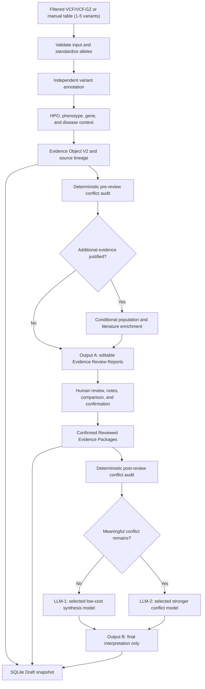

<div align="center">

# Clinical Variant Interpretation

Evidence-centered germline variant review with explicit human confirmation and
two-layer LLM routing.

[](docs/PROJECT_DECLARATION.md#4-stage-register)
[](#requirements)
[](#run-the-application)
[](#verification)
[](#verification)

</div>

> [!IMPORTANT]
> This application provides clinical decision support for educational and
> research use. It is not a diagnostic device, does not make autonomous
> pathogenicity classifications, and must not replace review by a qualified
> genetics professional.

## Overview

This project accepts one to five already-filtered germline Mendelian variants,
collects independent clinical and phenotype evidence, and guides each variant
through a review-and-confirmation workflow before LLM interpretation.

The application deliberately does not rank or filter a raw VCF. Candidate
selection is an upstream responsibility. Every valid supplied allele remains in
its original input order.

### Current status

- The implemented roadmap has passed the Stage 44 offline acceptance gate.
- Stage 45 professor review is the next formal milestone.
- Pipeline schema: `2.3`.
- Evidence Object schema: `2.4`.
- SQLite schema: `2`.
- Evidence Review, confirmation, routing, and final-report schemas: `1.0`.
- Current verified suite: **669 passed, 4 skipped; 85.76% coverage**.
- External-provider availability is not implied by the offline test result.

The complete stage register, API catalog, safety declaration, demonstration
guide, and limitations are maintained in
[`docs/PROJECT_DECLARATION.md`](docs/PROJECT_DECLARATION.md).

## Workflow



The pipeline has two resumable phases:

1. **Phase A — evidence and review:** validate input, call evidence providers,
   build Evidence Object V2, audit conflicts, conditionally enrich evidence,
   generate Output A, and persist a Draft.
2. **Phase B — confirmed interpretation:** require confirmation for every
   variant, rerun the conflict audit, select LLM-1 or LLM-2 per variant,
   isolate individual model failures, generate Output B, and persist Confirmed
   state under the same analysis ID.

## Inputs

### Filtered VCF upload

Supported formats:

- `.vcf`
- `.vcf.gz`
- One to five data rows
- GRCh37 or GRCh38, selected explicitly in `.env`
- Multiallelic rows are split into independent ALT alleles
- Sample, genotype, and patient columns are ignored

Upload size, decompressed size, row count, allele syntax, chromosome, and
assembly-specific coordinate ranges are validated before annotation.

### Manual table

The Streamlit form provides five VCF-style rows with:

- `CHROM`
- `POS`
- `REF`
- `ALT`
- Optional `QUAL`
- Optional `FILTER`

Only populated, valid rows are submitted. Coordinates are checked against the
configured assembly.

### Phenotype input

Reviewers can search local Human Phenotype Ontology data by text or enter
canonical `HP:NNNNNNN` identifiers. Selected terms are normalized,
deduplicated, and used consistently by the local HPO scorer and Phen2Gene.

## Evidence sources

### Core annotation and phenotype services

| Source | Role in the application |
|---|---|
| Ensembl VEP REST | Assembly-aware consequence, transcript, gene, identifier, and colocated evidence |
| GeneBe | Independent automated ACMG evidence and provider classification context; never treated as the final application classification |
| MyVariant.info | Exact assembly-aware variant aggregation and standardized population-frequency context |
| NCBI ClinVar | Direct germline classification, review status, accession, and condition evidence |
| UCSC Genome Browser GenCC track | Exact ClinGen-submitted gene-disease validity context |
| ClinGen CSpec Registry | Released VCEP specification availability and metadata; rules are not executed |
| Local HPO datasets | Ontology search, validation, gene/disease associations, and explainable phenotype similarity |
| Phen2Gene | HPO-to-gene score and provider-rank metadata without changing input order |
| MyDisease.info | Bounded MONDO-validated gene-disease-HPO context |

### Conditional enrichment

Conditional enrichment runs only when the deterministic conflict audit
justifies it and the relevant feature flag is enabled.

| Source | Conditional role |
|---|---|
| gnomAD GraphQL | Exact-allele population evidence using the configured GRCh37/GRCh38 dataset |
| Ensembl Variation REST | Population-evidence fallback with separate provenance |
| NCBI LitVar2 | Variant-linked publication identifiers |
| Europe PMC | Bounded article discovery and normalized metadata |
| PubMed E-utilities | Bounded literature search and article summaries |

`not_found` and `no_match` represent valid missingness. Timeouts, unavailable
services, invalid responses, and HTTP failures remain operational failures.
None of these states are converted into negative clinical evidence.

The detailed endpoints, request purposes, and provider responsibilities are in
the [API catalog](docs/PROJECT_DECLARATION.md#6-external-api-and-data-source-catalog).

## Human review and outputs

### Output A: Evidence Review Reports

Phase A creates one report per variant. Reviewers can:

- inspect the immutable machine-generated original;
- edit, add, or delete nested evidence;
- add reviewer notes;
- compare the current Draft with the original;
- reset or save the Draft;
- confirm the reviewed package.

Edits are recorded in bounded append-only history. Any edit after confirmation
invalidates that confirmation.

### Two-layer LLM routing

The interface exposes separate model selectors:

- **LLM-1:** a low-cost model for controlled synthesis when no meaningful
  conflict remains;
- **LLM-2:** a stronger model for interpreting meaningful evidence conflicts.

The selectors start with the `.env` defaults. The user can load the current
provider `/models` catalog through a bounded five-minute cache or enter another
provider-supported model ID; no speculative model list is hardcoded.

Only a bounded, confirmed Reviewed Evidence Package can reach the LLM. Raw VCF
content, sample data, and unconfirmed drafts are excluded. A failed model call
affects only its variant and can be retried without losing confirmed evidence
or successful results.

The only supported provider protocol is currently `openai_compatible`.
Compatible services are configured through `LLM_BASE_URL`, `LLM_API_KEY`, and
the selected model names.

### Output B: Final Interpretation Report

Output B preserves input order and contains:

- final interpretation text or an explicit per-variant failure;
- LLM route and model provenance;
- explicit unresolved-conflict status where applicable.

It excludes raw evidence, reviewer drafts, ranking, genotypes, and raw VCF
content. The report is displayed in Streamlit and downloadable as bounded
UTF-8 text.

The earlier validated clinical report view also supports local text, PDF, and
Word export without additional external-provider calls.

## Requirements

- Windows is the primary verified development environment.
- Python `3.13` is the currently verified runtime.
- Internet access is required for live annotation and LLM requests.
- An OpenAI-compatible LLM endpoint and API key are required for Phase B.
- Runtime dependencies are exactly pinned in `requirements.txt`; deterministic
  test tooling is isolated in `requirements-dev.txt`.

## Installation

```powershell
git clone <repository-url>
Set-Location clinical_variant_app
python -m venv .venv
.\.venv\Scripts\python.exe -m pip install -r requirements.txt
Copy-Item .env.example .env
```

Edit `.env` before starting the application. At minimum, set real values for:

```dotenv
GENOME_ASSEMBLY=GRCh38
LLM_PROVIDER=openai_compatible
LLM_BASE_URL=https://your-provider.example/v1
LLM_API_KEY=your-real-api-key
LLM_MODEL=your-default-model
LLM_MODEL_LIGHT=your-low-cost-model
LLM_MODEL_STRONG=your-conflict-model
```

Use either `GRCh37` or `GRCh38`. Do not commit `.env`.

All provider URLs, timeouts, retry limits, cache limits, enrichment limits,
storage paths, HPO sources, and feature flags are documented in
`.env.example` and validated by `config.py`.

Important optional controls:

```dotenv
ENABLE_GNOMAD_DEEP_LOOKUP=true
ENABLE_LITERATURE_ENRICHMENT=true
CONDITIONAL_ENRICHMENT_MAX_VARIANTS=5
CONDITIONAL_ENRICHMENT_MAX_ARTICLES=10
ANNOTATION_CACHE_TTL_SECONDS=3600
```

GeneBe credentials are optional but must be provided as a complete email/API
key pair when used.

## Run the application

On Windows:

```powershell
.\run_app.bat
```

Or run directly through the verified environment:

```powershell
.\.venv\Scripts\python.exe app.py
```

The conventional Streamlit command is also supported:

```powershell
.\.venv\Scripts\python.exe -m streamlit run app.py
```

At startup, configuration is validated, application directories are prepared,
and redacted structured logging is initialized.

## Using the application

1. Choose filtered VCF upload or manual-table input.
2. Supply one to five valid variants.
3. Select or search HPO terms.
4. Choose the low-cost no-conflict model and the stronger conflict model.
5. Start Phase A and monitor per-provider progress.
6. Inspect every Output A report and provider status.
7. Make any necessary evidence edits and add non-PHI reviewer notes.
8. Confirm every variant.
9. Start Phase B.
10. Review or download Output B.
11. Retry only failed interpretations when necessary.

Analyses run in cancellable background jobs. Progress updates on each normal
annotation provider, conditional-enrichment variant step, phenotype provider,
and individual Phase B LLM request.

A browser refresh reconnects through an opaque recovery token. A private,
one-hour sanitized checkpoint lets a restarted server safely rerun interrupted
Phase A work from normalized variants and HPO terms; it never stores raw VCF
content. Expired checkpoints and abandoned atomic temporary files are pruned
automatically. Persisted Draft or Confirmed results reload from SQLite by random
analysis ID.

## HPO data

The application uses coordinated local copies of:

- `data/hpo/hp.obo`
- `data/hpo/phenotype_to_genes.txt`
- `data/hpo/phenotype.hpoa`

The Streamlit **Update HPO data** action downloads, validates, and atomically
installs compatible ontology, gene-association, and disease-annotation files.
Do not replace only one file manually; the coordinated release is part of the
phenotype evidence contract.

## Verification

Install the runtime and test dependencies:

```powershell
.\.venv\Scripts\python.exe -m pip install -r requirements-dev.txt
```

Run the complete deterministic offline suite:

```powershell
.\.venv\Scripts\python.exe -m pytest -q
```

Current verified result:

```text
669 passed, 4 skipped
```

Run the final Stage 44 acceptance gate:

```powershell
.\.venv\Scripts\python.exe tests\run_stage44_acceptance.py
```

The gate performs:

- Python compilation;
- installed dependency consistency checks;
- repository and Git-history secret scanning;
- the deterministic five-variant Stage 44 workflow;
- the complete Testing V2 regression suite;
- the minimum 80% coverage requirement.

Current measured coverage is **85.76%**.

The same Stage 44 gate runs automatically on every push and pull request through
the read-only GitHub Actions workflow in `.github/workflows/verify.yml`.

Automated tests mock or block external HTTP traffic. Run the bounded live
contract gate separately; it checks every active annotation, phenotype,
population, literature, and configured LLM endpoint through production clients:

```powershell
.\.venv\Scripts\python.exe tests\run_live_provider_validation.py
```

Use `--skip-llm` when only biomedical providers should be checked. The gate
writes a non-clinical, ignored summary to
`output/live-provider-validation.json`. It may consume provider quotas.

The complete live gate passed on **2026-08-08**. VEP, GeneBe, MyVariant,
ClinVar, Phen2Gene, MyDisease, gnomAD, Ensembl Variation, and the configured LLM
returned usable responses. GenCC, CSpec, LitVar2, Europe PMC, and PubMed returned
valid no-match responses for the public probe, which is acceptable missingness.
This is a point-in-time result, not a future availability guarantee.

Component-specific diagnostics remain available:

```powershell
.\.venv\Scripts\python.exe tests\manual_annotation_smoke.py
.\.venv\Scripts\python.exe tests\manual_mydisease_diagnostic.py
.\.venv\Scripts\python.exe tests\manual_llm_smoke.py
```

A passing offline gate proves application contracts and failure handling; it
does not prove current availability or schema stability for every external
service.

## Persistence and storage

| Path | Purpose |
|---|---|
| `storage/database/clinical_variant.sqlite3` | Validated Draft and Confirmed pipeline snapshots |
| `storage/uploads/` | Temporary bounded uploads |
| `storage/reports/` | Generated report artifacts |
| `storage/logs/clinical_variant.log` | Rotating redacted operational log |
| `data/cache/` | Bounded application cache |
| `data/hpo/` | Coordinated local HPO datasets |

Storage, upload, and report directories are excluded from Git. SQLite is
appropriate for the current bounded single-application workflow, not a
production multi-user clinical deployment.

## Privacy and security

- Secrets are read from `.env`, which is excluded from Git.
- Raw VCF rows, sample identifiers, patient columns, and genotypes do not enter
  public pipeline results or LLM requests.
- External requests use verified HTTPS, explicit timeouts, bounded retries, and
  minimum required query fields.
- Logs use correlation IDs and operational metadata with defensive PHI,
  credential, and raw-VCF redaction.
- Reviewer notes reject detected phone numbers, government identifiers, email
  addresses, contextual person names, labelled identifiers, and raw VCF text.
- The confirmation button remains disabled until the reviewer explicitly
  attests that the reviewed evidence contains no PHI or direct identifiers;
  editing the Draft clears that attestation and invalidates confirmation.
- Provider failures are isolated and represented explicitly.
- Reviewer state and audit history are bounded and validated before storage.
- Review notes must not contain protected health information.

Free-text detection is defense in depth, not guaranteed de-identification.
Unlabelled identifiers or names can be linguistically ambiguous, so users must
still provide de-identified evidence only.

These controls are an application baseline, not a claim of production clinical
compliance. Institutional deployment requires authentication, authorization,
encryption and key management, retention policy, backups, monitoring, threat
modeling, and formal privacy/regulatory review.

## Project structure

```text
clinical_variant_app/
├── app.py                         # Streamlit entry point
├── config.py                      # Environment and safety validation
├── backend/
│   ├── annotation.py             # VEP, GeneBe, MyVariant, ClinVar, GenCC, CSpec
│   ├── conditional_enrichment.py # gnomAD and literature enrichment
│   ├── conflict_auditor.py       # Deterministic pre/post-review audit
│   ├── database.py               # SQLite schema and pipeline snapshots
│   ├── evidence_confirmation.py  # Reviewed Evidence Packages
│   ├── evidence_review.py        # Editable Output A contracts
│   ├── final_interpretation_report.py
│   ├── llm.py                    # OpenAI-compatible provider boundary
│   ├── llm_routing.py            # LLM-1/LLM-2 routing
│   ├── mydisease.py
│   ├── phenotype.py              # HPO and Phen2Gene
│   ├── pipeline.py               # Phase A/Phase B orchestration
│   ├── privacy.py
│   ├── report.py
│   └── report_exports.py
├── frontend/
│   ├── evidence_review.py
│   ├── execution.py              # Background jobs and refresh recovery
│   ├── final_interpretation_view.py
│   ├── report_viewer.py
│   ├── results.py
│   ├── styles.css
│   └── ui.py
├── data/
│   ├── hpo/
│   └── samples/
├── docs/
│   └── PROJECT_DECLARATION.md
├── storage/
├── tests/
│   ├── test_pipeline.py
│   ├── test_mydisease.py
│   ├── run_live_provider_validation.py
│   ├── run_stage44_acceptance.py
│   └── manual_*.py
├── .env.example
├── requirements-dev.txt
├── requirements.txt
└── run_app.bat
```

## Known limitations

- Stage 45 professor review remains pending.
- Candidate filtering and ranking must happen upstream.
- Human confirmation is mandatory before Phase B.
- CSpec is context-only; no CSpec rule engine is implemented.
- GeneBe automated ACMG results remain independent source evidence.
- Interpretation quality depends on evidence currency, phenotype completeness,
  reviewer judgment, and model behavior.
- Live services can change, throttle, or become unavailable.
- Restart recovery reruns interrupted Phase A requests from their last sanitized
  input checkpoint; it does not resume an operating-system thread mid-request.
- Production use requires controls beyond the current local SQLite/Streamlit
  architecture.

## Documentation

Use the
[Project Declaration](docs/PROJECT_DECLARATION.md)
for:

- the complete stage-by-stage implementation register;
- architecture and progress schematics;
- every API, data source, endpoint, purpose, and responsibility;
- schema and persistence contracts;
- privacy, security, failure-handling, and audit boundaries;
- the demonstration runbook;
- current limitations and the Stage 45 handoff.
