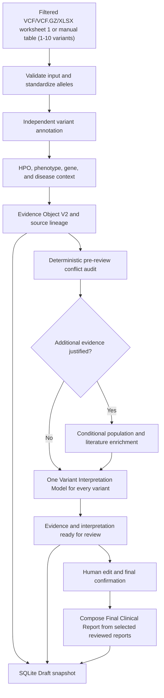

<div align="center">

# Clinical Variant Interpretation

Evidence-centered germline variant review with an accepted post-professor-review
redesign contract.

[](docs/PROJECT_DECLARATION.md#4-stage-register)
[](#requirements)
[](#run-the-application)
[](#verification)
[](#verification)

</div>

> [!IMPORTANT]
> This application provides clinical decision support for educational and
> research use. It is not a diagnostic device, does not make autonomous
> pathogenicity classifications, and must not replace review by a qualified
> genetics professional.

## Overview

This project accepts one to ten already-filtered germline Mendelian variants from
VCF, VCF.GZ, Excel `.xlsx`, or manual-table input, collects independent clinical
and phenotype evidence, and guides each variant through a review-and-confirmation
workflow with LLM interpretation available before final human confirmation.

The application deliberately does not rank or filter a raw VCF. Candidate
selection is an upstream responsibility. Every valid supplied allele remains in
its original input order.

### Current status

- The implemented roadmap has passed the Stage 60 V3 release gate, Stage 61
  point-in-time live validation, and Stage 78 resilience acceptance gate.
- Stage 45 has frozen the post-professor-review architecture; it is a documentation
  milestone and does not claim the redesign is implemented.
- Stage 46 input expansion is implemented and offline-verified.
- Stage 47 phenotype-extraction LLM contract is implemented and offline-verified.
- Stage 48 local HPO validation, editing, and explicit acceptance is implemented
  and offline-verified.
- Stage 49 UI layout and task-specific model controls are implemented and
  offline-verified.
- Stage 50 single-model, conflict-aware variant interpretation contract is
  implemented and offline-verified.
- Stage 51 interpretation-before-final-review pipeline refactor is implemented and
  offline-verified.
- Stage 52 Draft Variant Report V2 is implemented and offline-verified.
- Stage 53 safe report editing and audit history is implemented and
  offline-verified.
- Stage 54 audited per-variant Final Report selection is implemented and
  offline-verified.
- Stage 55 canonical reference and link hardening is implemented and
  offline-verified.
- Stage 56 Final Clinical Report composition and text/PDF/Word delivery is
  implemented and offline-verified.
- Stage 57 persistence schema V3 and recovery migration is implemented and
  offline-verified.
- Stage 58 privacy and safety reverification is implemented and offline-verified.
- Stage 59 Testing V3 is implemented and offline-verified.
- Stage 60 End-to-End Acceptance Gate V3 is implemented, offline-verified, and
  active in GitHub Actions.
- Stage 61 live provider and canonical-link validation is implemented and verified.
- Stage 62 documentation and demonstration preparation is complete; external
  professor feedback remains pending.
- Stages 63-78 provider resilience, free fallbacks, unified capability results,
  reviewer-facing fallback transparency, and deterministic failure injection are
  implemented, documented, and offline-verified; the multi-variant resilience gate
  and manual reachability utility are available.
- Pipeline schema: `2.9`.
- Evidence Object schema: `2.5`.
- Variant Interpretation Result schema: `1.1`.
- Draft Variant Report schema: `2.1`.
- Final Clinical Report schema: `2.0`.
- SQLite schema: `3`.
- Evidence Review, confirmation, routing, and final-report schemas: `1.0`.
- Current verified suite: **938 passed, 4 skipped; 85.83% Stage 59 coverage**.
- External-provider availability is not implied by the offline test result.

The complete stage register, API catalog, safety declaration, demonstration
guide, and limitations are maintained in
[`docs/PROJECT_DECLARATION.md`](docs/PROJECT_DECLARATION.md).

The authoritative redesign contract and implemented-versus-planned boundary are also
recorded in the unified project declaration.

## Accepted target architecture

The Stage 45 contract replaces the Stage 44 interaction model for all new work.
Stages 46-62 have implemented and documented the expanded input boundary, isolated
human-reviewed
phenotype extraction, task-specific UI model controls, and the route-free
interpretation-before-review pipeline through Final Clinical Report delivery,
persistence, privacy reverification, Testing V3, the V3 release gate, bounded live
validation, and the final demo/review handoff:

- VCF, VCF.GZ, manual-table, and first-worksheet-only Excel input for 1–10
  pre-filtered variants;
- optional de-identified Persian clinical text processed by a separately selected
  **Phenotype Extraction Model**;
- locally validated, editable, explicitly accepted HPO terms;
- one **Variant Interpretation Model** used for every variant, with conflict state
  retained as context rather than a model-routing decision;
- an evidence-and-interpretation **Draft Variant Report** for every variant;
- a human-edited **Reviewed Variant Report** with immutable original and edit history;
- a human `include_in_final_report` choice that does not rank variants; and
- one confirmed **Final Clinical Report** containing only selected reports, with
  backend-controlled canonical references.

For new analyses, `Output A`, `Output B`, `LLM-1`, `LLM-2`, and separate
no-conflict/conflict model selectors are retired. Legacy implementation modules remain
temporarily for bounded compatibility and regression coverage but are not used by the
active Streamlit workflow.

### Stage 47 phenotype-extraction contract

`backend/phenotype_llm.py` implements a dedicated Persian clinical-text task. It
sends only `task=extract_hpo_candidates` and a bounded, de-identified
`clinical_text_fa` value, then accepts only a strict structured candidate list with
`hpo_id`, `label`, and `source_phrase_fa`. The safety prompt prohibits diagnosis,
unsupported disease inference, invented identifiers, variant interpretation, and
treatment advice; an empty candidate list represents insufficient evidence.

The Phenotype Extraction Model is configured independently from the Variant
Interpretation Model. Provider failures and malformed responses remain isolated from
manual HPO entry. Stage 47 validates the candidate response shape and exact
`HP:ddddddd` format.

### Stage 48 local validation and acceptance

`backend/phenotype_selection.py` resolves every suggested identifier against the
installed ontology, canonicalizes alternate IDs, replaces model labels with local
ontology labels, and excludes invalid, absent, duplicate, or unsafe suggestions. The
Streamlit phenotype panel presents only locally validated candidates in an editable
table. Candidates remain separate from the analysis HPO set until the user explicitly
accepts them; acceptance revalidates all edited rows and merges them with manually
selected terms in stable order. Extraction or validation failure leaves manual HPO
search fully available.

### Stage 49 task-specific UI

The Streamlit workflow now presents **Task-specific models**, then **Phenotypes**,
then **Variant input**. Separate selectors configure one Phenotype Extraction Model
and one Variant Interpretation Model; provider-advertised and custom model IDs remain
available. Phenotype extraction receives only the phenotype model. The selected
variant model is forwarded for every interpretation request. Conflict status no
longer selects a different model in the UI or pipeline.

### Stage 50 single-model interpretation contract

`backend/variant_interpretation.py` accepts one validated, sanitized Evidence Object
per variant and calls the same selected Variant Interpretation Model regardless of
conflict state. The deterministic pre-review audit remains in the prompt and result
provenance. Meaningful conflict changes only the bounded instruction mode; it never
changes the selected model.

Responses must satisfy a strict route-free JSON schema containing interpretation,
conflict assessment, phenotype conclusion, and warnings. The phenotype conclusion is
restricted to supported, partially supported, no supported association found, or
phenotype evidence unavailable. Unsupported phenotype never removes the variant or
becomes negative pathogenicity evidence. The contract records model and prompt provenance,
conflict status/severity, completion state, token usage, and explicit isolated
failures while preserving variant order. It rejects obsolete `LLM-1`/`LLM-2` route
fields, malformed or incomplete responses, unsafe evidence, invented response URLs,
and unbounded text.

### Stage 51 interpretation-before-final-review pipeline

The active analysis phase now collects evidence, performs conflict auditing and
conditional enrichment, then generates one ordered interpretation result per variant
before human review. Model failures are isolated: the evidence remains reviewable and
the interpretation panel shows an explicit unavailable state with failure provenance.

The reviewer can inspect interpretation and evidence together, edit the evidence
draft, and confirm all variants. Finalization validates that complete reviewed state
without another LLM call. Legacy conflict routing and `Output B` generation are no
longer part of the active UI. Recovery schema `2` retains the selected interpretation
model and reruns the complete analysis phase after interruption.

### Stage 52 Draft Variant Report V2

`backend/variant_report.py` composes one schema-`2.0` Draft Variant Report for each
ordered evidence/interpretation pair. Each report presents normalized variant and
transcript identity, accepted HPO and disease context, source-aware evidence sections,
deterministic conflict status, the model interpretation or explicit failure,
references, compact provenance, and safety limitations.

The machine original and separate reviewed copy begin identical. Pipeline validation
reconstructs the expected report from its Evidence Object and interpretation result,
so an untracked edit, identity mismatch, reordered report, or untrusted non-HTTPS link
fails closed. The Streamlit review opens on the coherent report; raw evidence JSON is
not required to understand the analyzed variant.

### Stage 53 human report editing and audit history

Reviewers can edit only the reviewer summary, interpretation narrative, conflict
assessment wording, and reviewer notes. Normalized identity, provider evidence,
conflict facts, references, provenance, model metadata, and the machine original are
immutable. Every changed field appends a bounded record containing sequence, path,
old value, new value, timestamp, and available local reviewer context.

Validation replays the complete history from the integrity-checked machine original
and requires the replayed result to equal the current reviewed report. Resetting
editable fields appends reverse changes instead of deleting history. PHI checks apply
before persistence, and any report edit after confirmation invalidates that variant's
confirmation. The Streamlit comparison view displays field history and side-by-side
machine/current report states.

### Stage 54 per-variant Final Report selection

Every Draft Variant Report carries an audited `include_in_final_report` boolean.
The reviewer can include or exclude each report independently; this is a reporting
choice only and never a rank, filter, or clinical-priority score. Selection changes
append old/new values, timestamp, sequence, and bounded reviewer context.

All reports remain persisted and recoverable with their evidence, interpretation,
edits, provenance, conflicts, and selection history. The selected-report projection
contains only included reports and preserves original input order. Any selection
change invalidates prior final confirmation. Editing an included report also
invalidates confirmation; editing an already excluded report retains the current
confirmation because it cannot change selected Final Report content.

### Stage 55 canonical references and link hardening

`backend/references.py` creates a normalized reference catalog with stable `R1`,
`R2`, and subsequent identifiers, source, identifier type/value, optional title,
canonical URL, and explicit `validated` or `unavailable` link status. Deterministic
builders cover PMID, PMCID, DOI, ClinVar accessions, Europe PMC records, ClinGen
records, and CSpec records. Known-provider URLs require HTTPS and an allowlisted
domain; mismatched or untrusted links fail to an explicit no-validated-link state.

The Variant Interpretation Model receives the bounded reference catalog without
URLs and may cite only supplied bracket IDs such as `[R1]`. Fabricated, malformed,
or evidence-absent IDs are rejected. Draft Variant Report schema `2.1` maps those
IDs to canonical objects, Streamlit renders validated links and explicit fallbacks,
and generic Word/PDF exports preserve allowlisted hyperlinks.

### Stage 92 Reference Model V2

The active interpretation and report path now separates numbered scientific
literature from unnumbered database/tool provenance. Draft Variant Report schema
`2.2` stores `literature_references` for PubMed, PMC, and DOI article records and
stores ClinVar, Ensembl, GeneBe, MyVariant.info, ClinGen/GenCC, CSpec,
Phen2Gene/local HPO-Gene, MyDisease, and population-provider lineage under
`data_sources`. Interpretation prompt `variant-interpretation-v1.3` receives only
the literature citation catalog. ReportData, HTML/DOCX rendering, Streamlit review,
persistence, and final Markdown retain the category boundary.

### Stage 93 canonical human-link resolver

Reviewer-facing links now resolve through one deterministic policy. PubMed, PMC,
DOI, ClinVar, exact GeneBe alleles, and rsID-backed Ensembl records use human-readable
targets. Raw MyVariant.info JSON, Ensembl REST/VEP, GeneBe API, and NCBI E-utilities
targets cannot become ordinary report links. MyVariant.info remains visible as a
`Programmatic annotation source`, and sources without a validated human record keep
provenance with an unavailable link instead of receiving a fabricated URL.

### Stage 94 reference validation tests

The Stage 93 policy is protected by a dedicated offline matrix covering PMID, PMCID,
DOI, ClinVar VCV/RCV/SCV records, supported GeneBe alleles, MyVariant.info raw-data
suppression, missing identifiers, unsupported providers, and whole-model machine-link
rejection. A separate `live_provider` test can probe representative human pages when
`RUN_LIVE_PROVIDER_TESTS=1`; deterministic CI never performs those network calls.

### Stage 56 Final Clinical Report composer

`backend/final_clinical_report.py` deterministically composes schema `2.0` from the
confirmed reports whose audited `include_in_final_report` value is true. It preserves
the exact reviewer-edited report state in original variant order, groups each
variant's local citation namespace with its literature references, keeps database
and tool provenance in a separate Data Sources section, and includes
de-identified phenotype context, main findings, detailed findings, methods,
limitations, disclaimer, and bounded audit/provenance metadata.

Finalization requires confirmation coverage for every reviewed variant and creates
the report without an LLM call. Excluded reports remain in pipeline state but do not
appear in final findings or references. Streamlit displays the completed report and
offers in-memory text, PDF, and Word downloads with numbered clickable canonical
references. Pipeline schema `2.8` integrity-checks the report against the current
reviewed state so stale or untracked final content fails closed.

### Stage 57 persistence schema V3 and recovery migration

SQLite schema `3` adds normalized analysis, per-variant review, and finalization
projections beside the canonical pipeline snapshot. It persists input type, accepted
HPO terms, both task-specific model selections, phenotype-extraction provenance,
complete evidence/interpretation/report/edit/selection state, confirmation state,
selected canonical variant IDs, and bounded in-memory artifact metadata. Pipeline
schema `2.9` validates the same analysis context at the application boundary.

Schema-2 Stage 56 lifecycle snapshots receive a bounded migration to the current
schema. Older Output A/Output B records remain explicitly unsupported and are never
silently reinterpreted. Once generated drafts are durably saved, refresh or restart
recovery loads them by analysis ID without rerunning successful interpretation; the
reviewer can continue editing, selection, confirmation, and export from restored state.

### Stage 58 privacy and safety reverification

The two model entry points now have separate exact minimum-data validators. Phenotype
extraction accepts only the task identifier and sanitized `clinical_text_fa`;
interpretation accepts only its validated Evidence Object, prompt mode, task, and a
URL-free canonical-reference catalog. Cross-task clinical text is rejected from the
interpretation boundary.

Persian labelled identifiers—including patient name, national/record number, contact
details, birth date, and address—and Iranian mobile-number forms are redacted before
phenotype-model calls and rejected from review/report content. Automated acceptance
coverage also proves that ignored Excel worksheets are removed before downstream
pipeline, log, database, model, and export boundaries. Detection remains defense in
depth: linguistically ambiguous, unlabelled identifiers cannot be guaranteed and users
must supply de-identified text.

### Stages 59–60 deterministic verification and V3 release gate

`tests/run_stage59_testing_v3.py` registers and verifies eight non-empty requirement
groups, blocks unmocked HTTP suite-wide, runs the complete offline marker, and
enforces at least 80% coverage. `tests/run_stage60_acceptance.py` adds compilation,
dependency consistency, secret auditing, and one deterministic ten-variant redesigned
workflow before invoking Testing V3.

The Stage 60 scenario proves first-worksheet-only Excel processing, Persian phenotype
extraction and corrected HPO acceptance, independent task models, shared
interpretation-model use across conflict states, isolated failures, report editing,
four-of-ten selection, durable excluded-variant recovery, canonical references,
confirmed-state exports, and absence of ignored-sheet content. This is the active
offline GitHub Actions release gate; live-provider checks remain separate.

### Stage 61 live provider and canonical-link validation

`tests/run_live_provider_validation.py` now probes the production clients for VEP,
GeneBe, MyVariant, ClinVar, ClinGen/GenCC, CSpec, Phen2Gene, MyDisease, gnomAD,
Ensembl Variation, LitVar2, Europe PMC, PubMed, and both task-specific LLM roles. It
accepts usable normalized data, valid no-match states, or explicitly classified
transient unavailability; malformed schemas, unsafe states, and model configuration,
authentication, or response-contract failures still fail the gate.

The runner also builds the report's canonical-reference catalog and performs bounded
live GET probes against representative exact links. Stage 61 removed non-navigable
Ensembl VEP and GeneBe POST endpoints from report links, so they now render the
explicit unavailable-link fallback instead of a misleading hyperlink.

### Stage 62 documentation and professor-review handoff

The project declaration, README, schemas, verification baseline, and user workflow
now describe V3 as the active architecture. The unified declaration provides the
exact demonstration sequence, expected checkpoints, provider-failure fallback, and
professor feedback checklist. Its multi-sheet public demo workbook is
`data/samples/stage62_demo_variants.xlsx`; worksheet 2 contains a conspicuous marker
that must never enter application artifacts.

## Current implemented workflow



The pipeline has three lifecycle steps:

1. **Analysis:** validate input, collect evidence, audit conflicts, conditionally
   enrich, interpret each variant, and prepare the review state.
2. **Review:** inspect evidence and interpretation, edit bounded report fields,
   compare with the immutable original and append-only history, and confirm every
   variant.
3. **Finalization:** validate the confirmed review state, compose the selected-only
   Final Clinical Report, and provide text/PDF/Word exports without a new model
   request.

## Inputs

### Filtered VCF/VCF.GZ upload

Supported formats:

- `.vcf`
- `.vcf.gz`
- One to ten normalized variants after multiallelic splitting
- GRCh37 or GRCh38, selected explicitly in `.env`
- Multiallelic rows are split into independent ALT alleles
- Sample, genotype, and patient columns are ignored

Upload size, decompressed size, row count, allele syntax, chromosome, and
assembly-specific coordinate ranges are validated before annotation.

### Manual table

The Streamlit form provides ten VCF-style rows with:

- `CHROM`
- `POS`
- `REF`
- `ALT`
- Optional `QUAL`
- Optional `FILTER`

Only populated, valid rows are submitted. Coordinates are checked against the
configured assembly.

### Excel upload

Excel `.xlsx` input reads worksheet index 0 only. Later worksheets are never
iterated or included in normalized input, recovery checkpoints, persistence, logs,
provider calls, LLM payloads, or exports.

Required columns are `CHROM`, `POS`, `REF`, and `ALT`. Optional columns are `QUAL`
and `FILTER`. Headers are matched case-insensitively using these deterministic
aliases:

| Canonical column | Accepted headers |
|---|---|
| `CHROM` | `CHROM`, `#CHROM`, `Chromosome` |
| `POS` | `POS`, `Position` |
| `REF` | `REF`, `Reference` |
| `ALT` | `ALT`, `Alternate`, `Alternative` |
| `QUAL` | `QUAL`, `Quality` |
| `FILTER` | `FILTER`, `Filter status` |

Unknown columns are ignored. Excel rows pass through the same assembly, coordinate,
allele, multiallelic-splitting, ordering, and ten-variant validation contract used
by the existing input paths.

### Phenotype input

Reviewers can search local Human Phenotype Ontology data by text or enter
canonical `HP:NNNNNNN` identifiers. Selected terms are normalized,
deduplicated, and used consistently by the local HPO scorer and Phen2Gene.

## Evidence sources

### Core annotation and phenotype services

| Source | Role in the application |
|---|---|
| Ensembl VEP REST | Assembly-aware consequence, transcript, gene, identifier, and colocated evidence |
| GeneBe | Independent automated ACMG evidence and provider classification context; never treated as the final application classification |
| MyVariant.info | Exact assembly-aware variant aggregation and standardized population-frequency context |
| NCBI ClinVar | Direct germline classification, review status, accession, and condition evidence |
| UCSC Genome Browser GenCC track | Exact ClinGen-submitted gene-disease validity context |
| ClinGen CSpec Registry | Released VCEP specification availability and metadata; rules are not executed |
| Local HPO datasets | Ontology search, validation, gene/disease associations, and explainable phenotype similarity |
| Phen2Gene | HPO-to-gene score and provider-rank metadata without changing input order |
| MyDisease.info | Bounded MONDO-validated gene-disease-HPO context |

### Conditional enrichment

Conditional enrichment runs only when the deterministic conflict audit
justifies it and the relevant feature flag is enabled.

| Source | Conditional role |
|---|---|
| gnomAD GraphQL | Exact-allele population evidence using the configured GRCh37/GRCh38 dataset |
| Ensembl Variation REST | Population-evidence fallback with separate provenance |
| NCBI LitVar2 | Variant-linked publication identifiers |
| Europe PMC | Bounded article discovery and normalized metadata |
| PubMed E-utilities | Bounded literature search and article summaries |

`not_found` and `no_match` represent valid missingness. Timeouts, unavailable
services, invalid responses, and HTTP failures remain operational failures.
None of these states are converted into negative clinical evidence.

The detailed endpoints, request purposes, and provider responsibilities are in
the [API catalog](docs/PROJECT_DECLARATION.md#6-external-api-and-data-source-catalog).

### Provider resilience

Fallback activates only after a normalized operational failure, never after valid
`no_match`/`not_found`. Every degraded result retains the actual provider, method,
primary failure, and lineage in the Evidence Object and reports. Primary/fallback
pairs include VEP/VariantValidator, MyVariant/Ensembl Variation, direct
ClinVar/MyVariant-derived ClinVar, CSpec/local last-known-good metadata,
Phen2Gene/local direct HPO-gene overlap, gnomAD/Ensembl Variation, and
LitVar2/Europe PMC/PubMed.

Configuration, the complete capability matrix, architecture, pre-demo checks, and
troubleshooting are in the unified
[Project Declaration](docs/PROJECT_DECLARATION.md).

## Human review and outputs

### Pre-interpreted review state

Analysis creates ordered evidence and interpretation records for every variant.
Reviewers can:

- inspect the immutable machine-generated original;
- inspect the model interpretation, conflict assessment, warnings, and provenance;
- edit, add, or delete nested evidence;
- add reviewer notes;
- compare the current Draft with the original;
- reset or save the Draft;
- confirm the reviewed package and finalize without another model call.

Edits are recorded in bounded append-only history. Any edit after confirmation
invalidates that confirmation.

### Variant Interpretation Model

The task-specific selector starts with the `.env` default. The user can load the current
provider `/models` catalog through a bounded five-minute cache or enter another
provider-supported model ID; no speculative model list is hardcoded.

Default-model promotion is governed by the Stage 91 seven-case quality gate. A
recommendation requires at least two complete live-provider, human-reviewed
candidates and measures groundedness, hallucination, clinical-style coherence,
conflict handling, phenotype restraint, structured-output reliability, latency, and
cost. Offline fixtures can validate the gate but cannot select a model, and the
evaluator never changes `.env` automatically. See
`docs/stage_91_interpretation_quality.md`.

Only bounded, sanitized Evidence Objects can reach the model. Raw VCF content,
sample data, and reviewer-entered drafts are excluded. Every variant uses the same
selected model; conflict state changes prompt context, never model selection. A failed
call affects only its variant and leaves its evidence available for review.

The only supported provider protocol is currently `openai_compatible`.
Compatible services are configured through `LLM_BASE_URL`, `LLM_API_KEY`, and
the selected model names.

Draft Variant Report V2 combines these records into one coherent reviewer-facing
view with safe audited editing and reporting-only inclusion decisions. Canonical
Final Clinical Report schema `2.0` is composed from the confirmed selected subset
and exported without interpretation regeneration.

## Requirements

- Windows is the primary verified development environment.
- Python `3.13` is the currently verified runtime.
- Internet access is required for live annotation and LLM requests.
- An OpenAI-compatible LLM endpoint and API key are required for variant
  interpretation and optional Persian phenotype extraction.
- Runtime dependencies are exactly pinned in `requirements.txt`; deterministic
  test tooling is isolated in `requirements-dev.txt`.

## Installation

```powershell
git clone <repository-url>
Set-Location clinical_variant_app
python -m venv .venv
.\.venv\Scripts\python.exe -m pip install -r requirements.txt
Copy-Item .env.example .env
```

Edit `.env` before starting the application. At minimum, set real values for:

```dotenv
GENOME_ASSEMBLY=GRCh38
LLM_PROVIDER=openai_compatible
LLM_BASE_URL=https://your-provider.example/v1
LLM_API_KEY=your-real-api-key
LLM_MODEL=your-default-model
PHENOTYPE_EXTRACTION_MODEL=your-phenotype-model
VARIANT_INTERPRETATION_MODEL=your-interpretation-model
VARIANT_INTERPRETATION_FALLBACK_MODEL=
VARIANT_INTERPRETATION_MAX_RETRIES=1
PHENOTYPE_EXTRACTION_MAX_TOKENS=800
```

Use either `GRCh37` or `GRCh38`. Do not commit `.env`.

All provider URLs, timeouts, retry limits, cache limits, enrichment limits,
storage paths, HPO sources, and feature flags are documented in
`.env.example` and validated by `config.py`.

Important optional controls:

```dotenv
ENABLE_GNOMAD_DEEP_LOOKUP=true
ENABLE_LITERATURE_ENRICHMENT=true
CONDITIONAL_ENRICHMENT_MAX_VARIANTS=10
CONDITIONAL_ENRICHMENT_MAX_ARTICLES=10
ANNOTATION_CACHE_TTL_SECONDS=3600
VARIANT_INTERPRETATION_FALLBACK_MODEL=your-operational-backup-model
```

The interpretation fallback is operational recovery only. It never routes variants
by conflict, difficulty, phenotype, or evidence strength.

GeneBe credentials are optional but must be provided as a complete email/API
key pair when used.

## Run the application

On Windows:

```powershell
.\run_app.bat
```

Or run directly through the verified environment:

```powershell
.\.venv\Scripts\python.exe app.py
```

The conventional Streamlit command is also supported:

```powershell
.\.venv\Scripts\python.exe -m streamlit run app.py
```

At startup, configuration is validated, application directories are prepared,
and redacted structured logging is initialized.

## Using the application

1. Choose filtered VCF/VCF.GZ/XLSX upload or manual-table input.
2. Supply one to ten valid variants.
3. Select/search HPO terms manually, or extract candidates from a de-identified
   Persian description, edit them, and explicitly accept the locally validated set.
4. Choose one Phenotype Extraction Model and one Variant Interpretation Model.
5. Start analysis and monitor provider and per-variant interpretation progress.
6. Inspect every variant's evidence, interpretation, and provider status.
7. Make any necessary evidence edits and add non-PHI reviewer notes.
8. Choose which variants enter the Final Clinical Report; excluded variants remain
   persisted and recoverable.
9. Complete the privacy attestation and confirm every variant.
10. Finalize without another model call, then download the selected-only text, PDF,
    or Word report and open validated canonical references.

Analyses run in cancellable background jobs. Progress updates on each normal
annotation provider, conditional-enrichment variant step, phenotype provider,
and individual analysis-phase interpretation request.

A browser refresh reconnects through an opaque recovery token. A private,
one-hour sanitized checkpoint lets a restarted server safely rerun interrupted
analysis work from normalized variants, HPO terms, and the selected interpretation
model; it never stores raw VCF
content. Expired checkpoints and abandoned atomic temporary files are pruned
automatically. Persisted Draft or Confirmed results reload from SQLite by random
analysis ID.

## HPO data

The application uses coordinated local copies of:

- `data/hpo/hp.obo`
- `data/hpo/phenotype_to_genes.txt`
- `data/hpo/phenotype.hpoa`

The Streamlit **Update HPO data** action downloads, validates, and atomically
installs compatible ontology, gene-association, and disease-annotation files.
Do not replace only one file manually; the coordinated release is part of the
phenotype evidence contract.

## Demonstration and professor review

Use the reproducible multi-sheet workbook and complete checklist in the unified
[Project Declaration](docs/PROJECT_DECLARATION.md). Repository preparation is
complete; professor review date, outcome, required changes, and sign-off remain
pending until that external checkpoint occurs.

## Verification

Install the runtime and test dependencies:

```powershell
.\.venv\Scripts\python.exe -m pip install -r requirements-dev.txt
```

Run the complete deterministic offline suite:

```powershell
.\.venv\Scripts\python.exe -m pytest -q
```

Current verified result:

```text
789 passed, 4 skipped
```

Run the active V3 release gate:

```powershell
.\.venv\Scripts\python.exe tests\run_stage60_acceptance.py
```

Run the completed provider-resilience acceptance gate:

```powershell
.\.venv\Scripts\python.exe tests\run_stage78_resilience_acceptance.py
```

This gate compiles the project, audits secrets, runs the mocked multi-variant
degraded-mode scenario, runs the full offline suite, and enforces Testing V3 coverage.

The gate performs compilation, dependency consistency, repository secret auditing,
the deterministic ten-variant Stage 60 scenario, all eight Testing V3 groups, the
complete offline suite, and the minimum 80% coverage requirement.

Run Testing V3 alone when the end-to-end release scenario does not need repetition:

```powershell
.\.venv\Scripts\python.exe tests\run_stage59_testing_v3.py
```

The historical Stage 44 runner remains available for legacy regression checks but is
no longer the active release gate.

Current measured Stage 59 coverage is **85.81%**.

The Stage 60 gate runs automatically on every push and pull request through the
read-only GitHub Actions workflow in `.github/workflows/verify.yml`.

Automated tests mock or block external HTTP traffic. Run the bounded live
contract gate separately; it checks every active annotation, phenotype,
population, literature, and configured LLM endpoint through production clients:

```powershell
.\.venv\Scripts\python.exe tests\run_live_provider_validation.py
```

Use `--skip-llm` when only biomedical providers should be checked. The gate
writes a non-clinical, ignored summary to
`output/live-provider-validation.json`. It may consume provider quotas.

For a quicker manual DNS/HTTP check that does not exercise production evidence
contracts or LLMs, run:

```powershell
.\.venv\Scripts\python.exe tools\provider_reachability.py --json output\provider-reachability.json --csv output\provider-reachability.csv
```

This checker is network-dependent and intentionally excluded from CI. Its result is a
point-in-time operational observation, not proof of provider schema correctness.

The complete Stage 61 live gate passed on **2026-08-09**. VEP, GeneBe, MyVariant,
ClinVar, Phen2Gene, MyDisease, gnomAD, Ensembl Variation, both configured task-model
contracts, and representative ClinVar/MyVariant links returned usable responses.
GenCC, CSpec, LitVar2, Europe PMC, and PubMed returned valid no-match responses for
the public probe, which is acceptable missingness. This is a point-in-time result,
not a future availability guarantee.

Component-specific diagnostics remain available:

```powershell
.\.venv\Scripts\python.exe tests\manual_annotation_smoke.py
.\.venv\Scripts\python.exe tests\manual_mydisease_diagnostic.py
.\.venv\Scripts\python.exe tests\manual_llm_smoke.py
```

A passing offline gate proves application contracts and failure handling; it
does not prove current availability or schema stability for every external
service.

## Persistence and storage

| Path | Purpose |
|---|---|
| `storage/database/clinical_variant.sqlite3` | Validated Draft and Confirmed pipeline snapshots |
| `storage/uploads/` | Temporary bounded uploads |
| `storage/reports/` | Generated report artifacts |
| `storage/logs/clinical_variant.log` | Rotating redacted operational log |
| `data/cache/` | Bounded application cache |
| `data/hpo/` | Coordinated local HPO datasets |

Storage, upload, and report directories are excluded from Git. SQLite is
appropriate for the current bounded single-application workflow, not a
production multi-user clinical deployment.

## Privacy and security

- Secrets are read from `.env`, which is excluded from Git.
- Raw VCF rows, sample identifiers, patient columns, and genotypes do not enter
  public pipeline results or LLM requests.
- External requests use verified HTTPS, explicit timeouts, bounded retries, and
  minimum required query fields.
- Logs use correlation IDs and operational metadata with defensive PHI,
  credential, and raw-VCF redaction.
- Reviewer notes reject detected phone numbers, government identifiers, email
  addresses, contextual person names, labelled identifiers, and raw VCF text.
- Persian labelled identifiers and Iranian mobile-number forms are redacted before
  phenotype extraction and rejected from stored review/report content.
- Phenotype-extraction and variant-interpretation payloads use separate exact-field
  validators; interpretation cannot receive the Persian clinical-text field.
- Ignored Excel worksheets are discarded at the adapter boundary and cannot enter
  downstream provider/model calls, logs, SQLite state, reports, or exports.
- The confirmation button remains disabled until the reviewer explicitly
  attests that the reviewed evidence contains no PHI or direct identifiers;
  editing the Draft clears that attestation and invalidates confirmation.
- Provider failures are isolated and represented explicitly.
- Reviewer state and audit history are bounded and validated before storage.
- Review notes must not contain protected health information.

Free-text detection is defense in depth, not guaranteed de-identification.
Unlabelled identifiers or names can be linguistically ambiguous, so users must
still provide de-identified evidence only.

These controls are an application baseline, not a claim of production clinical
compliance. Institutional deployment requires authentication, authorization,
encryption and key management, retention policy, backups, monitoring, threat
modeling, and formal privacy/regulatory review.

## Project structure

```text
clinical_variant_app/
├── app.py                         # Streamlit entry point
├── config.py                      # Environment and safety validation
├── backend/
│   ├── annotation.py             # VEP, GeneBe, MyVariant, ClinVar, GenCC, CSpec
│   ├── conditional_enrichment.py # gnomAD and literature enrichment
│   ├── conflict_auditor.py       # Deterministic pre/post-review audit
│   ├── database.py               # SQLite schema and pipeline snapshots
│   ├── evidence_confirmation.py  # Reviewed Evidence Packages
│   ├── evidence_review.py        # Editable evidence-review contracts
│   ├── final_interpretation_report.py # Legacy compatibility
│   ├── llm.py                    # OpenAI-compatible provider boundary
│   ├── llm_routing.py            # Legacy compatibility
│   ├── mydisease.py
│   ├── phenotype.py              # HPO and Phen2Gene
│   ├── phenotype_llm.py          # Bounded phenotype-extraction contract
│   ├── pipeline.py               # Analysis/review/finalization orchestration
│   ├── privacy.py
│   ├── report.py
│   ├── report_exports.py
│   ├── variant_interpretation.py # Single-model interpretation contract
│   └── variant_report.py         # Draft Variant Report V2 composition
├── frontend/
│   ├── evidence_review.py
│   ├── execution.py              # Background jobs and refresh recovery
│   ├── final_interpretation_view.py # Legacy compatibility
│   ├── report_viewer.py
│   ├── results.py
│   ├── styles.css
│   └── ui.py
├── data/
│   ├── hpo/
│   └── samples/
│       └── stage62_demo_variants.xlsx
├── docs/
│   └── PROJECT_DECLARATION.md
├── storage/
├── tests/
│   ├── conftest.py
│   ├── test_pipeline.py
│   ├── test_mydisease.py
│   ├── run_stage59_testing_v3.py
│   ├── run_stage60_acceptance.py
│   ├── run_stage78_resilience_acceptance.py
│   ├── run_live_provider_validation.py
│   ├── run_stage44_acceptance.py
│   └── manual_*.py
├── tools/
│   └── provider_reachability.py
├── .env.example
├── requirements-dev.txt
├── requirements.txt
└── run_app.bat
```

## Known limitations

- Stages 46-78 are implemented and documented. The provider-resilience roadmap is
  complete; professor feedback/sign-off and the separate full web-app acceptance
  plan remain external checkpoints.
- Candidate filtering and ranking must happen upstream.
- Human confirmation is mandatory before finalization.
- CSpec is context-only; no CSpec rule engine is implemented.
- GeneBe automated ACMG results remain independent source evidence.
- Interpretation quality depends on evidence currency, phenotype completeness,
  reviewer judgment, and model behavior.
- Live services can change, throttle, or become unavailable.
- Restart recovery reloads a durably persisted current-schema draft without another
  interpretation call. An interrupted, unpersisted request reruns from its sanitized
  checkpoint; it does not resume an operating-system thread mid-request.
- Production use requires controls beyond the current local SQLite/Streamlit
  architecture.

## Documentation

Use the
[Project Declaration](docs/PROJECT_DECLARATION.md)
for:

- the complete stage-by-stage implementation register;
- architecture and progress schematics;
- every API, data source, endpoint, purpose, and responsibility;
- schema and persistence contracts;
- privacy, security, failure-handling, and audit boundaries;
- the demonstration runbook;
- current limitations and the professor-review checkpoint.

The same declaration contains the implemented fallback matrix, configuration
contract, operational checks, and degraded-mode troubleshooting.
