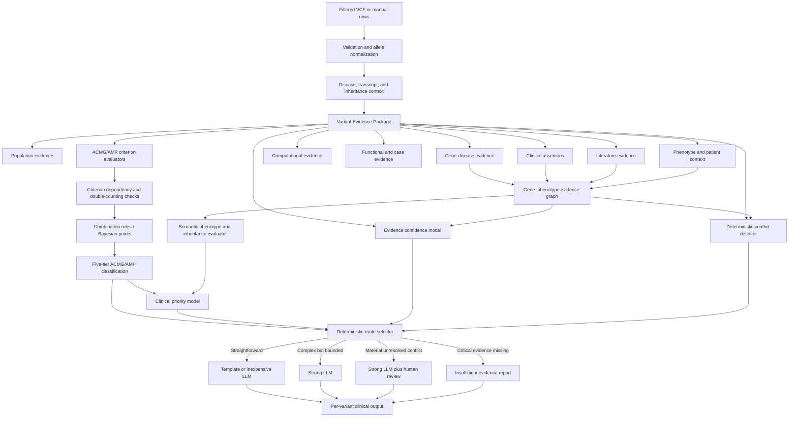

# ACMG/AMP Variant Interpretation Implementation Roadmap

**Status:** Planning document; no ACMG/AMP implementation has started  
**Project:** `clinical_variant_app`  
**Current input scope:** One to five already-filtered VCF-style rows  
**Primary clinical scope:** Germline Mendelian SNVs and small indels  
**Audience:** Project owner, professor, developers, reviewers, and AI coding agents  

---

## 1. Executive summary

The professor's requested output is achievable, but ACMG/AMP alone does not
produce the complete result.

For every supplied variant, the target system must produce five independent
but connected results:

1. **Variant Evidence Package**  
   A traceable collection of annotations, database assertions, scientific
   publications, population observations, functional evidence, disease
   context, and phenotype evidence.

2. **ACMG/AMP classification**  
   A deterministic evaluation of ACMG/AMP evidence criteria followed by one of
   the five germline classifications:
   `Benign`, `Likely Benign`, `VUS`, `Likely Pathogenic`, or `Pathogenic`.

3. **Gene–phenotype graph result**  
   An explainable, provenance-backed connection from the patient's HPO terms
   through diseases and genes to the supplied variant.

4. **Patient-specific priority**  
   A separate ranking showing how important the variant is for the current
   case. This is not the same as ACMG/AMP pathogenicity.

5. **Evidence confidence and conflict state**  
   A structured evaluation of evidence quality, completeness, agreement,
   review authority, and unresolved disagreement.

The LLM comes after these deterministic layers. It explains the evidence,
classification, priority, phenotype relationship, limitations, and conflicts.
It must not invent evidence or silently change the ACMG/AMP result.

The recommended routing design is:

- deterministic conflict detection;
- inexpensive LLM or deterministic template for straightforward cases;
- stronger LLM for genuinely complex or conflicting cases;
- mandatory human-review status when conflict remains clinically material.

---

## 2. Professor requirements mapped to system capabilities

| Professor requirement | Required capability | Final output |
|---|---|---|
| Complete information about each variant | Variant Evidence Package | Sources, claims, publications, dates, and limitations |
| Benign-to-pathogenic classification | ACMG/AMP rules engine | Evidence codes, strengths, points, and five-tier class |
| Danger/priority score | Patient-specific priority model | Priority band and validated numeric score |
| Useful LLM interpretation | Evidence-constrained report generation | Per-variant clinical narrative |
| Phenotype relationship | Provenance-backed gene–phenotype evidence graph | Explainable patient phenotype–disease–gene–variant paths |
| Handle conflicting evidence | Deterministic conflict detection plus advanced synthesis | Conflict matrix, explanation, and review status |
| Interpretation for every input row | Per-allele report generation | One complete report section per supplied allele |

---

## 3. Critical terminology and boundaries

### 3.1 ACMG/AMP classifies a variant-disease assertion

ACMG/AMP does not classify a gene by itself. It classifies a particular
sequence variant with respect to:

- a gene;
- a disease;
- an inheritance pattern;
- a relevant transcript;
- a defined evidence set;
- a defined criteria specification and version.

The same variant can receive different interpretations for different diseases
or inheritance contexts.

### 3.2 Pathogenicity is not patient priority

A variant can be pathogenic for a disease that does not match the patient's
phenotype. It can therefore have:

- high pathogenicity;
- high evidence confidence;
- low patient-specific priority.

A VUS may have strong phenotype compatibility and deserve investigation, but
it must remain a VUS until sufficient pathogenicity evidence exists.

### 3.3 ACMG/AMP points are not a danger score

The project must keep these fields separate:

- `acmg_classification`
- `acmg_evidence_points`
- `clinical_priority_score`
- `evidence_confidence`

If a Bayesian ACMG/AMP point framework is selected, its points represent the
strength and direction of pathogenicity evidence. They do not directly express
patient danger, treatment urgency, penetrance, or probability that the variant
explains the current case.

### 3.4 "Complete evidence" means bounded and versioned evidence

No system can guarantee that it has found every publication or unpublished
clinical observation. The correct engineering target is:

> Best available, explicitly sourced, versioned, reproducible evidence as of a
> recorded retrieval date.

### 3.5 LLM interpretation is not expert adjudication

An LLM may:

- summarize structured evidence;
- compare stated claims;
- explain why sources disagree;
- produce readable clinical-decision-support text;
- identify missing information already declared by the engine.

An LLM must not:

- create an unsupported ACMG/AMP criterion;
- change criterion strength without a rule;
- invent a publication or result;
- treat missing evidence as benign evidence;
- independently resolve an unresolved clinical disagreement;
- present its narrative as a diagnosis.

---

## 4. Current project state

The current application already provides:

- Streamlit upload and manual input;
- one to five prefiltered VCF-style rows;
- allele-specific splitting of multiallelic rows;
- Ensembl VEP annotation;
- MyVariant.info annotation;
- exact NCBI ClinVar matching;
- UCSC GenCC gene-disease evidence;
- local HPO search and phenotype matching;
- sanitized Evidence Objects;
- provider-neutral LLM interpretation;
- text, PDF, and DOCX reports;
- persistence, logging, privacy, and security controls;
- an extensive offline validation baseline.

The current architecture intentionally:

- receives variants already filtered upstream;
- preserves original input order;
- does not claim to rank or prioritize variants;
- excludes VCF genotype and sample fields from public output;
- focuses the generated interpretation on the first listed allele.

The professor's new request changes those decisions. The future application
must:

- interpret every supplied allele;
- add deterministic ACMG/AMP evaluation;
- add patient-specific priority;
- add evidence confidence and conflict detection;
- produce one clinical section for every supplied variant;
- decide whether genotype and family evidence may be collected.

The one-to-five-row limit remains a useful safety and cost boundary. A raw
whole-genome VCF must not be sent directly through literature retrieval and
LLM interpretation for every row.

---

## 5. Target architecture



### 5.1 Recommended module boundaries

The exact names may be adjusted during implementation, but responsibilities
should remain separate.

| Responsibility | Recommended location |
|---|---|
| Input validation | `backend/vcf_processing.py` |
| External annotation adapters | `backend/annotation.py` |
| Variant evidence schema and builder | `backend/evidence.py` |
| Literature retrieval and normalization | `backend/literature.py` |
| Gene–phenotype graph construction and queries | `backend/phenotype_graph.py` |
| ACMG domain models | `backend/acmg/models.py` |
| Criteria specification selection | `backend/acmg/specifications.py` |
| Individual criterion evaluators | `backend/acmg/criteria/` |
| Criterion combination and points | `backend/acmg/classifier.py` |
| Patient priority | `backend/prioritization.py` |
| Evidence confidence | `backend/confidence.py` |
| Conflict detection | `backend/conflicts.py` |
| Pipeline orchestration | `backend/pipeline.py` |
| LLM prompts and report composition | `backend/report.py` |
| Provider-neutral model access | `backend/llm.py` |
| Frontend presentation | `frontend/ui.py`, `frontend/results.py` |

The provider-neutral boundary in `backend/llm.py` must remain intact.

---

## 6. Target Variant Evidence Package

Every variant should be converted into a stable internal evidence object before
ACMG/AMP evaluation or LLM use.

### 6.1 Variant identity

- genome assembly;
- normalized chromosome, position, reference, and alternate allele;
- original input representation;
- allele-specific key;
- dbSNP identifier when available;
- ClinGen Allele Registry identifier when available;
- genomic, coding, and protein HGVS;
- normalization warnings.

### 6.2 Transcript and consequence

- gene symbol and identifier;
- selected transcript and transcript version;
- MANE status;
- consequence;
- exon/intron;
- protein position and amino-acid change;
- splice-region information;
- predicted nonsense-mediated decay status;
- transcript-selection rationale.

### 6.3 Disease context

- disease identifier and name;
- inheritance mode;
- gene-disease validity;
- disease mechanism;
- penetrance where known;
- prevalence where required;
- allelic heterogeneity where required;
- selected ClinGen VCEP specification and version.

### 6.4 Population evidence

- gnomAD release and genome assembly;
- global allele count and allele number;
- ancestry-specific allele counts and frequencies;
- population maximum frequency;
- filtering allele frequency;
- homozygote and hemizygote counts;
- coverage and quality filters;
- disease-specific frequency threshold;
- missing-data reason.

### 6.5 Clinical assertions

For each ClinVar assertion:

- `SCV`, `RCV`, and `VCV` accessions where applicable;
- submitted classification;
- condition;
- submitter;
- review status;
- assertion method;
- date evaluated and date updated;
- evidence description;
- cited publications;
- whether it matches the selected disease context.

The system must retain individual assertions rather than only the aggregate
ClinVar label.

### 6.6 Computational evidence

- splice prediction;
- missense prediction;
- conservation only where allowed;
- tool name;
- tool version;
- raw score;
- calibrated threshold;
- evidence direction;
- applicable ClinGen guidance;
- correlation/double-counting group.

### 6.7 Functional evidence

- publication;
- assay type;
- biological system;
- controls;
- validation status;
- measured effect;
- relevance to disease mechanism;
- curator assessment;
- ACMG/AMP strength supported.

### 6.8 Case and family evidence

- proband count;
- affected status;
- zygosity;
- parental testing;
- confirmed or assumed de novo state;
- phase;
- segregation;
- informative meioses;
- independent case count;
- case-control enrichment;
- alternate molecular diagnosis;
- evidence provenance.

These fields cannot be reconstructed by an API if the case data are not
provided.

### 6.9 Phenotype and graph evidence

- patient HPO terms;
- matched and unmatched HPO terms;
- disease-associated HPO terms;
- gene-associated HPO terms;
- specificity;
- phenotype similarity method and version;
- normalized graph node identifiers;
- provenance-backed gene–disease–phenotype relationships;
- inheritance relationships;
- supporting and contradicting graph edges;
- strongest patient phenotype–disease–gene–variant paths;
- path score and component scores;
- graph source releases;
- age-of-onset compatibility when available;
- phenotype evidence limitations.

### 6.10 Literature evidence

For every retained publication:

- PMID, PMCID, DOI, or stable identifier;
- title;
- publication year;
- exact variant identity used by the paper;
- disease and inheritance context;
- evidence type;
- structured claim;
- supporting location, such as abstract or table;
- whether full text was available;
- duplicate-patient warning;
- machine-extracted versus human-reviewed status.

### 6.11 Provenance

Every evidence item must contain:

- source;
- source record identifier;
- source URL where permitted;
- release/version;
- retrieval timestamp;
- normalization method;
- transformation warnings;
- evidence quality;
- reviewer state.

---

## 7. Evidence acquisition plan

| Evidence need | Primary source | Current status | Required work |
|---|---|---|---|
| Consequence/transcript | Ensembl VEP and MANE | Partially available | Retain more transcript and splice/LoF detail |
| Population frequency | gnomAD | Partially available through aggregation | Add granular versioned population evidence |
| Existing assertions | ClinVar | Aggregate/bounded details available | Retrieve and normalize individual assertions |
| Expert criteria | ClinGen CSpec | Missing | Add specification selection and versioning |
| Expert evidence | ClinGen Evidence Repository | Missing | Retrieve approved evidence when available |
| Gene-disease validity | GenCC/ClinGen | Partially available | Link exact disease and inheritance context |
| Phenotypes | HPO | Available at basic level | Add ontology-aware semantic similarity and specificity analysis |
| Gene–phenotype graph | HPO, MONDO, GenCC/ClinGen, ClinVar, optional Monarch KG | Missing | Add provenance-backed nodes, edges, path scoring, and graph release versioning |
| Variant literature | LitVar/PubTator/PubMed | Missing | Add bounded retrieval and claim extraction |
| Missense prediction | Calibrated approved tool | Missing/incomplete | Select tool, version, thresholds, and licence |
| Splice prediction | SpliceAI or approved equivalent | Missing/incomplete | Add calibrated splice evidence |
| Loss-of-function context | VEP, MANE, LOFTEE, literature | Incomplete | Implement ClinGen PVS1 decision inputs |
| Functional studies | Literature and expert curation | Missing | Add structured manual/mixed evidence |
| Segregation/de novo/phase | Patient/family data and papers | Missing | Add optional case-context input |
| Disease mechanism | ClinGen, GenCC, literature | Partial | Add explicit disease mechanism model |

### 7.1 API-key conclusion

Additional API keys are not the main blocker.

Likely optional credentials:

- NCBI API key for higher request throughput;
- OMIM API key/licence if OMIM is selected;
- commercial prediction or knowledge-base credentials if the project chooses
  licensed services.

Most foundational evidence can be obtained from public resources, local data,
or manual case entry. Patient genotype, pedigree, segregation, and unpublished
functional evidence cannot be created by adding an API key.

---

## 8. ACMG/AMP evaluation strategy

### 8.1 Criterion result contract

Every criterion evaluator must return:

```text
criterion_code
original_strength
applied_strength
status
evidence_direction
points
rationale
evidence_item_ids
specification_id
specification_version
missing_inputs
manual_review_required
warnings
```

Allowed `status` values:

- `MET`
- `NOT_MET`
- `NOT_APPLICABLE`
- `NOT_ASSESSABLE`
- `MANUAL_REVIEW_REQUIRED`

### 8.2 Automation matrix

| Criteria group | First-release approach | Notes |
|---|---|---|
| `BA1`, `BS1`, `PM2` | Automate after threshold configuration | Requires population quality and disease-specific thresholds |
| `BS2` | Mixed/manual | Requires knowledge of healthy observations, penetrance, and age |
| `PVS1` | Mixed automation | Requires ClinGen decision tree, mechanism, transcript, NMD, and exon relevance |
| `PS1`, `PM5` | Mixed automation | Requires exact protein/transcript/disease comparison to established variants |
| `PM4`, `BP7` | Mixed automation | Requires transcript and splice safeguards |
| `PP3`, `BP4` | Automate only with calibrated tools | Avoid double-counting correlated predictors |
| `PM1` | Curated/mixed | Requires validated domain or hotspot |
| `PP2`, `BP1` | Disease/gene specification dependent | Do not apply generically |
| `PS2`, `PM6` | Manual/mixed | Requires de novo evidence and parentage information |
| `PP1`, `BS4` | Manual/mixed | Requires segregation and penetrance evaluation |
| `PM3`, `BP2` | Manual/mixed | Requires phase, second allele, and inheritance |
| `PS3`, `BS3` | Manual | Requires validated functional-assay assessment |
| `PS4` | Manual/mixed | Requires independent cases or valid case-control analysis |
| `PP4` | Mixed | Requires phenotype specificity, not simple HPO overlap |
| `BP5` | Manual | Requires complete case-level alternate diagnosis |
| `PP5`, `BP6` | Do not implement automatically | Follow current ClinGen guidance and applicable CSpec |

### 8.3 Specification precedence

Recommended rule precedence:

1. Current applicable ClinGen VCEP gene/disease specification
2. Current general ClinGen variant-classification guidance
3. Original ACMG/AMP rules where not superseded

The selected specification and its version must appear in every result.

### 8.4 Dependency and double-counting controls

Before classification, the engine must check:

- correlated predictors are not counted independently;
- a ClinVar classification is not reused as independent criterion evidence;
- the same cases are not counted through multiple publications;
- phenotype evidence is not duplicated across criteria;
- splice evidence is not counted incompatibly;
- criterion-strength modifications follow the selected specification;
- pathogenic and benign evidence conflicts remain visible.

### 8.5 Combination and scoring

The project must explicitly choose one final-combination approach:

- original ACMG/AMP categorical combination rules;
- a published Bayesian point framework;
- gene-specific modified rules when an applicable ClinGen CSpec requires them.

Recommended output:

```text
ACMG classification: Likely Pathogenic
ACMG evidence points: 8
Applied criteria: PVS1_Strong, PM2_Supporting, PP3
Specification: <identifier and version>
Combination model: <identifier and version>
Manual review: Required/Not required
```

The exact point thresholds must be documented and tested before use.

---

## 9. Patient-specific priority model

### 9.1 Purpose

The priority model answers:

> How strongly should this variant be investigated for this patient and this
> phenotype?

It does not replace ACMG/AMP classification.

### 9.2 Recommended components

Recommended provisional structure:

| Component | Proposed contribution |
|---|---:|
| ACMG/AMP pathogenicity component | 0-40 |
| Phenotype compatibility | 0-25 |
| Inheritance and zygosity compatibility | 0-15 |
| Gene-disease validity | 0-10 |
| Technical and consequence relevance | 0-10 |
| **Total** | **0-100** |

These weights are a design proposal, not validated clinical thresholds.

### 9.3 Development sequence

The initial release should output:

- `HIGH`
- `MEDIUM`
- `LOW`
- `NOT_ASSESSABLE`

Only after validation should the project expose a numeric `0-100` score.

### 9.4 Required safeguards

- Do not call the priority score a probability.
- Do not convert a VUS into Pathogenic because its phenotype score is high.
- Preserve each component separately.
- Show missing components.
- Version the scoring formula.
- Validate rankings against expert-reviewed cases.
- Keep actionability separate unless the project formally defines it.

---

## 10. Evidence confidence model

Evidence confidence answers:

> How reliable, complete, current, and internally consistent is the evidence?

Suggested inputs:

- ClinVar review status;
- expert-panel or practice-guideline involvement;
- agreement among independent submitters;
- criteria transparency;
- publication quality;
- evidence recency;
- ACMG/AMP criterion completeness;
- source provenance;
- technical variant quality;
- unresolved conflict severity.

Recommended initial output:

- `HIGH`
- `MODERATE`
- `LOW`
- `INSUFFICIENT`

Confidence must not be combined invisibly into the patient-priority score.

---

## 11. Gene–phenotype evidence graph

### 11.1 Purpose

The graph is the patient-relevance bridge between the evidence package,
ACMG/AMP classification, priority model, conflict detector, and LLM.

It answers:

> Through which supported disease and phenotype relationships could this
> variant's gene explain the patient's HPO profile?

It does not determine variant pathogenicity by itself.

### 11.2 Minimal graph model

Recommended node types:

- normalized variant;
- gene;
- disease using MONDO or another approved normalized identifier;
- phenotype using HPO;
- inheritance mode;
- publication;
- evidence record;
- sanitized patient phenotype profile.

Recommended relationship types:

```text
Variant -> AFFECTS -> Gene
Variant -> ASSERTED_FOR -> Disease
Gene -> ASSOCIATED_WITH -> Disease
Gene -> ASSOCIATED_WITH -> Phenotype
Disease -> HAS_PHENOTYPE -> Phenotype
Disease -> INHERITED_AS -> Inheritance
Evidence -> SUPPORTS -> Relationship
Evidence -> CONTRADICTS -> Relationship
PatientProfile -> HAS_PHENOTYPE -> Phenotype
```

Every relationship must retain:

- source;
- source record identifier;
- direction;
- evidence strength;
- release/version;
- retrieval date;
- machine-derived or human-reviewed status;
- warnings and conflicts.

### 11.3 Data sources

Initial graph data should come from:

- the existing local HPO ontology;
- HPO gene and disease annotation files;
- MONDO disease identifiers and relationships;
- GenCC/ClinGen gene-disease validity and inheritance;
- ClinVar variant-disease assertions;
- curated literature evidence;
- optional bounded Monarch Knowledge Graph queries or versioned downloads.

The first release does not require Neo4j or another graph database. For the
one-to-five-variant scope, the graph can be represented using normalized
Python objects, indexed adjacency maps, and precomputed HPO ancestry and
information-content data.

### 11.4 Semantic phenotype matching

The graph evaluator should improve on exact term overlap by considering:

- HPO ancestors and descendants;
- term specificity;
- information content;
- patient-to-disease semantic similarity;
- patient-to-gene semantic similarity;
- matched and unmatched terms;
- optional explicitly absent phenotypes;
- age of onset where available;
- inheritance compatibility;
- graph-path provenance.

The exact semantic-similarity algorithm and dataset release must be versioned.
Its component scores must remain visible.

### 11.5 Graph outputs

Recommended outputs:

```text
gene_phenotype_relevance
disease_phenotype_relevance
inheritance_compatibility
matched_hpo_terms
unmatched_hpo_terms
contradictory_phenotype_evidence
best_explanatory_paths
path_evidence_ids
graph_release
graph_algorithm_version
graph_limitations
```

The best explanatory paths should be suitable for direct inclusion in the
Evidence Object, for example:

```text
Patient HP term
-> related disease phenotype
-> MONDO disease
-> associated gene
-> supplied variant
```

### 11.6 Use in ACMG/AMP

The graph may provide structured inputs for `PP4`, but a high semantic
similarity score must not automatically apply `PP4`.

Before `PP4` can be considered, the criterion evaluator must confirm:

- the phenotype is sufficiently specific;
- the selected disease context is appropriate;
- the genetic etiology satisfies current ClinGen guidance;
- inheritance is compatible;
- the evidence is not double-counted with segregation or other case-level
  criteria;
- an applicable VCEP specification does not define different requirements.

### 11.7 Use in priority, conflict detection, and LLM output

The graph should:

- supply the phenotype component of patient-specific priority;
- help separate variant pathogenicity from patient relevance;
- distinguish apparent conflicts caused by different disease contexts;
- expose inheritance mismatches;
- provide evidence paths rather than an unexplained percentage;
- supply the LLM with bounded, citation-backed relationships;
- show why a gene or disease was considered relevant.

The graph score must not modify the ACMG/AMP classification directly.

---

## 12. Deterministic conflict detection

### 12.1 Why the router must not be an LLM

Most conflict detection is structured comparison. Deterministic code is:

- cheaper;
- reproducible;
- testable;
- auditable;
- less likely to miss a conflict;
- independent of model availability.

### 12.2 Context normalization before comparison

Two assertions may only be compared directly after checking:

- exact allele;
- genome assembly;
- transcript;
- disease;
- inheritance;
- germline versus somatic context;
- assertion date;
- review authority.

### 12.3 Conflict states

Recommended states:

| State | Meaning | Route |
|---|---|---|
| `CONCORDANT` | Relevant evidence agrees | Template or inexpensive LLM |
| `CONTEXT_DIFFERENCE` | Difference is explained by disease/transcript/context | Separate contexts; inexpensive LLM |
| `RESOLVED_BY_PRECEDENCE` | Current expert/guideline evidence has documented precedence | Inexpensive LLM with explanation |
| `MINOR_UNRESOLVED` | Disagreement does not change the final class | Strong LLM or review depending on policy |
| `MATERIAL_UNRESOLVED` | Disagreement may change classification or priority | Strong LLM plus mandatory human review |
| `INSUFFICIENT_EVIDENCE` | Critical facts are absent | No forced conclusion |

### 12.4 Conflict comparison data

The detector should compare:

- submitted classifications;
- review statuses;
- dates;
- conditions;
- criteria applied;
- evidence strength;
- cited studies;
- population releases;
- transcript choice;
- disease mechanism;
- functional-assay quality;
- reasons for assertion.

The output should be a conflict matrix, not only a Boolean value.

---

## 13. Two-level LLM architecture

### 13.1 Layer 0: deterministic router

This is not an LLM. It selects the route from:

- ACMG/AMP result;
- priority;
- confidence;
- conflict state;
- missing evidence;
- report complexity.

### 13.2 Layer 1: inexpensive model

Use for:

- concordant evidence;
- benign or likely benign variants with adequate evidence;
- clear pathogenic or likely pathogenic evidence without material conflict;
- simple phenotype relationships;
- formatting evidence into readable prose.

Restrictions:

- evidence-object input only;
- citation identifiers supplied by the application;
- structured output schema;
- no classification changes;
- no external unsupported facts.

### 13.3 Layer 2: strong model

Use for:

- multiple relevant disease contexts;
- material evidence disagreement;
- conflicting functional studies;
- transcript-dependent interpretation;
- older versus newer evidence;
- complex phenotype relationships;
- difficult limitations requiring careful explanation.

The strong model should answer:

- What evidence agrees?
- What evidence conflicts?
- Does the conflict concern the same context?
- Which source has stronger review authority?
- Which ACMG/AMP criteria are affected?
- What evidence remains missing?
- Why is human review required?

It must not convert unresolved uncertainty into certainty.

### 13.4 Human-review gate

Mandatory review should be triggered when:

- conflict can change the five-tier classification;
- an ACMG/AMP criterion required manual assessment;
- disease context is ambiguous;
- a gene-specific specification is unavailable;
- functional evidence is decisive;
- a VUS is close to a classification threshold;
- the result disagrees with a current expert-panel assertion;
- provenance is incomplete;
- patient/family evidence is decisive.

### 13.5 LLM output validation

After generation, deterministic validation must confirm:

- every cited evidence identifier exists;
- no new ACMG/AMP code was introduced;
- classification matches the engine;
- points match the engine;
- priority and confidence match the engine;
- the model did not omit a material conflict;
- the model did not expose prohibited patient fields;
- the output includes limitations.

Invalid model output must be rejected or replaced by deterministic fallback
text.

---

## 14. Required per-variant clinical output

Every input allele should receive its own report section.

### 14.1 Variant identity

- Input row and allele number
- Normalized variant
- Assembly
- Gene and transcript
- Coding and protein change
- Consequence

### 14.2 Evidence summary

- Population evidence
- ClinVar assertions and review levels
- ClinGen evidence
- Functional evidence
- Computational evidence
- Relevant publications
- Gene–phenotype graph release and strongest evidence paths
- Evidence retrieval date

### 14.3 ACMG/AMP result

- Evaluated criteria
- Applied criteria and strengths
- Criterion-specific rationales
- Criteria not assessable
- ACMG/AMP points, if enabled
- Five-tier classification
- Specification and version

### 14.4 Patient relevance

- Phenotype compatibility
- Matched and unmatched HPO terms
- Best phenotype–disease–gene–variant paths
- Graph relationship provenance
- Contradictory phenotype or disease paths
- Inheritance compatibility
- Zygosity compatibility if available
- Gene-disease validity
- Clinical priority band/score

### 14.5 Confidence and conflicts

- Evidence-confidence level
- Conflict state
- Conflicting sources
- Explanation of precedence
- Remaining uncertainty
- Human-review requirement

### 14.6 LLM interpretation

- Plain-language clinical interpretation
- Phenotype relationship
- Explanation of evidence agreement or disagreement
- Important limitations
- Recommended evidence needed for resolution
- Citations

The report must remain clinical decision support and must not claim diagnosis
or treatment authority.

---

## 15. Implementation roadmap

Each stage should be completed, validated, reviewed, and committed before the
next stage starts.

### Stage 0 — Requirements and output-contract approval

#### Goal

Freeze terminology, initial scope, and the exact professor-approved output.

#### Steps

1. Confirm germline Mendelian scope.
2. Confirm supported variants: SNVs and small indels.
3. Confirm continued one-to-five filtered-row input.
4. Define disease-selection behavior.
5. Decide whether genotype, zygosity, trio, phase, and pedigree data are
   allowed.
6. Select the ACMG/AMP combination framework.
7. Define the meaning of ACMG/AMP points.
8. Define the meaning of clinical priority.
9. Define evidence-confidence levels.
10. Approve the gene–phenotype graph sources, algorithm boundary, and
    explainable-path output.
11. Define human-review requirements.
12. Create one professor-approved example report for:
    - one concordant variant;
    - one genuinely conflicting variant.
13. Update requirements and handoff documentation.

#### Deliverables

- Approved output contract
- Approved terminology
- Approved scope/non-scope
- Approved gene–phenotype graph contract
- Two reference report examples

#### Acceptance criteria

- ACMG/AMP classification and priority are clearly separated.
- Conflict behavior is approved.
- Missing-data behavior is approved.
- Graph relevance is clearly separated from ACMG/AMP pathogenicity.
- No implementation assumption remains ambiguous.

#### Suggested commit title

```text
docs: define ACMG interpretation output contract
```

---

### Stage 1 — Domain models and evidence schema

#### Goal

Create the stable data contracts used by all later stages.

#### Steps

1. Define normalized variant identity.
2. Define disease and inheritance context.
3. Define transcript context.
4. Define source provenance.
5. Define clinical assertions.
6. Define population evidence.
7. Define computational evidence.
8. Define functional evidence.
9. Define family/case evidence.
10. Define phenotype evidence.
11. Define graph nodes, relationships, paths, and edge provenance.
12. Define literature evidence.
13. Define ACMG/AMP criterion result.
14. Define classification result.
15. Define priority and confidence results.
16. Define conflict result.
17. Define the public sanitized Evidence Object.
18. Add strict validation and serialization tests.

#### Deliverables

- Versioned evidence schema
- Versioned graph schema
- Domain validation
- Serialization tests
- Privacy-field tests

#### Acceptance criteria

- Missing and unavailable evidence are distinguishable.
- Every evidence object supports provenance.
- Patient/sample fields cannot leak accidentally.
- Schema round trips deterministically.

#### Suggested commit title

```text
feat: add variant interpretation evidence contracts
```

---

### Stage 2 — Disease, transcript, and optional case-context input

#### Goal

Collect the context needed to interpret variants correctly.

#### Steps

1. Add disease selection or explicit disease identifier.
2. Add inheritance-mode selection.
3. Add transcript-selection behavior.
4. Preserve existing phenotype selection.
5. Decide whether case context is:
   - unavailable;
   - manually entered;
   - extracted from VCF/pedigree;
   - supplied by both methods.
6. If approved, add zygosity, affected status, parental status, de novo
   confirmation, phase, and segregation inputs.
7. Add privacy boundaries for case data.
8. Add frontend validation and error messages.
9. Add pipeline and persistence behavior.
10. Add tests for every missing and conflicting context state.

#### Deliverables

- Disease-aware input
- Inheritance-aware input
- Explicit transcript policy
- Optional privacy-safe case context

#### Acceptance criteria

- Classification cannot proceed silently without required context.
- Case-level criteria become `NOT_ASSESSABLE` when data are absent.
- Disease and transcript appear in the result.

#### Suggested commit title

```text
feat: add disease and inheritance context inputs
```

---

### Stage 3 — Evidence-source infrastructure

#### Goal

Create reliable, versioned, cached, and independently testable source adapters.

#### Steps

1. Define a common source-response contract.
2. Add source release/version metadata.
3. Add retrieval timestamps.
4. Add bounded retries and timeouts.
5. Add caching with explicit cache versions.
6. Add exact allele, assembly, transcript, and condition validation.
7. Add source-specific error isolation.
8. Add rate-limit handling.
9. Add source health and stale-cache behavior.
10. Add graph-source release and compatibility checks.
11. Add fixture-based offline tests.
12. Add explicitly marked live integration tests.
13. Ensure no raw unbounded payload enters the LLM.

#### Deliverables

- Reusable evidence-source boundary
- Versioned cache behavior
- Offline fixtures
- Optional live tests

#### Acceptance criteria

- One unavailable source does not corrupt other evidence.
- Exact-match failures are visible.
- Every retained record has provenance.
- Offline tests make no unmocked network calls.

#### Suggested commit title

```text
refactor: add versioned evidence source infrastructure
```

---

### Stage 4 — Population and disease-specification evidence

#### Goal

Support reliable population criteria and rule selection.

#### Steps

1. Select the gnomAD release and access method.
2. Retrieve ancestry-specific counts and frequencies.
3. Retain coverage and quality information.
4. Retain homozygote/hemizygote counts.
5. Define disease-specific threshold inputs.
6. Integrate ClinGen CSpec metadata.
7. Select the applicable gene/disease specification.
8. Record fallback to general guidance when no CSpec exists.
9. Add source and rule versioning.
10. Test boundary frequencies and missing coverage.

#### Deliverables

- Granular population evidence
- CSpec selection
- Versioned frequency-threshold inputs

#### Acceptance criteria

- Absence cannot be claimed when coverage is inadequate.
- Population criteria use the correct assembly and allele.
- Threshold source and version are visible.

#### Suggested commit title

```text
feat: add population and ClinGen specification evidence
```

---

### Stage 5 — ClinVar assertions and literature evidence

#### Goal

Build a condition-specific evidence and publication package.

#### Steps

1. Retrieve individual ClinVar assertions.
2. Retain review status and submitter.
3. Separate same-condition from other-condition assertions.
4. Retain evaluation and update dates.
5. Retrieve cited PMIDs/PMCIDs/DOIs.
6. Add bounded LitVar/PubTator/PubMed search.
7. Search exact variant identifiers and synonyms.
8. Validate that a paper refers to the same allele and context.
9. Extract structured evidence claims.
10. Mark machine-extracted claims as unreviewed.
11. Detect duplicate publications and possible duplicate patients.
12. Add limits on paper count and text size.
13. Add citation and provenance tests.

#### Deliverables

- Assertion-level ClinVar evidence
- Bounded publication package
- Structured literature claims

#### Acceptance criteria

- ClinVar aggregate labels are not treated as raw truth.
- Context-mismatched assertions are separated.
- Every literature claim has a citation.
- Unsupported full-text claims cannot enter the evidence object.

#### Suggested commit title

```text
feat: add assertion-level and literature evidence
```

---

### Stage 6 — Gene–phenotype evidence graph

#### Goal

Build a provenance-backed graph that connects patient HPO terms to diseases,
genes, inheritance modes, evidence, and the supplied variants.

#### Steps

1. Define graph node and relationship contracts.
2. Normalize HPO, MONDO, gene, disease, variant, and inheritance identifiers.
3. Build the local HPO hierarchy and ancestry index.
4. Load version-matched HPO gene and disease annotations.
5. Add GenCC/ClinGen gene-disease validity and inheritance relationships.
6. Add ClinVar variant-disease relationships.
7. Add supporting and contradicting literature relationships.
8. Decide whether to use bounded Monarch API queries, versioned downloads, or
   only the project's curated local subset.
9. Store provenance, release, direction, and review state on every graph edge.
10. Implement patient-to-disease semantic similarity.
11. Implement patient-to-gene semantic similarity.
12. Add inheritance compatibility.
13. Add matched, unmatched, and optional explicitly absent phenotype handling.
14. Extract the strongest explainable patient phenotype–disease–gene–variant
    paths.
15. Detect contradictory or context-mismatched graph paths.
16. Add graph release and algorithm versioning.
17. Add positive, negative, ambiguous, and missing-data tests.
18. Validate graph rankings against known disease-gene-phenotype examples.

#### Deliverables

- Versioned gene–phenotype evidence graph
- Semantic phenotype similarity
- Explainable graph paths
- Inheritance compatibility
- Contradictory-path detection
- Graph provenance and validation fixtures

#### Acceptance criteria

- Every edge has a source and release/version.
- Graph paths use normalized identifiers.
- Similarity is ontology-aware rather than exact overlap only.
- The graph does not directly alter ACMG/AMP classification.
- `PP4` is not applied from graph similarity alone.
- Missing phenotype evidence remains visible.
- No external graph database is required for the first release.

#### Suggested commit title

```text
feat: add gene phenotype evidence graph
```

---

### Stage 7 — ACMG/AMP engine framework

#### Goal

Build the deterministic engine without yet implementing every criterion.

#### Steps

1. Add criterion registry.
2. Add specification-aware criterion configuration.
3. Add criterion result states.
4. Add strength modification support.
5. Add point mapping.
6. Add dependency checks.
7. Add double-counting checks.
8. Add conflict retention.
9. Add combination-model interface.
10. Add complete audit output.
11. Add unit-test templates for criteria.
12. Add a no-LLM execution path.

#### Deliverables

- Criterion framework
- Rule registry
- Auditable result contract
- Test harness

#### Acceptance criteria

- Criterion execution is deterministic.
- One criterion cannot modify another implicitly.
- Missing evidence never becomes negative evidence.
- The engine operates without an LLM.

#### Suggested commit title

```text
feat: add deterministic ACMG rules framework
```

---

### Stage 8 — Automated ACMG/AMP criteria

#### Goal

Implement the bounded criteria that can be evaluated reproducibly.

#### Steps

1. Implement `BA1`.
2. Implement `BS1`.
3. Implement the current recommended `PM2` strength.
4. Implement calibrated `PP3`/`BP4`.
5. Implement eligible `PM4` and `BP7` paths.
6. Implement exact-comparison support for `PS1`/`PM5`.
7. Implement the ClinGen-guided `PVS1` decision workflow.
8. Add gene/disease-specific strength modifications.
9. Add boundary, negative, and missing-data tests.
10. Add criterion-level provenance tests.
11. Validate against expert-curated examples.

#### Deliverables

- First automated criterion set
- Criterion-level validation fixtures
- Coverage report by criterion

#### Acceptance criteria

- Every applied criterion has reproducible evidence.
- No criterion is applied from a single vague annotation.
- Gene-specific specifications override generic behavior.

#### Suggested commit title

```text
feat: implement automated ACMG evidence criteria
```

---

### Stage 9 — Manual and mixed ACMG/AMP criteria

#### Goal

Support clinical, family, functional, and case evidence safely.

#### Steps

1. Add structured manual evidence records.
2. Implement `PS2`/`PM6`.
3. Implement `PP1`/`BS4`.
4. Implement `PM3`/`BP2`.
5. Implement `PS3`/`BS3`.
6. Implement `PS4`.
7. Implement `PP4`.
8. Implement `PM1` where curated domains exist.
9. Implement `BS2` and `BP5` with required context.
10. Require evidence source and reviewer notes.
11. Add reviewer identity/status without exposing unnecessary patient data.
12. Add manual-edit audit history.
13. Validate mixed automatic/manual cases.

#### Deliverables

- Structured manual evidence workflow
- Remaining supported criteria
- Review audit trail

#### Acceptance criteria

- Manual criteria cannot be applied without provenance.
- Changes are auditable.
- Incomplete family evidence remains `NOT_ASSESSABLE`.

#### Suggested commit title

```text
feat: add manual ACMG evidence workflow
```

---

### Stage 10 — ACMG/AMP classification and Bayesian scoring

#### Goal

Combine criterion results into a transparent five-tier classification.

#### Steps

1. Implement the approved combination model.
2. Implement the selected Bayesian points if approved.
3. Preserve pathogenic and benign evidence separately.
4. Handle conflicting criteria.
5. Apply CSpec-specific overrides.
6. Produce a deterministic rationale.
7. Add threshold-boundary tests.
8. Add VUS and unresolved-conflict tests.
9. Add expert-panel comparison fixtures.
10. Version the classification model.

#### Deliverables

- Five-tier classifier
- Evidence-point output
- Versioned combination logic

#### Acceptance criteria

- Classification is reproducible from the criterion ledger.
- Points and class always agree with the selected model.
- VUS is preserved when evidence is insufficient.
- The LLM cannot alter the result.

#### Suggested commit title

```text
feat: add ACMG classification and evidence scoring
```

---

### Stage 11 — Priority, confidence, and conflict models

#### Goal

Create the patient-specific ranking and LLM-routing decision.

#### Steps

1. Implement priority components separately.
2. Use graph-derived gene–phenotype, disease–phenotype, and inheritance
   components without allowing them to change ACMG/AMP classification.
3. Preserve the strongest explanatory graph paths with the score.
4. Start with categorical priority bands.
5. Implement evidence-confidence levels.
6. Include graph-edge provenance and contradictions in confidence.
7. Implement context-aware assertion comparison.
8. Use graph context to separate genuine conflict from different diseases,
   phenotypes, transcripts, or inheritance modes.
9. Implement conflict states.
10. Implement source-precedence explanations.
11. Add missing-evidence routing.
12. Add deterministic route selection.
13. Validate ranking against expert-reviewed cases.
14. Only then consider the numeric `0-100` priority score.
15. Version every formula and threshold.

#### Deliverables

- Priority band/score
- Graph-derived relevance components and explanatory paths
- Confidence level
- Conflict matrix
- Deterministic LLM route

#### Acceptance criteria

- Priority does not modify ACMG classification.
- Confidence does not disappear inside priority.
- Conflict routing is reproducible without an LLM.
- Every score exposes its components.
- Graph similarity cannot upgrade an ACMG/AMP classification.

#### Suggested commit title

```text
feat: add variant priority and conflict routing
```

---

### Stage 12 — Two-level LLM interpretation

#### Goal

Produce evidence-constrained narratives at appropriate cost and complexity.

#### Steps

1. Define one shared structured interpretation schema.
2. Define the inexpensive-model prompt.
3. Define the strong-model conflict prompt.
4. Supply only bounded sanitized evidence.
5. Require evidence identifiers for every important claim.
6. Supply only bounded graph paths and their evidence identifiers.
7. Require phenotype and gene–disease relationship analysis.
8. Require limitations and conflict explanation.
9. Add deterministic post-generation validation.
10. Add fallback deterministic text.
11. Add provider/model provenance.
12. Add cost and token telemetry without patient-data leakage.
13. Test hallucinated graph edges, missing citation, and
    classification-change rejection.

#### Deliverables

- Inexpensive-model path
- Strong-model path
- Output validator
- Deterministic fallback

#### Acceptance criteria

- Model output cannot introduce unsupported evidence.
- Model output cannot change classification or scores.
- Material conflicts cannot be omitted.
- Failed model calls still produce a safe report.

#### Suggested commit title

```text
feat: add conflict-aware tiered LLM interpretation
```

---

### Stage 13 — Per-variant frontend and reports

#### Goal

Display a complete clinical-decision-support section for every supplied allele.

#### Steps

1. Replace first-allele-focused reporting with per-allele reporting.
2. Preserve original row and allele order.
3. Add evidence, ACMG/AMP, priority, confidence, and conflict sections.
4. Add a gene–phenotype graph conclusion section.
5. Show the strongest phenotype–disease–gene–variant evidence paths.
6. Add phenotype relationship section.
7. Add expandable criterion rationales.
8. Add publication links.
9. Add missing-evidence warnings.
10. Add human-review status.
11. Update text, PDF, and DOCX exports.
12. Add accessibility and dark/light theme checks.
13. Add one-to-five-row UI and export tests.
14. Update user-facing limitations.

#### Deliverables

- Per-variant Streamlit output
- Updated text/PDF/DOCX reports
- Review and limitation displays

#### Acceptance criteria

- Every supplied allele receives a complete section.
- No allele is silently omitted.
- Graph paths are explainable and source-linked.
- All formats show identical classifications and scores.
- Conflicts and missing evidence remain visible.

#### Suggested commit title

```text
feat: add per-variant ACMG clinical reports
```

---

### Stage 14 — Scientific validation and release

#### Goal

Demonstrate criterion-level and final-output reliability before claiming the
feature is usable.

#### Steps

1. Create a versioned expert-curated truth set.
2. Include Pathogenic/Likely Pathogenic variants.
3. Include Benign/Likely Benign variants.
4. Include VUS variants.
5. Include conflicting ClinVar variants.
6. Include variants with different disease contexts.
7. Include missing-evidence cases.
8. Measure criterion-level agreement.
9. Measure final-class agreement.
10. Review every disagreement manually.
11. Validate gene–phenotype graph rankings separately.
12. Validate explanatory paths and graph provenance separately.
13. Validate priority ranking separately.
14. Validate conflict routing separately.
15. Validate both LLM routes.
16. Run privacy, security, performance, and cost tests.
17. Update all project documentation and handoff.
18. Obtain professor review before release.

#### Deliverables

- Scientific validation report
- Known-limitations register
- Release checklist
- Updated handoff

#### Acceptance criteria

- No unresolved high-severity classification defect.
- Criterion disagreements are documented.
- Priority is not described as probability.
- Human-review cases are routed correctly.
- Security and offline acceptance pass.
- The professor approves the demonstrated output.

#### Suggested commit title

```text
test: validate ACMG interpretation workflow
```

---

## 16. Testing strategy

### 16.1 Unit tests

- Every criterion branch
- Threshold boundaries
- Missing evidence
- Invalid evidence
- Strength changes
- Double-counting prevention
- Graph node/edge normalization
- HPO ancestry and semantic-similarity boundaries
- Explanatory path extraction
- Graph contradiction states
- Conflict states
- Score components
- LLM route selection

### 16.2 Contract tests

- External source mapping
- Schema validation
- Provenance retention
- Graph edge provenance and source-release compatibility
- Exact allele and assembly matching
- Source version changes

### 16.3 Integration tests

- Evidence Package construction
- Gene–phenotype graph construction and querying
- Criteria-to-classification workflow
- Priority/confidence/conflict workflow
- Report generation
- Database persistence

### 16.4 Live tests

Live network tests must be:

- explicitly marked;
- excluded from default offline tests;
- bounded;
- safe for rate limits;
- prevented from logging credentials or patient data.

### 16.5 Golden cases

Maintain frozen expert-reviewed examples with:

- source-release versions;
- expected criteria;
- expected strengths;
- expected class;
- expected conflict state;
- expected gene–phenotype relevance and explanatory paths;
- expected priority band;
- expected review status.

### 16.6 Regression baseline

Every stage must preserve the existing project baseline unless an approved
architecture change intentionally modifies it.

Primary commands:

```powershell
.\.venv\Scripts\python.exe -m pytest -q
.\.venv\Scripts\python.exe tests\run_stage16_final_acceptance.py
```

New ACMG-specific acceptance commands should be added only after the relevant
stage exists.

---

## 17. Privacy, safety, and security requirements

- Do not send raw VCF files to an LLM.
- Do not send sample identifiers.
- Do not send pedigree identifiers.
- Minimize genotype and patient context.
- Represent the patient in the graph as a sanitized phenotype profile, not a
  persistent identifiable person node.
- Do not expose internal graph identifiers that contain patient information.
- Require explicit policy approval before persisting case-level data.
- Sanitize every LLM payload.
- Keep credentials in `.env`.
- Never log API keys or patient data.
- Bound literature text and external payloads.
- Treat external text as untrusted input.
- Prevent prompt injection from papers and database descriptions.
- Record model and prompt version.
- Preserve deterministic fallback reports.
- Continue describing the application as clinical decision support.

---

## 18. Performance and cost strategy

The current one-to-five-variant boundary should be retained initially.

Recommended controls:

- cache immutable source records by version;
- precompute HPO ancestry, information content, and local association indexes;
- build or query only the graph subset needed for the supplied variants and
  phenotypes;
- avoid a graph database in the first one-to-five-variant implementation;
- batch API requests where supported;
- retrieve detailed literature only after exact variant matching;
- cap publication count per variant;
- prioritize ClinGen/ClinVar-cited papers;
- use deterministic templates when prose generation adds little value;
- route only material complexity to the strong model;
- expose model route and reason;
- measure cost per variant;
- do not sacrifice evidence completeness solely to reduce LLM cost.

If future scope includes raw exomes or genomes, introduce a separate upstream
filtering and candidate-selection pipeline before this roadmap's evidence and
interpretation stages.

---

## 19. Major risks and mitigations

| Risk | Mitigation |
|---|---|
| Classifying a gene rather than variant-disease assertion | Require disease, inheritance, transcript, and allele context |
| Treating ClinVar aggregate label as truth | Retain individual assertions and review status |
| Missing population record treated as rarity | Require adequate coverage and explicit absence logic |
| High HPO overlap treated as pathogenicity | Keep phenotype relevance separate from ACMG/AMP |
| Graph similarity treated as proof of causality | Use graph output for relevance; require independent ACMG/AMP evidence |
| Inferred graph path presented as a sourced fact | Distinguish direct edges, inferred paths, and reviewed relationships |
| Gene/disease identifiers merged incorrectly | Normalize identifiers and retain source-specific mappings |
| Stale graph relationships | Version every graph source and rebuild compatible indexes |
| Arbitrary priority score presented as probability | Version, validate, and label the score explicitly |
| LLM resolves disagreement by confidence of prose | Deterministic conflict state and human-review gate |
| Literature hallucination | Citation-constrained evidence and output validation |
| Duplicate patient evidence | Publication/case deduplication warnings |
| Double-counting predictors | Correlation groups and dependency checks |
| Wrong transcript or assembly | Explicit versioned normalization and context |
| External source changes | Cache source version and retrieval date |
| Over-expansion to raw VCFs | Retain filtered one-to-five-variant boundary |
| Private data leakage | Sanitized Evidence Object and prohibited-field tests |

---

## 20. Decisions requiring professor approval

Before Stage 1 implementation, obtain answers to:

1. Is the initial scope limited to germline Mendelian disease?
2. Are only SNVs and small indels required initially?
3. Will input remain limited to one to five prefiltered variants?
4. Must every variant be associated with a selected disease?
5. Should genotype and zygosity be accepted?
6. Should trio, phase, and segregation data be accepted?
7. Does "ACMG score" mean Bayesian ACMG/AMP points?
8. Does "danger score" mean patient-specific clinical priority?
9. Should priority initially be categorical or numerical?
10. Is mandatory human review acceptable for unresolved conflicts?
11. Which LLM providers and budget limits are acceptable?
12. Is licensed data such as OMIM or a commercial database permitted?
13. Which expert-curated cases will be used for validation?
14. What disclaimer and intended-use language does the professor require?
15. Which graph sources are approved: local HPO/ClinGen only, Monarch, or both?
16. Which HPO semantic-similarity algorithm should be validated?
17. Should explicitly absent phenotypes and age of onset be collected?
18. Should the frontend show an actual graph visualization or only the best
    explainable paths?

Recommended answers:

- germline Mendelian SNVs/small indels first;
- retain one-to-five filtered variants;
- require disease and inheritance context;
- accept minimal privacy-safe case data if permitted;
- expose both ACMG/AMP points and a separate priority score;
- use categorical priority before numeric priority;
- use a provenance-backed local graph subset before adopting a graph database;
- expose graph paths and component scores rather than one unexplained
  phenotype percentage;
- require human review for material conflicts;
- validate against ClinGen expert-panel examples.

---

## 21. Instructions for another AI or developer

Before changing code:

1. Read `docs/AI_HANDOFF.md` completely.
2. Read this roadmap completely.
3. Read `docs/ACMG_RULES_ENGINE_CHALLENGE_AND_ROADMAP.txt`.
4. Inspect `git status` and preserve unrelated changes.
5. Inspect the latest commit.
6. Run the offline baseline.
7. Identify the single roadmap stage authorized by the user.
8. Do not implement later stages speculatively.
9. Use authoritative ClinGen/NCBI documentation for clinical rules.
10. Version external rules and sources.
11. Add tests with every functional change.
12. Run `git diff --check`.
13. Update the handoff and synchronized project documents.
14. Provide a commit title after the completed stage.

An AI reviewer should reject a proposed implementation if it:

- lets the LLM assign ACMG/AMP classification;
- hides missing evidence;
- merges ACMG/AMP points with patient priority;
- treats a ClinVar aggregate label as independent evidence;
- lacks exact allele/assembly/disease matching;
- lacks criterion-level provenance;
- uses a gene–phenotype score without graph-edge provenance;
- lets graph similarity change ACMG/AMP classification directly;
- applies `PP4` automatically from semantic similarity alone;
- lacks a conflict state;
- lacks validation fixtures;
- removes human review for material unresolved conflicts.

---

## 22. Definition of done

The complete challenge is solved only when:

- every supplied allele has a complete report section;
- every evidence claim is traceable;
- every ACMG/AMP criterion is deterministic and auditable;
- unsupported criteria are visibly not assessable;
- the selected ACMG/AMP specification is versioned;
- the five-tier classification is reproducible;
- ACMG/AMP points are documented;
- patient priority is separate and validated;
- the gene–phenotype graph is versioned and provenance-backed;
- phenotype similarity is ontology-aware and independently validated;
- explanatory patient phenotype–disease–gene–variant paths are visible;
- graph similarity cannot directly upgrade ACMG/AMP classification;
- evidence confidence is separate and visible;
- conflict detection is deterministic;
- inexpensive and strong LLM routes are validated;
- the LLM cannot alter classification or scores;
- phenotype relevance is explained per variant;
- material conflicts require human review;
- text, PDF, and DOCX reports agree;
- privacy and security acceptance passes;
- scientific validation against expert-curated cases is documented;
- the professor approves the final demonstrated output.

---

## 23. Primary references

- Richards et al., ACMG/AMP sequence variant interpretation guidelines:  
  <https://pmc.ncbi.nlm.nih.gov/articles/PMC4544753/>

- ClinGen variant-classification guidance:  
  <https://www.clinicalgenome.org/tools/clingen-variant-classification-guidance/>

- ClinGen Criteria Specification Registry:  
  <https://cspec.clinicalgenome.org/cspec/ui/svi/>

- ClinGen Evidence Repository:  
  <https://erepo.clinicalgenome.org/evrepo/>

- ClinGen Variant Curation Interface:  
  <https://curation.clinicalgenome.org/>

- ClinGen variant-curation process:  
  <https://vci-gci-docs.clinicalgenome.org/vci-gci-docs/vci-help/about-variant-curation>

- ClinVar classification representation:  
  <https://www.ncbi.nlm.nih.gov/clinvar/docs/clinsig/>

- ClinVar review status:  
  <https://www.ncbi.nlm.nih.gov/clinvar/docs/review_status/>

- Human Phenotype Ontology:  
  <https://obophenotype.github.io/human-phenotype-ontology/>

- Monarch Knowledge Graph:  
  <https://monarch-app.monarchinitiative.org/>

- ClinGen PP1/BS4 and PP4 phenotype-specificity guidance:  
  <https://www.clinicalgenome.org/docs/clingen-guidance-for-use-of-the-pp1-bs4-co-segregation-and-pp4-phenotype-specificity-criteria-for-sequence-variant/>

- Bayesian modeling of ACMG/AMP guidelines:  
  <https://pubmed.ncbi.nlm.nih.gov/29300386/>

- NCBI LitVar API:  
  <https://www.ncbi.nlm.nih.gov/CBBresearch/Lu/Demo/LitVar/api.html>

- PubTator 3:  
  <https://pmc.ncbi.nlm.nih.gov/articles/PMC11223843/>

- gnomAD browser:  
  <https://gnomad.broadinstitute.org/>

---

## 24. Recommended execution order

```text
Stage 0  Requirements and output approval
    ↓
Stage 1  Evidence contracts
    ↓
Stage 2  Disease/inheritance/case context
    ↓
Stage 3  Evidence-source infrastructure
    ↓
Stage 4  Population and CSpec evidence
    ↓
Stage 5  ClinVar assertions and literature
    ↓
Stage 6  Gene–phenotype evidence graph
    ↓
Stage 7  ACMG/AMP engine framework
    ↓
Stage 8  Automated criteria
    ↓
Stage 9  Manual and mixed criteria
    ↓
Stage 10 Classification and ACMG/AMP points
    ↓
Stage 11 Priority, confidence, and conflicts
    ↓
Stage 12 Two-level LLM interpretation
    ↓
Stage 13 Per-variant frontend and reports
    ↓
Stage 14 Scientific validation and release
```

Do not skip Stage 0. The output contract and the meanings of the two different
scores must be approved before implementation begins.
