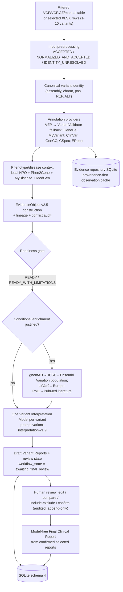

# Clinical Variant Interpretation Platform — Project Declaration & Agent Handoff

**Project:** Clinical Variant Interpretation
**Document role:** Single authoritative handoff record for any agent or contributor
**Last verified against code:** 2026-08-25 (master @ `f741ca8`)
**Primary interface:** Streamlit · **Primary language:** Python 3.13
**Status:** Educational/research decision-support software — NOT a diagnostic device

---

## 0. How to use this document (agent orientation)

This is the unified handoff record for the whole project. Read it top to bottom once;
after that, use it as a reference map.

- Sections **1–2** tell you what the product is and what it must never do.
- Sections **3–8** describe the implemented system as it exists in code today.
- Section **9** is the consolidated history of every workstream and stage register,
  including workstreams that were never recorded in any other committed document.
- Sections **10–13** cover verification, configuration, open defects, and which
  other documents in `docs/` remain load-bearing.

Historical companion documents (`AI_HANDOFF_MASTER_EVIDENCE_GRAPH.md`,
`EVIDENCE_RESILIENCE_IMPLEMENTATION_ROADMAP.md`,
`COMPLETE_CODEX_EXECUTION_ROADMAP.md`) still exist and are referenced by
`AGENTS.md`; where this document and those documents disagree about *current*
state, this document wins because it was verified against code last. Their
semantic contracts (evidence semantics, provider roles, correlation rules) remain
authoritative for meaning; this document records implementation reality.

---

## 1. TL;DR

The application accepts **one to ten already-filtered germline Mendelian variants**
(from VCF, VCF.GZ, explicitly selected Excel `.xlsx` worksheet rows, or a manual
VCF-style table), collects independent annotation / clinical / phenotype /
population / literature evidence for each variant through bounded external
providers, normalizes everything into provenance-aware Evidence Objects, sends only
sanitized normalized evidence to one selected LLM per variant, and presents ordered
evidence + interpretation state for mandatory human review, editing, confirmation,
and composition of a Final Clinical Report (text/PDF/Word/DOCX) — with no further
model calls at finalization.

It deliberately does **not** rank, filter, prioritize, or diagnose. Candidate
selection is an upstream responsibility of the caller (professor/reviewer).

One sentence: *an evidence aggregation and interpretation-support system with
mandatory human review, strict provenance, and hard safety boundaries.*

---

## 2. Non-negotiable safety contract

These boundaries are frozen by professor review (Stage 45) and every roadmap since.
No agent may weaken them.

### 2.1 Frozen product scope

The application receives `1–10 user-preselected variants`. It must never:

```text
rank or prioritize variants
choose Top-N / "best" variants
re-filter selected variants by FILTER/QUAL/DP/GQ
perform autonomous diagnosis
perform autonomous final ACMG classification
execute ClinGen CSpec rules automatically
treat correlated fallback transports as independent biological evidence
fabricate evidence
```

Source quality fields (FILTER/QUAL/DP/GQ) may be displayed as provenance but never
become post-selection filtering rules.

### 2.2 Variant identity contract

Canonical identity = `(assembly, chromosome, position, REF, ALT)`.
rsID, gene, transcript, HGVS strings, worksheet rows, or source representations are
never primary identity. Unresolved identity stays explicit:
`IDENTITY_UNRESOLVED` inputs remain input-level records and never become
annotations, Evidence Objects, or LLM input. Do not provider-shop to overturn a
valid biological/reference mismatch. ANNOVAR-like `REF=0`/`ALT=0` indels are
adapted to non-empty GRCh38 canonical alleles before API handoff; source zero
tokens remain provenance only.

### 2.3 Evidence semantics golden rules

```text
missing != zero
valid no_match != unavailable
operational failure != biological absence
provider outage != negative evidence
no fake evidence
no silent double counting (mirrors/aggregators share upstream sources)
no automatic final classification
no uncontrolled fallback (fallback only after normalized operational failure)
no retry storms (bounded retries, analysis-scoped circuit breakers)
no patient-specific context promoted into global evidence
no raw provider data sent to the interpretation LLM
human review remains mandatory
```

### 2.4 LLM boundary

Exactly two approved LLM roles exist (see §5). Raw API payloads, raw VCF content,
genotypes, sample identifiers, PHI, shadow-composition candidates, wholesale
coverage diagnostics, and rejected `candidate_diagnostics` must never reach either
LLM boundary. The interpretation LLM cannot fetch evidence, invent evidence,
override structured evidence, perform final ACMG classification, or make clinical
decisions.

---

## 3. System architecture

### 3.1 Pipeline flow



Three lifecycle phases:

1. **Analysis** — validate input, collect evidence, audit conflicts, conditionally
   enrich, interpret each variant, prepare review state.
2. **Review** — inspect evidence + interpretation, edit four reviewer-owned report
   fields with append-only replayable history, make audited include/exclude choices,
   confirm every variant (with no-PHI attestation).
3. **Finalization** — validate confirmed state, compose selected-only Final Clinical
   Report deterministically, export text/PDF/Word/DOCX. No model call.

Orchestration entry points live in `backend/pipeline.py` (`run_analysis`,
`run_variant_processing`, `resume_saved_analysis`, `confirm_reviewed_evidence`,
`finalize_reviewed_analysis`, `retry_failed_variant_interpretation`).
Per-variant failure isolation is enforced throughout: one failed variant produces an
explicit outcome record and never erases successful siblings.

### 3.2 Module map

Backend (`backend/`, 62 modules):

| Module | Responsibility |
|---|---|
| `pipeline.py` | Orchestrator; validated `PipelineResult` (schema 3.6); stage/API status tracking; persistence hooks |
| `input_preprocessing.py` | Selected-input outcome contract; ANNOVAR-like adaptation; unresolved-input containment |
| `variant_identity.py` | Deterministic canonical identity |
| `vcf_processing.py`, `excel_processing.py` | Input adapters (VCF/vcf.gz via vcfpy; safe XLSX) |
| `annotation.py` | All core annotation providers (VEP, VariantValidator fallback, GeneBe, MyVariant, ClinVar, GenCC/UCSC, CSpec, ERepo) with batching, retries, caches, fallback chains |
| `phenotype.py` | Local HPO matching/similarity + Phen2Gene client (+ local HPO-gene fallback) |
| `mydisease.py`, `medgen.py` | MyDisease gene-disease-HPO context; MedGen three separate support/context roles |
| `erepo.py` | ClinGen ERepo expert-curated variant context |
| `report.py` | EvidenceObject TypedDict + validation/sanitization + isolated construction + prompt composition |
| `conflict_auditor.py` | Deterministic pre/post-review conflict audits (routing-only) |
| `conditional_enrichment.py` | Bounded gnomAD/UCSC/Ensembl-Variation population + LitVar2/Europe PMC/PubMed literature enrichment |
| `provider_resilience.py` | Shared retry policy, timeouts/backoff, analysis-scoped circuit breakers, `CapabilityResult` contracts |
| `provider_repository.py`, `evidence_repository*.py` | Provenance-first persistent provider-observation cache (SQLite, schema 2) with TTL freshness/maintenance |
| `variant_interpretation.py` | Single-model interpretation boundary; prompt `variant-interpretation-v1.9`; retry/repair/fallback policy; draft AI classification |
| `llm.py` | OpenAI-compatible client; typed error taxonomy; bounded retries; execution-trace hooks |
| `llm_preflight.py` | Pre-analysis model reachability check (isolated) |
| `phenotype_llm.py` | Persian narrative → clinical entities/HPO candidates; prompt `phenotype-extraction-v3.0` |
| `phenotype_selection.py` | Local ontology validation/canonicalization of model suggestions |
| `disease_resolution.py`, `clinical_entities.py` | Explicit disease-entity resolution; case-context sidecar only |
| `privacy.py` | Prohibited-field/pattern gates; exact task-specific LLM payload validators; PHI redaction |
| `evidence_readiness.py`, `final_disposition.py`, `evidence_coverage.py` | READY/BLOCKED readiness, semantic capability disposition, runtime coverage |
| `shadow_composition.py`, `active_annotation_promotion.py` | Observational VEP-outage candidates; gated field-level promotion (gene/transcript/HGVS.c/HGVS.p only) |
| `variant_report.py` | Draft Variant Reports (schema 2.3); audited editing; selection |
| `report_data.py`, `report_data_projection.py`, `report_docx.py`, `report_exports.py`, `report_lifecycle.py`, `final_clinical_report.py`, `final_docx_package.py` | ReportData V4 family, DOCX rendering/export, Final Clinical Report, ZIP package |
| `references.py`, `reference_model.py`, `reference_content.py`, `human_links.py` | Canonical references, literature/data-source separation, human-link resolution |
| `database.py` | SQLite persistence (schema 4); migrations; recovery projections; retention |
| `execution_trace.py` | Bounded backend execution trace observability |
| `classification_evidence.py`, `evidence_rescue.py`, `retrieval_intelligence.py`, `cspec_cache.py`, `fallback_transparency.py`, `provider_readiness.py`, `logging_config.py`, `error_handling.py` | Supporting contracts |

Frontend (`frontend/`): presentation-only projections over backend contracts —
`ui.py` (main workflow), `execution.py` (background job bridge, ≤7200 s timeout,
cancellation, recovery tokens), `analysis_summary.py`, `variant_status.py`,
`warning_semantics.py`, `technical_diagnostics.py`, `source_status.py`,
`evidence_graph.py`, `evidence_review.py`, `report_preview.py`, `report_viewer.py`,
`final_interpretation_view.py` (legacy), `interpretation_failure_semantics.py`,
`provider_readiness.py`, `reference_access.py`, `execution_trace.py`,
`xlsx_selection.py`. UI display semantics never alter backend/source semantics.

Entry: `app.py` → `config.py` settings validation → redacted structured logging →
`frontend/ui.render_app()`.

---

## 4. Provider matrix and fallback chains

| Provider | Semantic node(s) | Role / fallback position |
|---|---|---|
| Ensembl VEP REST | `annotation` | Primary consequence/transcript/gene source |
| VariantValidator REST | `annotation` (composition) | Operational-only VEP fallback: validation + HGVS/gene/transcript mapping; never supplies VEP consequence/impact/MANE fields |
| GeneBe | `automated_acmg_context` | Independent automated ACMG context; outage ⇒ UNAVAILABLE, no fallback (ERepo is never relabeled as GeneBe fallback); evidence, not final verdict |
| MyVariant.info | aggregation + correlated ClinVar rescue | Exact assembly-aware aggregation; ClinVar-derived rescue after direct-ClinVar operational failure (single-vote lineage preserved); Ensembl-Variation exact-overlap fallback on its own outage |
| NCBI ClinVar E-utils | `clinvar_clinical_evidence` | Primary direct clinical significance/review status/accessions; valid no-record = missingness |
| UCSC GenCC track | `gene_disease_validity` | Only source of ClinGen-submitted validity claims |
| ClinGen CSpec Registry | `cspec_context` | Registry metadata only; local last-known-good cache after operational failure; rules never executed |
| ClinGen ERepo | `expert_curated_variant_context` | Expert-curated variant context; exact CPRA/build identity |
| Phen2Gene | `phenotype_gene_ranking` | One call per analysis; never reorders variants; local HPO-gene overlap fallback on operational failure |
| MyDisease.info | `disease_hpo_context` | Bounded MONDO-validated gene-first disease context |
| NCBI MedGen E-utils | `gene_disease_support`, `phenotype_gene_support`, `disease_hpo_context` | Source-labelled support only — never GenCC validity, never rank/score |
| gnomAD GraphQL | `population_evidence` | Conditional-enrichment primary (exact allele, assembly dataset r2_1/r4) |
| UCSC gnomAD mirror | `population_evidence` | Verification-only mirror continuation (shared upstream provenance, not an independent vote) |
| Ensembl Variation REST | `population_evidence` / overlap | Operational fallback for gnomAD or MyVariant |
| LitVar2 → Europe PMC → PubMed | `literature_evidence` | Bounded conditional literature chain with deduplication |
| UCSC sequence API | identity infrastructure | hg38 reference-sequence access after Ensembl sequence operational failure; not biological evidence |
| Monarch API | — | Config metadata only; never called |

Fallback activation rule: only after a **normalized operational failure**, never
after valid `no_match`/`not_found`. Every degraded result retains actual provider,
method, primary failure, and lineage in Evidence Object and reports. Overlapping
routes are transport paths, not independent biological votes.

---

## 5. LLM boundaries (exactly two roles)

### Role A — Persian clinical entity extraction

`backend/phenotype_llm.py`, prompt version **`phenotype-extraction-v3.0`**.

- Input: only `task=extract_clinical_entities` + bounded, de-identified,
  privacy-redacted `clinical_text_fa` (≤4000 chars).
- Output: strict JSON with bounded `clinical_entities` +
  `unmapped_clinical_phrases`. Every entity has grounded source text, explicit type
  `PHENOTYPE` or `DISEASE`, and assertion state `PRESENT`/`SUSPECTED`/`NEGATED`/
  `HISTORICAL`. HPO IDs allowed only for present phenotypes.
- Prohibited: diagnosis, unsupported disease inference from symptom clusters,
  invented identifiers, variant interpretation, treatment advice. Empty list =
  insufficient evidence.
- Candidates then pass local ontology validation (`phenotype_selection.py`) and
  require **explicit user acceptance** before entering the analysis HPO set.
  Extraction failure leaves manual HPO search fully available.
- Explicit DISEASE entities go through a deterministic resolver
  (`disease_resolution.py`); results are case-context `disease_resolutions`
  sidecar metadata only — they never enter accepted HPO terms, Phen2Gene,
  EvidenceObjects, ACMG logic, interpretation prompts, or reports.
- Clinical narrative circularity guard: user-entered disease names are case
  context, never proof of disease or pathogenicity. Negated/suspected/historical
  assertions never silently become positive evidence.

### Role B — Variant interpretation

`backend/variant_interpretation.py`, prompt version **`variant-interpretation-v1.9`**,
result schema **1.3** (1.1/1.2 accepted for persisted compatibility).

- Input: exactly one validated, sanitized EvidenceObject per variant
  (`shadow_free_evidence_for_llm()` strips shadow/prohibited fields;
  `privacy.validate_llm_payload()` enforces minimum data), plus readiness audit and
  a URL-free canonical-reference catalog (literature citation IDs like `[R1]` only).
- One `VARIANT_INTERPRETATION_MODEL` for every variant regardless of conflict
  state; meaningful conflict changes only the bounded instruction mode.
- Recovery policy: one transient retry, one constrained structured-output repair,
  optional operational-only `VARIANT_INTERPRETATION_FALLBACK_MODEL` — never
  difficulty/conflict routing.
- Output contract: interpretation, conflict assessment, four-valued phenotype
  conclusion (supported / partially supported / no supported association found /
  phenotype evidence unavailable — unsupported phenotype never becomes negative
  pathogenicity evidence), warnings, draft AI classification with calibrated policy,
  normalized grouped citations `[Rn]`. Fabricated citations, response URLs,
  oversized/unbounded text fail closed.
- Failure taxonomy: twelve stable categories with secret-free structured
  diagnostics; per-variant isolation with reviewer-triggered retry from persisted
  evidence.

Provider protocol is exclusively `openai_compatible` (`LLM_BASE_URL`,
`LLM_API_KEY`, task-specific model names). Default-model promotion requires the
Stage 91 seven-case live benchmark gate; offline fixtures can never promote a model.

---

## 6. Evidence semantics

- **EvidenceObject schema 2.5**: normalized variant identity, assembly,
  source-specific evidence, phenotype context, provider statuses, warnings,
  provenance, bounded lineage (65,536-byte envelope; fixed compaction policy when
  MyDisease context exceeds budget). Raw payloads/sample/genotype fields excluded.
- **Semantic nodes**: `annotation`, `automated_acmg_context` (GeneBe only),
  `expert_curated_variant_context` (ERepo only), `clinvar_clinical_evidence`
  (direct NCBI; MyVariant-derived rescue is correlated, single-vote),
  `cspec_context` (metadata only), `gene_disease_validity` (GenCC only),
  `gene_disease_support` (MedGen only), `phenotype_gene_ranking` (Phen2Gene only),
  `phenotype_gene_support` (MedGen/local only), `disease_hpo_context`
  (source-separated MyDisease/MedGen), `population_evidence`, `literature_evidence`.
- **Coverage (runtime-only, schema 1.0)**: classifies paths as critical/important/
  optional; states `FULL`, `DEGRADED`, `UNAVAILABLE`, `NOT_TRIGGERED`,
  `NOT_APPLICABLE`; retrieval states kept separate; not persisted, not a score.
- **Internal readiness**: `READY`, `READY_WITH_LIMITATIONS`, `RESCUE_REQUIRED`
  (reassessed after enrichment; never survives as final),
  `MINIMUM_IDENTITY_FAILURE`.
- **Final disposition (runtime schema 1.0)**: `READY`,
  `READY_WITH_LIMITATIONS`, `BLOCKED`. BLOCKED is reserved for structural/
  minimum-safety (identity) failures; safe sparse evidence or a provider outage
  alone never blocks.
- Reviewer-facing axes stay separate: provider operational status vs query
  retrieval result vs per-variant semantic capability (e.g., unavailable GenCC +
  accepted MedGen support = validity UNAVAILABLE, support FULL — never converted).
- **Conflict auditing**: deterministic pre-review audit embedded in EvidenceObject
  construction; post-review audit at confirmation. Routing-only — it changes prompt
  mode/enrichment decisions, never classifications.
- **VEP-outage composition (gated promotion)**: under proven VEP operational
  failure, only `gene`, `transcript`, `HGVS.c`, `HGVS.p` may be promoted after
  exact build/versioned same-transcript proof; consequence/impact/MANE/canonical
  are never promoted; non-VEP values are never attributed to VEP.

Full semantic rationale lives in `AI_HANDOFF_MASTER_EVIDENCE_GRAPH.md`.

---

## 7. Persistence, schemas, and recovery

Active pipeline schema: `3.6`. Active schema versions verified in code on
2026-08-25:

| Artifact | Constant | Value |
|---|---|---|
| Pipeline result | `PIPELINE_SCHEMA_VERSION` (`pipeline.py`) | **3.6** |
| SQLite database | `DATABASE_SCHEMA_VERSION` (`database.py`) | **4** |
| EvidenceObject | `EVIDENCE_SCHEMA_VERSION` (`report.py`) | **2.5** |
| Evidence construction outcome | `EVIDENCE_CONSTRUCTION_OUTCOME_SCHEMA_VERSION` | 1.0 |
| Variant Interpretation Result | `VARIANT_INTERPRETATION_SCHEMA_VERSION` | **1.3** (1.1–1.2 read-compatible) |
| Draft Variant Report | `DRAFT_VARIANT_REPORT_SCHEMA_VERSION` (`variant_report.py`) | **2.3** (2.2 read-compatible) |
| Reference Model | `reference_model.py` | 2.x (literature vs data-source separation) |
| ReportData | `REPORT_DATA_SCHEMA_VERSION` (`report_data.py`) | **4.0** |
| Final Clinical Report | `FINAL_CLINICAL_REPORT_SCHEMA_VERSION` | **2.0** |
| Report Lifecycle / Integrity / Review / Confirmation | various | 1.0 |
| Evidence repository DB / record | `evidence_repository.py` | **2** / **"1.0"** |
| Prompt versions | — | `phenotype-extraction-v3.0`, `variant-interpretation-v1.9` |

Notes:

- Pipeline 3.4+ persists per-selected-input preprocessing outcomes (source
  provenance, status, warnings) and per-canonical-variant construction outcomes;
  failed entries retain only canonical identity plus safe step/field/code/scope
  diagnostics. 3.3 snapshots migrate without provider/model reruns.
- 3.5 added case-specific `clinical_entities`; 3.6 added nullable
  `disease_resolutions` sidecar. SQLite stays 4; recovery request schema 4 carries
  bounded clinical entities.
- Analysis DB: `storage/database/clinical_variant.sqlite3`. Tables include
  analyses, candidate variants, evidence objects, reports, pipeline states, V3
  lifecycle projection, and V4 report-recovery projection (atomic delete+insert,
  validated against the canonical snapshot on load; restart recovery never reruns
  interpretation).
- Refresh/restart recovery: browser holds only an opaque token; a private one-hour
  checkpoint stores normalized variants, HPO terms, reviewed clinical entities,
  task model choices, extraction provenance — never raw VCF. Persisted drafts
  reload by random analysis ID; interrupted unpersisted work reruns from sanitized
  input; legacy Output A/B payloads return an explicit unsupported-resume error.
- **Evidence repository** (`storage/evidence_repository/evidence_repository.sqlite3`)
  is a provenance-first global provider-observation cache keyed by canonical
  identity: preserves provider/upstream source/semantic node/query identity/
  exact-match proof/retrieved_at/release/freshness/normalization version/correlation
  group. Fresh hits may skip provider calls (TTLs: default 24 h; gnomAD 7 days);
  stale entries re-query; operational failures are never cached as biological
  absence; changing evidence is versioned, not destructively overwritten; global
  knowledge stays strictly separated from case-specific patient context.
- Retention: count-based cleanup (`ANALYSIS_RETENTION_*`) protects active analyses
  and failed-audit records by default.

---

## 8. Human review workflow

1. Reviewer sees per-variant Draft Variant Reports (immutable machine original +
   editable reviewed copy beginning identical).
2. Editable fields (whitelist): reviewer summary, interpretation narrative,
   conflict-assessment wording, reviewer notes. Everything else is immutable.
3. Each edit appends a sequence-numbered record (path, old/new, UTC timestamp,
   bounded reviewer context). Validation replays history from the integrity-checked
   original and must reproduce the current report exactly. Resets append reverse
   edits.
4. Per-variant `include_in_final_report` boolean with append-only selection
   history — a reporting choice only, never a rank. Excluded reports remain fully
   persisted/recoverable.
5. Confirmation requires an explicit no-PHI attestation per variant; any edit or
   selection change invalidates prior confirmation.
6. Finalization validates complete confirmed state and composes the selected-only
   Final Clinical Report without another model call; exports preserve allowlisted
   canonical hyperlinks (numbered literature references; unnumbered data-source
   provenance; raw machine endpoints can never become ordinary links).

UI surfaces reflect pipeline semantics (`Selected inputs`, `Canonical variants`,
`Annotated variants`, `EvidenceObjects`, `Interpreted variants`) — never stale
"filtered variants" wording. Primary-provider failure and fallback success are
displayed separately; technical provider detail lives in collapsed drawers.

---

## 9. Workstream & stage history (unified register)

Four sequential workstreams produced the current system. This section is the
single consolidated record; details of superseded roadmap documents were folded
here intentionally.

### Workstream A — Declaration Stages 0–115 (original roadmap)

Stages **0–114 Complete**; stages 18, 20, 21, 26 intentionally unnumbered.
Highlights by arc:

- **0–16 MVP**: scope/config/input foundations; VEP/MyVariant/ClinVar/ClinGen
  annotation; HPO management; EvidenceObject V1; LLM client; clinical report;
  pipeline; Streamlit; SQLite persistence; offline gates; redacted logging;
  security hardening; MVP acceptance.
- **17**: professor-review governance checkpoint.
- **19–44**: repository reality audit; annotation hardening (exact assembly-aware
  VEP matching, GeneBe, direct ClinVar, GenCC/CSpec, Phen2Gene, MyDisease);
  EvidenceObject V2 + lineage + conflict audit + conditional enrichment; evidence
  review/editing; two-layer routing era (Stage 35/36/40 — now historical only);
  Phase A/B split (superseded); resilience/privacy/Testing V2; Stage 44 five-variant
  acceptance gate (now legacy).
- **45**: professor-review incorporation; V3 architecture freeze; retired Output
  A/B and dual-routing for new analyses.
- **46–62 (V3 product)**: centralized 10-variant limit + expanded input; Persian
  phenotype-extraction LLM contract; local HPO validation/acceptance; task-specific
  model UI; single-model interpretation contract; interpretation-before-review
  pipeline; Draft Variant Report V2; audited editing/history; per-variant final
  selection; canonical references; Final Clinical Report composer; persistence V3 +
  migration; privacy reverification; Testing V3; Stage 60 release gate (active in
  GitHub Actions); Stage 61 live provider/link validation; Stage 62 documentation +
  demo workbook (`data/samples/stage62_demo_variants.xlsx`; worksheet 2 contains a
  marker that must never be processed).
- **63–78 (provider resilience)**: operational-status taxonomy; shared request
  wrapper (connect/read deadlines, Retry-After, analysis-scoped circuits); local
  HPO-gene fallback; population fallback chain; ClinVar-derived rescue; literature
  resilience chain; MyDisease degraded mode; VEP→VariantValidator and
  MyVariant→Ensembl-Variation fallbacks; CSpec LKG cache; unified capability
  results; transparency notices; deterministic failure injection; reachability
  checker; documentation consolidation; Stage 78 resilience acceptance gate.
- **79–105 (report-first)**: acceptance-defect freeze; professor-PDF-derived
  specification; ReportData V4 contract; authoritative DOCX template; fidelity gate;
  in-app HTML preview; document-region editing; per-variant report lifecycle;
  cardinality/integrity ledger; interpretation failure taxonomy; recovery policy;
  phenotype non-concordance; Stage 91 model-quality benchmark; Reference Model V2;
  human-link resolver + regression matrix; analysis summary; status cards; warning
  semantics V2; diagnostics drawer; persistence V4; DOCX export/ZIP package; visual
  regression harness; interpretation acceptance suite; reference acceptance suite;
  status/warning UX suite; professor-testcase E2E.
- **106–114 (post-acceptance defect fixes)**: Persian multi-concept extraction;
  valid no-match rescue; cross-provider identifier intelligence; exact ClinVar
  retrieval; scoped CSpec applicability; deterministic evidence readiness;
  secondary classification recovery; classified interpretation retry; reviewer
  source-status semantics.
- **115**: final Word/LibreOffice visual sign-off + external professor sign-off —
  **Pending** (as is the Stage 83 manual DOCX visual comparison).

### Workstream B — Evidence-resilience Stages 1–11 (COMPLETE / APPROVED; closed 2026-08-17)

Approved historical implementation workstream integrating ClinGen ERepo and NCBI
MedGen after network probes killed Monarch/Open Targets/PanelApp alternatives.
Recorded in `EVIDENCE_RESILIENCE_IMPLEMENTATION_ROADMAP.md` and
`AI_HANDOFF_MASTER_EVIDENCE_GRAPH.md`.

| Stage | Outcome |
|---|---|
| 1 | Frozen ERepo response shape + exact CPRA/assembly identity contract + fixtures |
| 2 | Production ERepo integration (`backend/erepo.py`) as `expert_curated_variant_context`; not a GeneBe replacement |
| 3 | Shared bounded MedGen E-utils client + disease/HPO context role |
| 4 | MedGen phenotype-gene supporting evidence (never rank/score) |
| 5 | MedGen gene-disease supporting evidence (never GenCC validity) |
| 6 | Gated field-level VEP-outage annotation composition/promotion (shadow schema 1.0) |
| 7 | Runtime-only per-variant coverage calculator (schema 1.0) |
| 8 | Capability states + derived final disposition mapping |
| 9 | Deterministic resilience tests + bounded live validation |
| 10 | Failure-driven input-to-LLM trace audit; fixed `candidate_diagnostics` leak via `shadow_free_evidence_for_llm()` |
| 11 | Documentation closeout reconciling declaration/handoff/README/.env.example |

Closed; **no Stage 12 authorized**.

### Workstream C — Live-run stabilization + extensions (ACTIVE Codex roadmap)

Defined in `COMPLETE_CODEX_EXECUTION_ROADMAP.md` (created 2026-08-17 after a real
professor-workbook run exposed runtime defects; execution model: one stage at a
time, STOP for external review after each).

| Stage | Content | Status (verified via git history) |
|---|---|---|
| 1 | Evidence-construction root-cause audit | Complete (`LIVE_STAGE_1_AUDIT_COMPLETE`) |
| 2 | Evidence-construction resilience + per-variant isolation | Complete |
| 3 | Provider failover/retry orchestration + readiness-aware fast fail | Complete (approved commit baseline) |
| 4 | Observability + UI semantic cleanup + Arrow-safe display | Complete |
| 5 | Final deterministic + live acceptance closeout | Complete (commit `0a48517` "stage 5 finalized") |
| 6 | Persian clinical-narrative dual-entity extraction + disease-aware routing | Complete (commits `a7bb13c`…`a283673`) |
| 7 | Persistent provenance-first evidence cache/repository | Complete (commits `e75ef92`, `b951948`, `8a25afb`; freshness/maintenance follow-ups) |
| 8 | Franklin free external-validation / benchmark layer | **NOT implemented — registered as Pending/on hold awaiting supervisor decision** |

Note: this roadmap's own "Current Roadmap Status" section still reads "NOT
STARTED" for all stages — that section is stale and superseded by this register.
Its frozen scope/baseline sections remain binding.

Franklin constraint (binding whenever Stage 8 resumes): manual Community
Variant/Gene search + free-case allowance only as an External Manual Validation /
Benchmark layer; no scraping, undocumented endpoints, headless ingestion,
credential automation, rate-limit circumvention, or paid dependency; Franklin is
never ground truth — disagreement creates reviewer attention only; manual
observations preserve source/date/canonical variant checked/exposed upstream.

### Workstream D — Stage 9.2 / 10 / 11 series (implemented 2026-08-24)

**This series has NO committed defining roadmap document.** It was implemented in
the commit range following Workstream C Stage 7 and is registered here as the
authoritative record until a defining document is provided. Its only companion
audit outputs (`stage_11_2_analysis_lifecycle_audit.md`,
`stage_11_3_variant_failure_isolation_audit.md`) were folded into this register
and deleted in the 2026-08-25 documentation cleanup (§13).

| Sub-stage | Content | Commits / tests |
|---|---|---|
| 9.2.x | Draft AI classification added to interpretation output; classification calibration tests; calibration policy fix; grouped reference-citation normalization | `41f1246`, `eb34dbf`, `dcb72e2`, `bbc8904`; `tests/test_stage9_2_*` (contract, calibration, policy, citations) |
| 10.1 | Bounded backend execution trace across pipeline/LLM/provider layers | `0165864`; `tests/test_stage10_1_execution_trace.py` |
| 10.2 | UI rendering of the analysis execution trace | `010a70c`; `tests/test_stage10_2_execution_trace_ui.py` |
| 11.1 | Field-level interpretation validation | inside `600876c`; `tests/test_stage11_1_field_level_interpretation_validation.py` |
| 11.2 | Analysis-lifecycle stability (incl. whole-analysis deadline `ANALYSIS_MAX_RUNTIME_SECONDS`, watchdog, registry pruning) | `600876c`; `docs/stage_11_2_analysis_lifecycle_audit.md`; `tests/test_stage11_2_analysis_lifecycle.py` |
| 11.3 | Variant failure-isolation hardening | `600876c`; `docs/stage_11_3_variant_failure_isolation_audit.md`; `tests/test_stage11_3_variant_failure_isolation.py` |
| 11.4 | Legacy provider-status UI removal | `b3b25bf`; `tests/test_stage11_4_legacy_provider_ui_removal.py` |
| misc | Report narrative audit fix; reference-content access + rate-limit retry hardening ("finalized 90%") | `ad6d481`, `f741ca8` |

The working tree at registration time contains one dirty tracked file
(`storage/evidence_repository/evidence_repository.sqlite3` — see Open Item O-1).

---

## 10. Verification & gates

The automated suite is **offline by design** (suite-wide HTTP blocking unless a
live diagnostic is explicitly enabled) — deterministic, no quota consumption.

Measured full-suite baseline on **2026-08-25** (master `f741ca8`):

```text
1747 passed, 3 failed, 6 skipped   (duration ≈ 108 s)
```

The three failures are pre-existing open defects (§12, O-1..O-3), not caused by
documentation work; the last all-green recorded baselines were
**1476 passed / 6 skipped** (selected-input smoke era) and **1133 passed / 6
skipped, 85.83% coverage** (resilience closeout era).

Commands:

```powershell
.\.venv\Scripts\python.exe -m pytest -q                          # full offline suite
.\.venv\Scripts\python.exe tests\run_stage59_testing_v3.py       # Testing V3 (≥80% coverage gate)
.\.venv\Scripts\python.exe tests\run_stage60_acceptance.py       # V3 release gate (CI-active)
.\.venv\Scripts\python.exe tests\run_stage78_resilience_acceptance.py
.\.venv\Scripts\python.exe tests\run_live_provider_validation.py # bounded LIVE gate (manual; consumes quota; --skip-llm optional)
.\.venv\Scripts\python.exe tools\provider_reachability.py        # quick DNS/HTTP check (network-dependent, excluded from CI)
```

Testing V3 verifies eight requirement groups (Input, Phenotype, Interpretation,
Draft Report, Selection, Reference, Final Report, Recovery/Retry), blocks
unmocked HTTP suite-wide, and enforces ≥80% coverage. The Stage 60 gate runs on
every push/PR (`.github/workflows/verify.yml`). Last full Stage 61 live gate
passed **2026-08-09** (point-in-time result, not an availability guarantee).

A passing offline gate proves application contracts and failure handling — never
current provider availability or schema stability.

---

## 11. Configuration & runbook

Windows is the primary verified environment; Python 3.13; dependencies exactly
pinned (`requirements.txt` runtime, `requirements-dev.txt` test tooling).

```powershell
git clone <repository-url>; cd clinical_variant_app
python -m venv .venv
.\.venv\Scripts\python.exe -m pip install -r requirements.txt
Copy-Item .env.example .env     # then edit — never commit .env
.\run_app.bat                   # or: python app.py / streamlit run app.py
```

Minimum `.env` values: `GENOME_ASSEMBLY` (GRCh37|GRCh38), `LLM_PROVIDER=openai_compatible`,
`LLM_BASE_URL`, `LLM_API_KEY`, `LLM_MODEL`, `PHENOTYPE_EXTRACTION_MODEL`,
`VARIANT_INTERPRETATION_MODEL` (+ optional `VARIANT_INTERPRETATION_FALLBACK_MODEL`,
bounded retries/max-tokens for both tasks, `ANALYSIS_MAX_RUNTIME_SECONDS` 1–7200).

Key control groups (all documented in `.env.example`, validated in `config.py`):
per-provider base URLs/timeouts/retry caps; UCSC sequence fallback controls;
enrichment flags/limits (`ENABLE_GNOMAD_DEEP_LOOKUP`,
`ENABLE_LITERATURE_ENRICHMENT`, caps of 10 variants/articles); annotation cache;
CSpec LKG cache path; MedGen/ERepo enable switches; evidence-repository path/TTLs;
analysis retention; upload/log/storage paths; HPO release URLs and coordinated
local datasets (`data/hpo/hp.obo`, `phenotype_to_genes.txt`, `phenotype.hpoa` —
update all three together via the in-app action).

Demo runbook: use `data/samples/stage62_demo_variants.xlsx` (show worksheet 2's
`THIS_SHEET_MUST_NOT_BE_PROCESSED` marker first, then process the real sheet);
demonstrate model selection, Persian extraction, HPO acceptance, ordered analyses,
one audited edit, one exclusion, attestations/confirmations, model-free
finalization, exports, and one validated link. If a live source fails during demo,
explain the explicit no-match/unavailable state — never rewrite it as negative
clinical evidence.

Storage layout:

| Path | Purpose |
|---|---|
| `storage/database/clinical_variant.sqlite3` | Validated Draft/Confirmed pipeline snapshots |
| `storage/evidence_repository/evidence_repository.sqlite3` | Global provider-observation cache (must NOT be git-tracked — see O-1) |
| `storage/uploads/`, `storage/reports/`, `storage/logs/` | Bounded temporary uploads; artifacts; rotating redacted log |
| `data/cache/`, `data/hpo/` | App cache; coordinated HPO datasets |

Privacy/security baseline: secrets only in `.env`; sample/genotype/patient columns
stripped at input boundary; defensive PHI/credential/raw-VCF log redaction;
Persian-labelled identifiers + Iranian mobile numbers redacted before extraction
and rejected from stored content; exact task-specific payload validators prevent
cross-task mixing; unselected worksheets/rows eliminated before every downstream
boundary; confirmation-gated PHI attestation; verified HTTPS + explicit deadlines
everywhere. Free-text detection is defense in depth — users must still supply
de-identified text. Application-level baseline only; institutional deployment
requires authN/authZ, encryption/KMS, retention, backups, monitoring, threat
modeling, and formal regulatory review.

---

## 12. Open items & known limitations

### Open defects (measured 2026-08-25; fixing them requires code/test changes — out of scope for documentation passes)

| ID | Severity | Description |
|---|---|---|
| O-1 | High | `storage/evidence_repository/evidence_repository.sqlite3` is git-tracked and modified; Stage 15 secrets audit fails (`sensitive_file_tracked`/`sensitive_file_committed`). Fix: untrack + ignore the runtime DB (repo hygiene change). |
| O-2 | Medium | `test_external_api_status_panel_shows_each_service_state` expects label `'ClinGen/GenCC (UCSC)'` absent from current rendered panel — test/UI drift after Stage 11.4 legacy provider-UI removal (`b3b25bf`). |
| O-3 | Medium | `test_repository_cache_hit_is_distinct_from_live_provider`: expected fresh cache hit returns `outcome=miss` and falls through to the live call — logic defect in `provider_repository.execute_provider_with_repository` cache-hit path. |

### Pending milestones

- Stage 83 manual Word/LibreOffice DOCX visual-fidelity comparison.
- Stage 115 final visual sign-off + external professor feedback/sign-off.
- Workstream C **Stage 8 (Franklin)** — pending/on hold awaiting supervisor decision.
- Stage 91 default-model promotion — requires ≥2 complete live, human-reviewed
  candidates; offline fixtures can never promote.

### Structural limitations

1. Assumes pre-filtered input; must never be presented as a genome-wide
   prioritization engine.
2. External APIs can change/throttle/vanish; run live smokes before demos.
3. CSpec is contextual metadata only — no rule engine. GeneBe is evidence, never
   the application's final classification.
4. Human review required for every variant before finalization.
5. Restart recovery cannot resume an exactly-interrupted HTTP call; multi-instance
   production would need a durable distributed queue.
6. SQLite fits the bounded single-application workflow, not multi-user clinical
   production.
7. Interpretation quality depends on upstream data quality, evidence currency,
   reviewer judgment, prompt/model behavior, and phenotype completeness.
8. Documentation drift risk: several historical `docs/*.md` files and README
   numbers lag behind code (this document is the verified reference as of
   2026-08-25).

---

## 13. Document map & cleanup guidance

### Executed cleanup (2026-08-25)

The following thirteen superseded/audit documents were **deleted** after their
facts were folded into this declaration (mostly §9) and after confirming zero
references from code, tests, tools, README, or AGENTS.md:
`Clinical_Variant_Active_Codex_Roadmap_After_Stage3.md`,
`EREPO_EXACT_IDENTITY_CONTRACT.md`, `input_preprocessing_stage1_audit.md`,
`live_run_stage1_evidence_construction_audit.md`,
`live_run_stage3_provider_resilience_audit.md`,
`persian_clinical_entity_extraction.md`, `stage_4_3_audit_and_acceptance.md`,
`stage_6_1_clinical_entity_contract_audit.md`,
`stage_8_performance_optimization_audit.md`, `stage_9_resilience_validation.md`,
`stage_10_failure_driven_trace.md`, `stage_11_2_analysis_lifecycle_audit.md`,
`stage_11_3_variant_failure_isolation_audit.md`.

### Remaining documents and why each is load-bearing

| Document | Kept because |
|---|---|
| `AGENTS.md` | Agent operating contract |
| `COMPLETE_CODEX_EXECUTION_ROADMAP.md` | Active roadmap definition (Workstream C); STATUS section stale but scope/stage specs binding |
| `AI_HANDOFF_MASTER_EVIDENCE_GRAPH.md` | Authoritative evidence-semantics/correlation/LLM-boundary/human-review contracts |
| `EVIDENCE_RESILIENCE_IMPLEMENTATION_ROADMAP.md` | Closed Workstream B record (referenced by AGENTS.md and doc-consistency tests) |
| `docs/PROJECT_DECLARATION.md` | This document |
| `acceptance_failures_v1.md` | Referenced by `tests/test_stage79_acceptance_assets.py` |
| `professor_report_template_spec.md`, `report_style_spec.yaml`, `stage_80_progress.md` | Referenced by `tests/test_stage80_specification.py`; authoritative report design reference for pending Stages 83/115 visual work |
| `stage_82_template_contract.md` | Referenced by `tests/test_stage82_docx_template.py` |
| `stage_83_fidelity_gate.md` | Referenced by `tests/test_stage83_docx_fidelity.py` |
| `stage_6a_counterfactual_audit.md` | Generated/read by `tools/generate_stage6a_counterfactual_audit.py` and `tests/test_stage6a_shadow_composition.py` |
| `input_preprocessing_stage2b.md`, `stage2c.md`, `stage3.md` | Active behavioral contracts (zero-allele adaptation, reference-route semantics, selected-input workflow) hyperlinked from README |

Deletion rule going forward: never delete a document referenced by an executable
test, tool, README link, or by `AGENTS.md` without updating the referencing
artifact in the same reviewed change.

---

## 14. Completion statement

As of 2026-08-25 the implemented system comprises: Declaration Stages 0–114
(complete), the closed evidence-resilience workstream 1–11, Codex-roadmap Stages
1–7 (complete), the implemented-but-undocumented Stage 9.2/10/11 series, and
pending items listed in §12 (Stage 8 Franklin, Stage 83/115 visual sign-offs,
three open defects O-1..O-3). The platform provides a coherent evidence-collection,
single-model interpretation-before-review, and human-confirmation workflow within
explicit safety boundaries. Any agent continuing work here should: honor §2
without exception, treat §7's schema table as ground truth over older documents,
check §9 before assuming a stage is done or undone, and STOP for external review
at stage boundaries per `AGENTS.md`.
