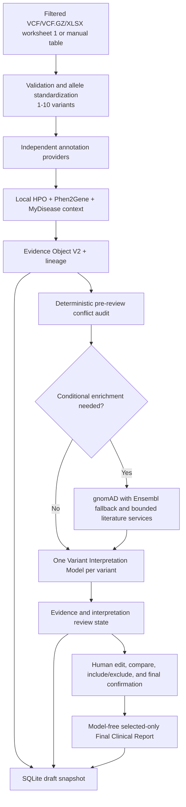

# Clinical Variant Interpretation Project Declaration

**Project:** Clinical Variant Interpretation  
**Implementation status:** Stage 76 reachability regression utility complete
**Current release gate:** Stage 60 V3 acceptance passed; Stage 61 live gate passed
**Next checkpoint:** Stage 77 documentation and configuration
**Document date:** 2026-08-09
**Primary interface:** Streamlit  
**Primary language:** Python

## 1. Executive declaration

This repository implements an evidence-centered clinical variant interpretation
workflow for one to ten already-filtered germline Mendelian variants. It accepts a
filtered VCF/VCF.GZ file, the first worksheet of an Excel `.xlsx` workbook, or a
manual VCF-style table, validates and standardizes each allele, collects independent
annotation and phenotype evidence, interprets every variant with one selected model,
then presents ordered evidence and interpretation state for human review and final
confirmation. Per-variant model failures remain explicit without removing collected
evidence or successful interpretations.

The application is clinical decision-support software for educational and research
use. It does not diagnose disease, prescribe treatment, replace ACMG/AMP expert
judgment, or replace review by a qualified genetics professional.

The professor review on 2026-08-08 changed the accepted target architecture. Stage
45 froze that architecture, and Stages 46-62 implement and document its input,
phenotype,
model-selection, interpretation-before-review, reviewed-report, selection, reference,
Final Clinical Report, persistence, recovery, privacy, testing, V3 release gate, and
bounded live validation. Stages 63-66 begin the separate provider-resilience roadmap
with central operational-status, retry, timeout, circuit, and fallback-provenance
contracts. Stages 66-72 apply those contracts to population, ClinVar, literature,
MyDisease, VEP-dependent annotation evidence, MyVariant degraded operation, and
CSpec last-known-good metadata.
The authoritative
V3 target is defined in
[`STAGE45_ARCHITECTURE_CONTRACT.md`](STAGE45_ARCHITECTURE_CONTRACT.md). Sections
describing Output A, Output B, or two-layer routing are historical Stage 44 facts;
they are not part of the active workflow for new analyses.

## 2. Current project boundaries

### In scope

- One to ten professor-filtered variants in VCF, VCF.GZ, first-worksheet-only
  Excel `.xlsx`, or manual-table form.
- Explicit GRCh37 or GRCh38 assembly handling.
- Germline Mendelian evidence collection and interpretation support.
- SNV/indel allele validation, multiallelic splitting, and input-order preservation.
- Independent evidence collection from variant, clinical, population, disease,
  phenotype, specification, and literature sources.
- Human-editable evidence, immutable machine originals, confirmation invalidation
  after edits, and append-only review history.
- One selected Variant Interpretation Model applied before final review.
- Local SQLite persistence, secure report exports, audit metadata, failure
  isolation, and browser-refresh recovery.

### Explicitly out of scope

- Raw-VCF filtering, clinical prioritization, ranking, or Top-N selection.
- Autonomous pathogenicity classification or diagnosis.
- Automatic application of ClinGen CSpec rules.
- Treatment recommendations or independent medical decisions.
- Sending raw VCF records, sample names, genotypes, or patient columns to an LLM.
- Production identity management, role-based access control, cloud deployment,
  multi-institution workflows, or regulatory certification.

### Stage 46 input contract

`MAX_VARIANTS_PER_ANALYSIS = 10` in `config.py` is the single active limit for
VCF, manual, Excel, frontend, and recovery validation. The limit applies after
multiallelic splitting, so no supported input route can produce more than ten
normalized variants.

Excel `.xlsx` input reads worksheet index 0 only. Later worksheets are not iterated
and cannot enter normalized input, recovery checkpoints, persistence, logs,
provider calls, LLM payloads, or exports. Required headers are `CHROM`, `POS`,
`REF`, and `ALT`; `QUAL` and `FILTER` are optional. Matching is case-insensitive
with deterministic aliases: `#CHROM`/`Chromosome`, `Position`, `Reference`,
`Alternate`/`Alternative`, `Quality`, and `Filter status`. Unknown columns are
discarded before pipeline entry.

Excel rows are projected onto the established manual-table structure and pass
through the same assembly, coordinate, allele, ordering, and multiallelic
validation. Excel therefore adds an input adapter, not a separate interpretation
pipeline.

### Stage 47 phenotype-extraction LLM contract

`backend/phenotype_llm.py` defines one dedicated task:
`extract_hpo_candidates`. Before any model request, the Persian clinical description
must be non-empty, no longer than 4,000 characters, free of invalid control
characters, and redacted by the shared privacy layer. The outbound user payload is
limited to `clinical_text_fa` and `task`; raw VCF data, genotypes, sample data, and
identifiers are prohibited.

The model response uses a strict JSON-schema contract containing only a bounded
`candidates` array. Every candidate must contain exactly `hpo_id`, `label`, and
`source_phrase_fa`. Stage 47 enforces the exact `HP:ddddddd` format, bounded text,
unique identifiers, safe completion state, and strict response fields. These are
format-level checks; Stage 48 performs the separate local ontology acceptance gate.

The system prompt restricts this model to phenotype extraction and prohibits
diagnosis, unsupported disease inference, invented HPO identifiers, variant
interpretation, and treatment recommendations. Insufficient evidence produces an
empty candidate list. `PHENOTYPE_EXTRACTION_MODEL` and
`VARIANT_INTERPRETATION_MODEL` are separate validated settings. Provider failures
remain explicit and do not disable the existing manual HPO path.

### Stage 48 local validation and explicit acceptance

`backend/phenotype_selection.py` validates every model suggestion against the
installed `hp.obo` ontology. Alternate identifiers are resolved to their canonical
active terms, model-provided labels are replaced with local ontology labels, and
invalid, absent, duplicate, malformed, or unsafe candidates are excluded. A missing
or unreadable ontology remains an explicit data failure rather than being misreported
as model invalidity.

The Streamlit phenotype panel accepts an optional de-identified Persian description,
runs the Stage 47 extraction task, and displays only locally validated suggestions in
an editable table. Editing or extraction alone does not alter the analysis phenotype
set. The **Accept HPO candidates** action revalidates the complete edited selection,
then atomically merges it with manually selected HPO terms while preserving stable
order and the established 50-term cap. Failed extraction, validation, or acceptance
does not disable the existing local manual-search path.

### Stage 49 task-specific model UI

The active Streamlit input flow is ordered as **Task-specific models**,
**Phenotypes**, then **Variant input**. It replaces the visible low-cost/no-conflict
and strong/conflict selectors with one **Phenotype Extraction Model** and one
**Variant Interpretation Model** selector. Both selectors support configured defaults,
provider-advertised models, and bounded custom model IDs; choices remain independent
across reruns and are disabled while an analysis job is active.

The selected phenotype model is passed only to the Stage 47 extraction task. The
selected variant model is forwarded to every analysis-phase interpretation call, so
conflict status cannot select a different model. Changing either task model
invalidates stale analysis output and unaccepted phenotype suggestions.

### Stage 50 single-model interpretation contract

`backend/variant_interpretation.py` defines the new route-free interpretation
boundary. Each validated and sanitized Evidence Object is sent to exactly one
selected `VARIANT_INTERPRETATION_MODEL`. Conflict-free and conflict-containing
variants therefore use the same model. The deterministic pre-review conflict audit
is retained as bounded context and provenance; meaningful conflict changes only the
prompt instruction mode, not model selection.

The strict structured response contains only `interpretation`,
`conflict_assessment`, and bounded `warnings`. The validated result carries stable
variant identity and order, prompt version/mode, conflict status/severity, configured
and returned models, token usage, timestamp, and explicit failure state. Obsolete
`LLM-1`, `LLM-2`, and route fields are rejected. Unsafe evidence, incomplete or
malformed model output, response URLs, invalid controls, and oversized content fail
closed. Batch calls isolate provider/model failures without changing the selected
model for later variants.

`VARIANT_INTERPRETATION_MAX_TOKENS` is independently bounded in centralized
configuration.

### Stage 51 interpretation-before-final-review pipeline

`backend/pipeline.py` now treats evidence collection, conflict audit, conditional
enrichment, and one interpretation call per variant as a single analysis phase.
Ordered `variant_interpretation_results` are persisted beside the existing evidence
review reports. The active review UI shows both records together and explicitly marks
interpretation as unavailable when an isolated provider or validation failure occurs.

Review edits and confirmation do not invoke a model. Finalization requires one
confirmed package and one interpretation result per input variant, clears obsolete
routing/final-interpretation fields, and completes without another LLM call. Pipeline
schema `2.4` and recovery-request schema `2` carry the new state; legacy pipeline
payloads receive a clear unsupported-resume error rather than being reinterpreted.
### Stage 52 Draft Variant Report V2

`backend/variant_report.py` defines schema `2.0` and deterministically composes one
professional reviewer-facing report for every evidence/interpretation pair. The
report contains normalized allele and transcript identity, accepted HPO and supported
disease context, source-aware evidence sections with missingness, deterministic
conflict status, interpretation or explicit model failure, trusted current references,
compact provenance, and safety limitations.

Every report stores an immutable `machine_original_report` and a separate
`reviewed_report` that begins as an identical deep copy. The
pipeline preserves report order and validates each report by reconstructing it from
its Evidence Object and Variant Interpretation Result. Pipeline schema is now `2.5`.

### Stage 53 human report editing and audit history

`backend/variant_report.py` restricts edits to four reviewer-owned fields: reviewer
summary, interpretation narrative, conflict-assessment wording, and reviewer notes.
Machine-backed identity, provider evidence, conflict facts, references, provenance,
model metadata, and the machine original cannot be edited through this contract.

Each changed field appends a sequence-numbered record with field path, old/new values,
UTC timestamp, and optional bounded reviewer/session context. Validation replays the
entire history from the integrity-checked original and requires an exact match with
the reviewed report. Reset actions append reverse edits; they never erase history.
Human-review privacy validation runs before persistence. `backend/pipeline.py`
invalidates any prior confirmation for the edited variant, and the Streamlit review
provides bounded field editors plus machine/current comparison and history views.

### Stage 54 per-variant Final Report selection

Every Draft Variant Report now carries an `include_in_final_report` boolean and a
bounded append-only `selection_history`. The choice defaults to included and is a
human reporting decision only; it does not rank, prioritize, or delete variants.
Each change records sequence, old/new values, UTC timestamp, and optional bounded
reviewer/session context, and validation replays the decision history from the
default state.

Excluded reports retain their complete evidence, interpretation, edits, provenance,
conflict state, and exclusion decision. The selected-report projection filters only
at reporting time and preserves original input order. Any selection change
invalidates final confirmation. Editing an included report also invalidates it;
editing an already excluded report does not alter the confirmed selected content.
At the Stage 54 checkpoint, pipeline schema was `2.6`; Stage 55 then hardened
canonical references, and Stage 56 composed the selected-only Final Clinical Report.

### Stage 55 canonical reference and link hardening

`backend/references.py` defines one normalized canonical-reference contract with a
stable report ID, source, identifier type/value, optional title, canonical URL, and
explicit validated/unavailable link status. Deterministic builders support PMID,
PMCID, DOI, ClinVar accession, Europe PMC, ClinGen, and CSpec records. Provider URLs
must use HTTPS and approved domains without credentials or fragments; CSpec URLs must
also agree with the retained record identifier. Unsafe or unverifiable URLs become
explicit non-clickable fallbacks instead of fabricated links.

The Variant Interpretation Model receives only a bounded reference catalog without
URLs and may cite supplied IDs such as `[R1]`. Backend validation rejects malformed,
invented, or evidence-absent IDs in model output and reviewer-edited report text.
Draft Variant Report schema `2.1` maps citations to canonical objects. Streamlit and
legacy Markdown expose exact links, and generic Word/PDF exports preserve allowlisted
hyperlinks. Variant Interpretation Result schema is `1.1`; Stage 55 used pipeline
schema `2.7`.

### Stage 56 Final Clinical Report composer

`backend/final_clinical_report.py` defines Final Clinical Report schema `2.0` and
composes it only from fully confirmed Draft Variant Reports whose audited
`include_in_final_report` value is true. Selected reports retain original variant
order and the exact reviewer-edited state; excluded reports remain persisted in the
analysis but are absent from final findings and references.

The artifact includes metadata, de-identified HPO context, main findings, one detailed
section per selected report, grouped canonical references, method/data-source notes,
limitations, a non-diagnostic disclaimer, and bounded confirmation/edit provenance.
Finalization makes no new LLM call. Streamlit provides text, PDF, and Word downloads,
and canonical reference URLs remain numbered and clickable. Pipeline schema `2.8`
recomposes and integrity-checks the artifact against current reviewed state.

## 3. Progress schematic


Stage numbers 18, 20, 21, and 26 were not assigned implementation work in the
adopted roadmap. They are intentional numbering gaps, not missing code. Stage 4's
initial internal prioritization experiment was later superseded by the current
filtered-input contract; the application now preserves all supplied variants in
their original order.

## 4. Stage register

| Stage | Delivered outcome | Current status |
|---:|---|---|
| 0 | Defined inputs, outputs, safety boundary, data sources, and MVP acceptance contract. | Complete |
| 1 | Created the Python environment, repository structure, dependencies, and Git hygiene. | Complete |
| 2 | Centralized environment and application configuration in `config.py` and `.env`. | Complete |
| 3 | Implemented streaming VCF/VCF.GZ validation, parsing, multiallelic splitting, and safe normalization boundaries. | Complete |
| 4 | Implemented an initial prioritization prototype. The later professor-filtered input decision removed it from the active workflow. | Complete, superseded |
| 5 | Integrated independent VEP, MyVariant, ClinVar, and ClinGen-related annotation contracts with explicit source status. | Complete |
| 6 | Added HPO validation, ontology management, text search, gene/disease associations, normalization, and phenotype similarity. | Complete |
| 7 | Added a versioned, bounded, sanitized Evidence Object contract. | Complete |
| 8 | Added a provider-neutral LLM client, evidence-bound prompts, response validation, and safe failures. | Complete |
| 9 | Added deterministic clinical-report composition, sanitization, storage, and text/PDF/Word exports. | Complete |
| 10 | Connected input, annotation, phenotype, evidence, LLM, reporting, and frontend-safe errors into one pipeline. | Complete |
| 11 | Built the Streamlit input, progress, cancellation, results, report, and download experience. | Complete |
| 12 | Added versioned SQLite persistence for analyses, candidates, Evidence Objects, and report references. | Complete |
| 13 | Added offline unit/integration/regression gates and separate manual live-provider validation tools. | Complete |
| 14 | Added redacted structured logging, correlation IDs, API timing/retry telemetry, and safe user errors. | Complete |
| 15 | Added secret scanning, upload validation, secure temporary storage, data minimization, and transport/runtime hardening. | Complete |
| 16 | Finalized and accepted the original MVP, demo input, presentation runbook, and release gate. | Complete |
| 17 | Established the professor-review checkpoint for evidence weights, filtering policy, LLM role, report format, evaluation data, security, and deployment. | Governance checkpoint complete |
| 18 | No stage was assigned in the adopted roadmap. | Intentionally skipped |
| 19 | Audited the real repository, classified keep/modify/new/bypass/defer boundaries, and confirmed that ranking is not active. | Complete |
| 20 | No stage was assigned in the adopted roadmap. | Intentionally skipped |
| 21 | No stage was assigned in the adopted roadmap. | Intentionally skipped |
| 22 | Hardened Ensembl VEP with exact assembly-aware allele matching, bounded batches, provenance, missingness, and retries. | Complete |
| 23 | Added GeneBe as an independent source for automated ACMG evidence and provider metadata without overriding other sources. | Complete |
| 24 | Added direct NCBI ClinVar query, exact-record validation, germline classification/review evidence, provenance, and missingness. | Complete |
| 25 | Added exact ClinGen-submitted GenCC context and ClinGen CSpec Registry availability metadata. CSpec is context-only. | Complete |
| 26 | No stage was assigned in the adopted roadmap. | Intentionally skipped |
| 27 | Added one Phen2Gene request per analysis and attached bounded gene score/rank context without reordering variants. | Complete |
| 28 | Added MyDisease.info disease/HPO context with exact MONDO material-basis HGNC validation and bounded provenance. | Complete |
| 29 | Introduced Evidence Object V2 with bounded source-specific evidence and explicit missingness. | Complete |
| 30 | Added evidence lineage, upstream-source identity, derivation metadata, and shared-vote collapsing. | Complete |
| 31 | Added deterministic conflict auditing before and after review, severity assignment, and meaningful-conflict routing. | Complete |
| 32 | Added conflict-triggered gnomAD and literature enrichment with exact-allele checks, limits, feature flags, and isolated failures. | Complete and reverified |
| 33 | Added one editable detailed Evidence Review Report per variant, immutable originals, reviewer notes, and edit history. | Complete |
| 34 | Added explicit human confirmation, Reviewed Evidence Packages, confirmation invalidation after edits, and post-review conflict audit. | Complete and reverified |
| 35 | Added two-layer routing: a low-cost no-conflict LLM and a stronger conflict-resolution LLM, with separate model selection and provenance. | Complete |
| 36 | Added final-interpretation-only Output B with ordered results, unresolved-conflict disclosure, and explicit failures but no raw evidence. | Complete |
| 37 | Split the workflow into pausable Phase A evidence collection and confirmation-gated Phase B interpretation. | Complete |
| 38 | Centralized new provider limits, timeouts, feature flags, model settings, and secret-redaction validation. | Complete |
| 39 | Migrated SQLite to schema version 2 for validated Pipeline V2 snapshots, draft review state, confirmation state, and resumption. | Complete |
| 40 | Added the complete Streamlit human-review workflow, separate LLM selectors, confirmation gate, and Output B generation. | Complete |
| 41 | Added independent provider resilience, bounded retry/backoff, annotation caching, explicit missingness, and targeted failed-interpretation retry. | Complete |
| 42 | Extended privacy, minimum-data enforcement, PHI/raw-VCF log redaction, audit metadata, and confirmation-gated LLM payload checks. | Complete |
| 43 | Registered the complete offline Testing V2 suite and a cross-stage human-edit-to-Output-B acceptance scenario. | Complete |
| 44 | Added the deterministic five-variant, multi-HPO end-to-end gate covering both routes, unresolved conflict, failures, provenance, and ordering. | Complete |
| 45 | Incorporated professor-review decisions, froze the V3 product contract and terminology, deprecated Stage 44 interaction concepts for new analyses, and defined legacy compatibility boundaries. | Complete, documentation/architecture only |
| 46 | Centralized the 10-variant limit, expanded VCF/manual input, added first-worksheet-only Excel normalization, and preserved the shared normalized variant contract and ordering. | Complete |
| 47 | Added a dedicated de-identified Persian text to structured HPO-candidate LLM contract, separate phenotype/interpretation model settings, strict response validation, and isolated failures. | Complete |
| 48 | Added local ontology validation for every model suggestion, canonical ID/label resolution, editable candidate review, atomic explicit acceptance, and manual-path failure isolation. | Complete |
| 49 | Reordered the Streamlit input flow, added separate task-specific model selectors, connected phenotype extraction to its selected model, and removed conflict-based model choice from the UI. | Complete |
| 50 | Added a strict single-model variant interpretation contract with conflict-aware prompt context, route-free provenance, bounded response validation, and per-variant failure isolation. | Complete |
| 51 | Moved interpretation into the analysis phase before final review, exposed evidence and interpretation together, isolated per-variant failures, retired active Output A/B routing, and made finalization model-free. | Complete |
| 52 | Added Draft Variant Report V2 with coherent identity, phenotype, evidence, conflict, interpretation, reference, provenance, and limitation sections plus immutable machine-original validation and professional Streamlit rendering. | Complete |
| 53 | Added whitelisted report editing, PHI-safe reviewer text, append-only field history with deterministic replay, comparison/reset controls, and confirmation invalidation after edits. | Complete |
| 54 | Added audited `include_in_final_report` decisions, full excluded-report retention, ordered selected-report projection, UI controls, and confirmation invalidation after selection changes. | Complete |
| 55 | Added normalized canonical references, provider-specific exact-record URL builders, domain/identifier validation, bounded LLM citation IDs, explicit link fallbacks, and clickable Streamlit/Word/PDF rendering. | Complete |
| 56 | Added deterministic selected-only Final Clinical Report composition, exact reviewed-state integrity validation, grouped canonical references, audit/provenance summary, and text/PDF/Word delivery without another LLM call. | Complete |
| 57 | Added SQLite schema V3 normalized lifecycle projections, pipeline schema `2.9` analysis context, bounded Stage 56 migration, explicit legacy Output A/B rejection, and persisted-draft refresh/restart recovery without repeated interpretation. | Complete |
| 58 | Added exact task-specific LLM minimum-data validators, Persian identifier/mobile redaction, ignored-worksheet downstream leakage proof, and report-content privacy enforcement with explicit detection limitations. | Complete |
| 59 | Registered the deterministic offline Testing V3 suite, eight required test-group markers with collection checks, suite-wide live-HTTP blocking, and an 80%-coverage runner. | Complete |
| 60 | Added the deterministic ten-variant redesigned acceptance scenario, release runner, and GitHub Actions V3 gate covering all professor-review assertions plus Testing V3. | Complete |
| 61 | Revalidated every configured biomedical provider and both task-specific LLM contracts, live-probed representative report links, and removed non-navigable provider POST endpoints from canonical hyperlinks. | Complete |
| 62 | Reconciled V3 documentation, added a reproducible multi-sheet Excel demo, corrected stale UI wording, and prepared the exact demonstration and professor-feedback checklist. | Complete; external professor feedback pending |
| 63 | Added one strict provider operational-status taxonomy, centralized retry/fallback decisions, request/HTTP classification, and validated primary/fallback provenance while preserving `no_match` as a non-failure. | Complete |
| 64 | Added one bounded provider-call wrapper with separate connect/read deadlines, centralized retry/backoff and practical `Retry-After` handling, analysis-scoped circuits, safe transition logging, and initial MyDisease adoption. | Complete |
| 65 | Added a deterministic direct HPO-to-gene overlap fallback for operational Phen2Gene failures, with exact source/method/dataset provenance and distinct report/UI wording. | Complete |
| 66 | Kept gnomAD as the exact-allele primary population source and added Ensembl Variation fallback only for operational failures, with retry-once behavior, analysis-scoped circuit suppression, exact mapping checks, and distinct report provenance. | Complete |
| 67 | Added a non-independent MyVariant.info path for ClinVar-derived fields after operational direct NCBI ClinVar failure, while preserving direct success/no-match behavior, exact allele identity, fallback provenance, and single-vote lineage. | Complete |
| 68 | Hardened literature retrieval with operational-only LitVar2-to-Europe PMC-to-PubMed fallback, Europe-PMC-first general searches, persisted search/fallback provenance, identifier-priority deduplication, bounded article results, and exact canonical links. | Complete |
| 69 | Bounded MyDisease connect/read latency, limited retries to one transient connection retry, retained exact primary-failure provenance, and added a bounded local HPO disease-annotation context that never claims a gene-disease association. | Complete |
| 70 | Kept Ensembl VEP primary and added one-call VariantValidator validation/HGVS fallback after operational failure, preserving exact normalized identity and provenance while leaving unavailable VEP consequence/plugin fields explicitly missing. | Complete |
| 71 | Kept MyVariant.info primary and added a one-call Ensembl Variation overlap fallback after operational failure, accepting only exact assembly/coordinate/allele records and retaining provider-specific context without fabricating MyVariant aggregation fields. | Complete |
| 72 | Added an atomic, bounded, schema-validated local cache for released CSpec metadata and operational-only live-to-cache fallback with exact gene/disease keys, explicit age provenance, and unchanged context-only semantics. | Complete |

## 5. Current implemented architecture



### Active pipeline provider order

The normal progress stream reports `vep`, `genebe`, `myvariant`, `clinvar`,
`clingen`, `cspec`, `phen2gene`, `mydisease`, and `llm`. Annotation progress is
updated on each provider start/completion event instead of remaining fixed at 35%.
Conditional population/literature work and the analysis-phase interpretation step
report each variant independently.

## 6. External API and data-source catalog

| Provider or resource | Default interface | Request purpose | Evidence returned and implementation responsibility |
|---|---|---|---|
| Ensembl VEP REST | `https://rest.ensembl.org/vep/homo_sapiens/region` | Submit bounded, assembly-explicit alleles. | Consequence, transcript, gene, identifiers, and available colocated evidence. Exact allele/coordinate validation is enforced in `backend/annotation.py`. |
| VariantValidator REST | `https://rest.variantvalidator.org/VariantValidator/variantvalidator` | Validate one normalized pseudo-VCF allele only after operational VEP failure. | Exact assembly/allele validation and bounded HGVS/gene/transcript mapping with explicit fallback provenance; it never supplies or guesses VEP consequence/plugin fields. |
| GeneBe API | `https://api.genebe.net/cloud/api-public/v1/variants` | Batch-query normalized variants; optional account credentials are supported. | Independent automated ACMG criteria, classifications, scores, identifiers, and provenance. It is evidence, not the application's final classification. |
| MyVariant.info | `https://myvariant.info/v1/variant/{id}` | Query an exact assembly-aware HGVS variant identifier once for normal annotations and any later ClinVar fallback candidate. | Aggregated identifiers and population frequencies plus a bounded ClinVar-derived subset. Exact identity is required; an operational outage may activate only the separate Ensembl Variation overlap-context fallback, while a valid no-match remains terminal. |
| NCBI ClinVar E-utilities | `https://eutils.ncbi.nlm.nih.gov/entrez/eutils` using `esearch.fcgi` and `esummary.fcgi` | Locate and summarize the primary direct ClinVar record. | Germline clinical significance, review status, accessions, conditions, and provenance. A valid no-record result is missingness, not negative evidence and not a fallback trigger. |
| UCSC Genome Browser API, GenCC track | `https://genome-euro.ucsc.edu/cgi-bin/hubApi/getData/track` | Query the assembly-specific locus and retain exact gene claims submitted by ClinGen. | Gene-disease validity context, submitter, classification, disease identifiers, and report links. It does not classify the variant. |
| ClinGen CSpec Registry | `https://cspec.clinicalgenome.org/cspec/{entity}/id/{identifier}` | Resolve matching VCEP/disease/specification entities; after operational live failure only, look for the exact gene/disease key in the local LKG cache. | Released specification names, versions, VCEP metadata, URLs, and explicit live/cache freshness provenance. Cached metadata remains context only and is never presented as current live data or executed as CSpec rules. |
| Phen2Gene | `https://phen2gene.wglab.org/api` | Send the canonical HPO set once per analysis with the `sk` weighting model. | Gene score and provider rank metadata attached to matching annotated genes. It supports phenotype correlation and never reorders input variants. |
| MyDisease.info | `https://mydisease.info/v1/query` | Search bounded disease records by normalized gene symbol. | MONDO/DOID/OMIM/MedGen context, names, synonyms, HPO terms, pathways, and references. Primary records require an exact MONDO material-basis HGNC relation. |
| Monarch API | `https://api-v3.monarchinitiative.org/v3/api` | Retained as centralized configuration/compatibility metadata. | It is not called by the active Stage 28 path; MyDisease.info supplies the bounded Monarch-derived disease context. |
| gnomAD GraphQL | `https://gnomad.broadinstitute.org/api` | Conflict-triggered exact-allele lookup using an assembly-specific dataset (`gnomad_r2_1` or `gnomad_r4`). | Global and population allele-frequency evidence, release/dataset provenance, and explicit no-match/unavailable states. |
| Ensembl Variation REST | `https://rest.ensembl.org` | Conditional population fallback after operational gnomAD failure, or one exact-region overlap lookup after operational MyVariant failure. | Provider-specific population or overlap context with exact assembly/coordinate/allele validation and separate provenance; it never masquerades as gnomAD or MyVariant evidence. |
| NCBI LitVar2 | `https://www.ncbi.nlm.nih.gov/research/litvar2-api` | Resolve a variant and collect related publication identifiers. | Variant-linked PMID/PMCID references used only in bounded conditional literature enrichment. |
| Europe PMC | `https://www.ebi.ac.uk/europepmc/webservices/rest/search` | Search bounded variant/gene literature and normalize metadata. | Titles, identifiers, dates, journals, and source metadata; article count is capped. |
| PubMed E-utilities | `https://eutils.ncbi.nlm.nih.gov/entrez/eutils` using `esearch.fcgi` and `esummary.fcgi` | Search and summarize bounded variant/gene literature. | PMID-linked article metadata. PubMed is independent of the direct ClinVar use of the same NCBI interface. |
| OpenAI-compatible LLM API | Configured by `LLM_BASE_URL`, `LLM_API_KEY`, and task-specific model settings. | Send each bounded, sanitized Evidence Object during analysis. | One selected Variant Interpretation Model handles every variant. Conflict changes bounded prompt context, not model selection; prompt/model/failure provenance remains explicit. |
| Human Phenotype Ontology files | `hp.obo`, `phenotype_to_genes.txt`, and `phenotype.hpoa` release URLs | Download/update coordinated local ontology, gene, and disease association datasets. | Local HPO validation, search, normalization, association lookup, and explainable similarity scoring without a per-analysis ontology API call. |

### Provider request and failure rules

- Genome assembly remains explicit wherever coordinates leave the application.
- Only the minimum fields needed for a provider query are transmitted.
- Providers are isolated: one failure cannot delete another provider's evidence.
- `not_found`/`no_match` means the source had no matching record; `unavailable`,
  timeout, HTTP failure, and invalid response are operational failures. None of
  these states are converted into negative clinical evidence.
- Retries are bounded and limited to transient failures. Timeouts and maximum
  result sizes are provider-specific.
- Conditional enrichment is capped at ten variants and ten articles by default.
- `ENABLE_GNOMAD_DEEP_LOOKUP` and `ENABLE_LITERATURE_ENRICHMENT` can disable
  those optional calls without code changes.

## 7. Evidence, conflict, and human-review contracts

### Evidence Object V2

The active Evidence Object schema is `2.5`. Each object contains a normalized
variant identity, assembly, source-specific evidence, phenotype context,
provider statuses, warnings, provenance, and bounded lineage. Raw provider payloads,
sample fields, and genotype data are excluded.

Lineage records provider, upstream dataset/source, retrieval time, derivation, and
version where available. Shared upstream sources are collapsed before conflict
assessment so the same database cannot create artificial voting weight through
multiple aggregators.

### Deterministic conflict audit

The auditor runs before human review and after confirmation. It detects conflicting
clinical assertions, meaningful pathogenicity disagreements, and source failures
without making a final classification. Severity and routing are deterministic.
Conditional enrichment is invoked only when the audit says additional population or
literature context is justified.

### Pre-interpreted review state and confirmation

Analysis produces one editable Evidence Review Report and one interpretation result
per variant in the same order. The machine evidence original remains immutable.
Reviewers inspect interpretation, conflict assessment, warnings, and model provenance;
they may edit/add/delete nested evidence, add notes, save/reset a draft, and compare
the draft with the original. Changes are recorded in bounded append-only history.
Confirmation creates a validated Reviewed Evidence Package; any later draft change
invalidates that confirmation.

### Single-model interpretation and failure isolation

- One selected Variant Interpretation Model handles every supplied variant before
  final review.
- Meaningful conflict changes prompt instructions and recorded context, never the
  selected model.
- One model failure becomes an explicit unavailable interpretation and does not
  remove evidence or successful results for other variants.
- Prompts and responses are versioned, validated, bounded, and stored with model
  provenance.

### Draft Variant Report V2

Draft Variant Report schema `2.1` combines evidence, interpretation, conflict summary,
references, provenance, and limitations in one coherent per-variant object. Machine
original and reviewed copies begin identical. Only reviewer-owned narrative fields
can differ, and every difference must be reproduced by the append-only edit history.
Stage 55 provides deterministic canonical reference mapping.

Each report also retains an audited `include_in_final_report` decision. Excluded
reports remain fully recoverable, while the selected projection preserves original
input order and contains only included reports.

### Final Clinical Report

Final Clinical Report schema `2.0` contains only confirmed reports selected by the
reviewer. Each detailed section is the exact persisted `reviewed_report`; finalization
does not regenerate interpretation. Variant-local reference IDs remain scoped to
their report and resolve to grouped canonical HTTPS links or explicit unavailable-link
fallbacks. The artifact also carries de-identified phenotype context, method/source
notes, limitations, the fixed decision-support disclaimer, and bounded audit data.

### Stage 57 persistence schema V3 and recovery migration

SQLite schema `3` stores normalized projections for analysis context, every
variant's evidence/interpretation/review lifecycle, and finalization state while
retaining the canonical validated pipeline snapshot. Pipeline schema `2.9` records
input type, accepted HPO terms, phenotype and interpretation model selections, and
bounded phenotype-extraction provenance. Per-variant rows retain immutable machine
originals, editable reviewed reports, edit/selection histories, failure state,
canonical references, and inclusion decisions. Finalization rows retain confirmation,
selected canonical variant IDs, the final report, and in-memory delivery metadata.

Migration is deliberately bounded: valid schema-2 Stage 56 report-lifecycle
snapshots can be upgraded, while older Stage 44 Output A/Output B snapshots receive
an explicit unsupported-legacy error and are never reinterpreted as current reports.
Persisted drafts are recovered by analysis ID after refresh or restart without
rerunning successful interpretation.

### Stage 58 privacy and safety reverification

`backend/privacy.py` now validates the two LLM entry points independently. The
phenotype task permits exactly `task` and sanitized `clinical_text_fa`. The variant
interpretation task permits exactly its task, prompt mode, validated Evidence Object,
and bounded URL-free reference catalog; phenotype clinical text cannot cross into
that payload. Existing Evidence Object size and schema validation remains mandatory.

Persian-labelled patient names, national/record numbers, contact details, birth
dates, addresses, and Iranian mobile-number forms are redacted before phenotype
extraction and rejected from review/report state. The Excel first-worksheet boundary
is verified through downstream pipeline arguments, logging, SQLite, model-facing
state, and text/PDF/Word exports. Provider-derived labelled identifiers are rejected
before a Draft or Final Clinical Report can retain them.

These checks are defense in depth, not automatic de-identification. Unlabelled names,
indirect identifiers, unusual spelling, and linguistically ambiguous phrases may not
be detected; only deliberately de-identified clinical text is permitted.

### Stage 59 Testing V3

The complete deterministic suite now carries the `stage59_testing_v3` marker and is
organized into eight explicit requirement groups: Input, Phenotype LLM/HPO,
Interpretation, Draft Report, Selection, Canonical References, Final Report, and
Recovery/Retry. `tests/run_stage59_testing_v3.py` first proves every group collects
tests, then runs the entire V3 suite with coverage enforcement. A shared autouse
fixture blocks unmocked HTTP across every offline test module. The retained Stage 44
runner is now historical compatibility coverage; Stage 60 activates the V3
end-to-end acceptance scenario.

### Stage 60 End-to-End Acceptance Gate V3

`tests/run_stage60_acceptance.py` is the active offline release gate. It performs
compilation, installed-dependency consistency, repository/Git-history secret audit,
the dedicated Stage 60 scenario, and the complete coverage-enforced Testing V3 gate.
`.github/workflows/verify.yml` runs it on every push and pull request.

The scenario begins with ten ordered variants on worksheet 1 and sensitive-looking
decoy content on a later worksheet. It exercises Persian phenotype extraction,
invalid-suggestion correction, multiple accepted HPO terms, separate phenotype and
interpretation models, conflict and no-conflict interpretation through the same
selected model, unresolved conflict, isolated model/provider failure, Draft Report
editing, four-of-ten inclusion, confirmation, SQLite recovery, deterministic Final
Clinical Report generation, canonical references, and text/PDF/Word exports. It
asserts that ignored-sheet content is absent from model requests, pipeline/database
state, reports, and exports.

### Stage 61 live provider and canonical-link validation

`tests/run_live_provider_validation.py` now exercises the current production clients
for VEP, GeneBe, MyVariant, ClinVar, ClinGen/GenCC, CSpec, Phen2Gene, MyDisease,
gnomAD, Ensembl Variation, LitVar2, Europe PMC, PubMed, phenotype extraction, and
variant interpretation. It distinguishes usable evidence, valid no-match states,
and safely classified transient unavailability while failing malformed or unsafe
provider/model states.

The same bounded run constructs canonical references and probes representative exact
report links. Live validation showed that the Ensembl VEP and GeneBe batch POST
endpoints are source endpoints rather than browser-navigable records; Stage 61 now
maps them to the explicit unavailable-link fallback. Representative ClinVar and
MyVariant exact links returned reachable responses.

### Stage 62 documentation and professor-review handoff

The project declaration, README, architecture contract, verification baseline, and
active UI language now consistently describe the implemented V3 workflow. Historical
Stage 44 terminology remains only in explicitly labelled compatibility and stage-
history sections.

`data/samples/stage62_demo_variants.xlsx` is a reproducible two-worksheet GRCh38
demo input. Worksheet 1 contains five ordered public variants; worksheet 2 contains
conspicuous demo-only markers that must not appear downstream. The workbook is covered
by the offline Input test group.

`docs/STAGE62_DEMO_AND_REVIEW.md` records the exact UI sequence from independent model
selection and Persian phenotype extraction through HPO correction, report editing,
inclusion/exclusion, confirmation, selected-only export, and canonical-link review.
It also provides the final professor questions and leaves review date, outcome,
required changes, and sign-off explicitly pending until the external review occurs.

### Stage 63 resilience contract and provider failure taxonomy

`backend/provider_resilience.py` defines the normalized operational statuses
`success`, `no_match`, `unavailable`, `timeout`, `forbidden`, `rate_limited`,
`server_error`, `invalid_response`, and `configuration_error`. This operational
taxonomy remains separate from provider-specific clinical evidence statuses.

The contract classifies HTTP/request failures without retaining exception text,
centralizes retryability and fallback eligibility, and validates exact primary or
fallback provenance. A valid `no_match` is neither retryable nor a fallback trigger.
Stage 63 does not modify provider clients or implement retries, circuits, or fallback
calls; those integrations begin in Stage 64.

### Stage 64 shared retry, timeout, and circuit-breaker layer

`backend/provider_resilience.py` now provides one reusable provider-call wrapper with
validated connect/read timeout tuples, a default two-attempt policy, bounded
exponential backoff, small practical `Retry-After` support, and a hard three-attempt
upper bound. `403` is not retried; timeout, connection, `408`, `429`, `5xx`, and
temporarily invalid responses follow the centralized retry taxonomy. Capability-
specific HTTP no-match states remain terminal and never open a circuit.

`ProviderCircuitState` is created per analysis operation and preserves only a bounded
provider failure category plus optional HTTP status. Once a persistent failure opens
a circuit, later calls for that provider in the same analysis are skipped. Separate
analysis instances do not share circuit state. Logs contain provider, operation,
attempt, normalized failure, circuit state, retry decision, and fallback eligibility,
without exception text or clinical payloads.

MyDisease metadata and gene-query operations now use the shared policy. Repeated
MyDisease calls in one analysis therefore reuse strict deadlines, retry decisions,
and one analysis-scoped circuit without implementing Stage 65 fallback behavior.

### Stage 65 simple local HPO-gene fallback

`backend/local_hpo_gene_fallback.py` implements only direct accepted-HPO-to-gene
association overlap. A gene score is the number of distinct matched accepted HPO
terms divided by the total distinct accepted HPO count. Results sort by score
descending and gene symbol ascending. Duplicate HPO terms and associations collapse
deterministically. No ontology traversal, ancestor propagation, semantic similarity,
information-content weighting, graph database, machine learning, or disease
propagation is used.

The fallback reuses the validated official `data/hpo/phenotype_to_genes.txt` loader
and records provider `local_hpo_gene_fallback`, method
`direct_hpo_gene_overlap`, method version, accepted HPO set, companion HPO release,
release date, primary provider, and normalized primary failure. It activates only
after a retry-bounded operational Phen2Gene failure. A successful Phen2Gene response
with no matching gene remains a valid primary no-match state and does not trigger the
fallback.

Evidence lineage identifies HPO as the fallback upstream source rather than
Phen2Gene. The pipeline, reviewer report, and phenotype table explicitly label local
fallback scores and methods; they never call them Phen2Gene scores. Fallback use is a
recoverable degraded-mode warning and does not reorder variants or affect
pathogenicity.

### Stage 66 gnomAD to Ensembl Variation population fallback

`backend/conditional_enrichment.py` keeps gnomAD GraphQL as the primary direct
population-frequency source and queries its assembly-specific dataset with the exact
chromosome, position, reference, and alternate allele. A successful response or a
valid `no_match` is terminal and never calls Ensembl. Timeout, connection, `403`,
`408`, `429`, `5xx`, and centrally classified invalid-response failures can activate
the fallback after at most one gnomAD retry.

The fallback queries Ensembl Variation only by a stable rsID and accepts population
rows only after the returned rsID, assembly, coordinate, reference, alternate, and
row allele match the candidate. It records `Ensembl REST Variation` as the evidence
provider, `ensembl_variation` as the operational source, the original normalized
gnomAD failure, and explicit fallback role. Reports and evidence lineage preserve
that source instead of relabeling Ensembl frequencies as gnomAD.

One `ProviderCircuitState` is shared by population lookups within an analysis. A
persistent gnomAD operational failure opens that circuit, so later triggered
variants skip repeated gnomAD calls and proceed to the separately labelled Ensembl
fallback. If Ensembl also fails, the final state remains explicitly unavailable;
neither provider failure is converted into negative clinical evidence.

### Stage 67 ClinVar resilience

`backend/annotation.py` keeps exact direct NCBI ClinVar ESearch/ESummary evidence as
the primary path. A direct success remains authoritative, and a valid empty exact
search remains terminal `not_found`; neither state promotes MyVariant ClinVar fields.
The existing exact assembly-aware MyVariant query now requests a bounded subset of
ClinVar-derived fields alongside its independent population annotations.

After retry-bounded operational direct ClinVar failure, the application may promote
those already-retrieved MyVariant fields as a fallback. The promoted source records
provider `MyVariant.info`, upstream source `ClinVar`, role `fallback`, target
`ncbi_clinvar`, the normalized primary failure, source type `derived_fallback`, and
`independent_evidence = false`. Germline RCV significance, review status, conditions,
evaluation date, Variation ID, and bounded RCV accessions are retained only after the
MyVariant record has passed its exact assembly/chromosome/coordinate/allele identity
check.

Evidence lineage represents the fallback as one derived ClinVar path supplied by
MyVariant, never as direct NCBI evidence and never as an independent second ClinVar
vote. Draft and text reports label it as MyVariant ClinVar-derived fallback evidence.
If direct ClinVar and the MyVariant-derived path are both unavailable, the direct
source remains explicitly unavailable with the failed fallback attempt recorded.

### Stage 68 literature resilience chain

`backend/conditional_enrichment.py` now formalizes the existing variant-focused
literature chain as LitVar2, then Europe PMC after an operational LitVar2 failure,
then PubMed after an operational Europe PMC failure. General gene-and-disease
searches without a variant identifier use Europe PMC as the primary source and may
fall back to PubMed. Valid successful searches with no articles remain terminal
`no_match` states and never trigger fallback.

Every provider record persists the search provider, exact query and query
identifier, primary or fallback role, fallback target, normalized primary failure,
fallback reason, and the canonical identifiers of its retained articles. Articles
are merged and deduplicated in PMID, then PMCID, then DOI priority, while preserving
all contributing source providers. The configured article cap applies after the
fallback merge.

`backend/references.py` derives article links only from those canonical identifiers:
PMIDs map to exact PubMed records, PMCIDs to PubMed Central, and DOIs to DOI records.
No model-generated article URL is accepted. Compact evidence/report persistence
retains the complete fallback provenance needed to distinguish primary and degraded
literature retrieval.

### Stage 69 MyDisease latency guard and local degraded mode

`backend/mydisease.py` now applies a practical default MyDisease read deadline of
eight seconds and a three-second connect deadline. Configuration rejects MyDisease
deadlines above fifteen seconds and more than one retry. The shared provider policy
supports a provider-specific retry-status allowlist, so MyDisease may retry once only
after a connection-level `unavailable` result; timeouts, HTTP failures, and malformed
responses do not receive another potentially long attempt.

After an operational MyDisease failure, accepted patient HPO terms may activate a
bounded local degraded mode backed by the installed official `phenotype.hpoa`
dataset. It retains at most ten locally validated HPO terms and five disease examples
per term. This patient-level phenotype context is stored separately from the empty
direct gene-disease association list, explicitly labels Human Phenotype Ontology as
the fallback provider, and preserves the MyDisease primary failure. It never asserts
that a locally listed disease is associated with the variant gene.

If accepted HPO terms or the installed local disease annotations are unavailable,
MyDisease remains explicitly unavailable and the analysis continues with annotation,
local HPO, Phen2Gene, and all other collected evidence. Pipeline warnings, compact
evidence persistence, and lineage retain the distinction between direct MyDisease
evidence and the local context-only degraded path.

### Stage 70 VEP and annotation fallback hardening

`backend/annotation.py` keeps Ensembl VEP as the primary annotation provider and now
normalizes its terminal timeout, network, HTTP, assembly-mismatch, and malformed
response failures. Only an operational primary failure activates the bounded
VariantValidator path; a valid VEP success or valid no-result remains terminal. One
analysis-scoped fallback circuit prevents a VariantValidator outage from causing
repeated calls for later variants.

The fallback submits the already-normalized assembly, chromosome, position,
reference, and alternate allele to the public VariantValidator API and accepts a
mapping only after the returned assembly-specific VCF identity matches all four
allele coordinates exactly. It may retain a validated genomic HGVS, transcript HGVS,
protein HGVS, gene, and transcript. The original normalized variant remains stored
unchanged whether the fallback succeeds, has no exact match, or fails.

Fallback evidence is explicitly labelled provider `VariantValidator`, role
`fallback`, source type `validation_mapping_fallback`, and target `ensembl_vep`, with
the normalized VEP primary failure retained. It does not invent a consequence,
impact, transcript-consequence list, predictor result, or VEP plugin annotation;
those fields remain empty with `consequence_available = false`. Evidence persistence,
provider summaries, and lineage retain the fallback provider instead of relabelling
it as VEP. Ensembl Variation remains an independent exact-record source and is not
used here to imitate VEP semantics.

### Stage 71 MyVariant fallback hardening

`backend/annotation.py` keeps MyVariant.info as the primary aggregation provider and
normalizes its terminal network, timeout, HTTP, malformed-response, and identity-
mismatch failures. Only an operational failure remaining after the existing bounded
retry path activates Ensembl Variation. A valid MyVariant success, valid no-result,
or unsupported allele remains terminal. An analysis-scoped circuit suppresses later
fallback calls when Ensembl Variation itself is operationally unavailable.

The fallback performs one assembly-specific Ensembl overlap lookup at the normalized
variant position and accepts a record only when assembly, chromosome, start, end,
strand, reference, and alternate allele match exactly. It retains only bounded
provider-native overlap context: stable variation identifier, source, exact mapping,
alleles, consequence type, and clinical-significance labels. GRCh37 requests use the
Ensembl GRCh37 REST host when the default service configuration is active.

Successful degraded evidence is labelled provider `Ensembl REST Variation`, role
`fallback`, source type `overlapping_variant_context_fallback`, and target
`myvariant`, while retaining the normalized MyVariant primary failure. MyVariant
`variant_id`, `rsid`, gene, aggregated population frequencies, maximum frequency, and
ClinVar-derived fields remain empty rather than being fabricated or relabelled.
Compact evidence, provider summaries, direct-source lineage, and references preserve
the Ensembl identity. A fallback no-match or outage leaves MyVariant explicitly failed
and does not stop the rest of the annotation pipeline.

### Stage 72 CSpec last-known-good cache

`backend/cspec_cache.py` provides a private local last-known-good store for released
CSpec context. The cache accepts only the bounded standardized metadata already
retained by the application: specification identifier, title/version, VCEP and date
fields, trusted canonical/source URLs, exact gene/disease scope, and retrieval dates.
It rejects unknown fields, unsafe URLs, malformed identifiers, invalid timestamps,
oversized files, and non-released records. Writes use a private temporary file plus
atomic replacement; the schema is versioned, capped at 500 exact query entries and
two megabytes, and contains no criteria/rule payloads.

Live CSpec remains primary. A live success refreshes the exact gene and ordered MONDO
query key; a valid live no-result remains terminal and never activates cached data.
Only a normalized operational live failure remaining after bounded retries checks the
cache. Missing, non-matching, or invalid cache state remains explicit and leaves CSpec
unavailable. `CSPEC_LKG_CACHE_PATH` defaults to the ignored private
`data/cache/cspec_lkg.json` location and may be configured independently.

When an exact cache entry is available, the result is labelled provider
`Local CSpec last-known-good cache`, role `fallback`, source `cached_cspec`, and source
type `last_known_good_cache`, while retaining the live primary failure. The original
live retrieval time, cache-storage time, fallback-use time, and
`last_known_good_age_unbounded` freshness state are persisted in compact evidence and
lineage. Cached specifications remain `context_only`, never apply rule logic, and are
not silently treated as current live registry data.

### Stage 73 unified capability result schema

`backend/provider_resilience.py` defines one strict, bounded capability result
contract for primary and fallback outputs. Every result retains the capability,
normalized status, exact provider identifier, provider role, fallback target,
operational primary failure, retrieval method, compact data pointer, and bounded
provenance. Valid no-match and non-triggered states remain distinct from operational
failure, and fallback provenance is accepted only after an operational failure.

Evidence Object schema `2.5` adds exact results for variant annotation, variant
context, ClinVar evidence, CSpec context, phenotype-gene evidence, disease context,
population frequency, and literature. Normalization occurs once at the Evidence
Object boundary, so downstream consumers receive the same shape without relabelling
fallback evidence as its primary source. Draft report status composition now uses one
generic availability function and renders successful degraded evidence as
`available via fallback`; exact provider and method remain in the capability result.

### Stage 74 UI and report transparency

`backend/fallback_transparency.py` derives one bounded reviewer-facing notice for
every capability whose Stage 73 result records `fallback_used=true`. Notices use
controlled capability, provider, and method labels; retain the exact provider IDs,
fallback target, normalized primary failure, and method; and never expose raw HTTP
exceptions or provider response text.

The Evidence Object view now shows a single concise fallback panel plus an optional
provenance table, and its overview counts affected capabilities. Draft report review
shows the same source-specific notices before evidence sections and automatically
expands sections available through fallback. Evidence-section titles name both the
primary capability source and actual fallback source. Draft and final report
provenance carries every fallback notice, including the exact retrieval method, so a
reviewer can determine which source supplied every degraded-mode result without
mistaking it for primary-provider evidence.

### Stage 75 deterministic failure injection

`tests/test_failure_injection.py` injects provider failures without external network
traffic and verifies the complete degraded-mode path through capability results,
reviewer notices, and final-report provenance. The seven acceptance cases cover
Phen2Gene timeout and retry to local HPO-gene overlap; gnomAD 403 circuit opening and
Ensembl fallback for subsequent variants; ClinVar connection failure to derived
MyVariant evidence; LitVar2 5xx retry to Europe PMC; Europe PMC timeout to PubMed;
CSpec network failure to an exact local last-known-good cache entry; and VEP 503 to
the limited VariantValidator validation/HGVS mapping path.

Each case asserts the preserved primary failure and exact fallback provenance,
successful fallback status rather than false `no_match`, single-counted evidence,
absence of fabricated unsupported fields, continued report composition, and an
explicit degraded-source entry in the final report.

### Stage 76 reachability regression utility

`tools/provider_reachability.py` provides a bounded manual checker for every
configured bioinformatics provider used by the application. Each check performs DNS
resolution followed by one non-mutating HTTP `HEAD` request and reports the provider,
DNS status, HTTP status, latency, and a safe normalized failure category. Operators
may select individual providers and optionally save the results as JSON and CSV.

```powershell
.\.venv\Scripts\python.exe tools\provider_reachability.py
.\.venv\Scripts\python.exe tools\provider_reachability.py --provider gnomad --json output\provider-reachability.json
```

The checker is intentionally network-dependent and remains outside deterministic CI;
its classification and export behavior are covered by offline unit tests.

## 8. Pipeline, persistence, and refresh recovery

- Active pipeline schema: `2.9`.
- SQLite schema: `3`.
- Evidence Review Report schema: `1.0`.
- Reviewed Evidence Package schema: `1.0`.
- Variant Interpretation Result schema: `1.1`.
- Draft Variant Report schema: `2.1`.
- Final Clinical Report schema: `2.0`.
- Recovery request schema: `3`.

Analysis collects evidence, performs pre-review audit and optional enrichment,
interprets each variant, and persists the ordered review state. Review may edit and
confirm evidence while retaining the pre-review interpretation provenance.
Finalization validates every confirmed package and interpretation result, composes
the selected-only Final Clinical Report, then persists completed state without
another model call or changing the analysis ID.

Long analyses execute in cancellable background jobs. The browser stores only an
opaque, unguessable recovery token. A page refresh reconnects to an active in-process
job; when the job has completed and the result was persisted, the UI reloads it from
SQLite by random analysis ID. Clinical data and evidence are never placed in the URL.
A private one-hour checkpoint stores normalized variants, HPO terms, task model
choices, and bounded extraction provenance, never raw VCF content. After a
process/server restart, a checkpoint linked to a durably persisted draft reloads that
state without another interpretation call. Only interrupted, unpersisted work reruns
from sanitized input. Older Output A/B payloads return an explicit unsupported-legacy
resume error.

## 9. Privacy, security, and audit position

- Secrets are loaded from `.env`; `.env` is excluded from Git.
- LLM and GeneBe credentials are never written into result objects or normal logs.
- Upload type, size, row count, and content are validated before processing.
- Temporary uploads and generated artifacts use bounded application-controlled paths.
- Generated reports, validation output, coverage files, and effective Streamlit
  configuration dumps are excluded from version control.
- Sample columns, patient identifiers, genotypes, and raw VCF rows are stripped at the
  input boundary and excluded from public pipeline and LLM payloads.
- Logs use safe correlation IDs, provider names, timing, retry/outcome metadata, and
  defensive redaction instead of clinical payloads.
- Human-review notes reject detected phone numbers, government identifiers, email
  addresses, contextual person names, labelled identifiers, and raw VCF text before
  storage or LLM use. The same high-risk patterns are redacted from logs.
- Persian-labelled identifiers and Iranian mobile-number forms are covered by the
  same redaction/rejection boundary.
- Exact task-specific payload validation prevents phenotype clinical text and
  interpretation evidence from being mixed across model entry points.
- Ignored Excel worksheets are eliminated before provider/model, logging, database,
  report, and export boundaries.
- Evidence confirmation requires an explicit no-PHI attestation in the Streamlit UI;
  saving or resetting a Draft clears the attestation and invalidates confirmation.
- Human-review state and audit history are bounded and validated before persistence.
- The application uses verified HTTPS requests and explicit deadlines.
- Reports are generated locally; PDF/Word export does not make additional provider
  calls.
- Reviewers must not enter protected health information in free-text notes.

Free-text detection is defense in depth and cannot guarantee de-identification of
linguistically ambiguous, unlabelled names. Only de-identified evidence may be used.

This is an application-level security baseline, not a claim of production clinical
compliance. Deployment would require institutional authentication, authorization,
encryption/key management, retention policy, backups, monitoring, threat modeling,
and formal privacy/regulatory review.

## 10. Failure handling and operational behavior

- Provider calls use independent timeouts, bounded retry/backoff, and safe status
  normalization.
- Normalized annotation caching reduces repeated external calls and has a bounded TTL.
- Expired restart checkpoints and abandoned atomic temporary files are pruned without
  touching unrelated files in the recovery directory.
- Failures are shown as explicit source/model states rather than fabricated evidence.
- Successful variant/model results remain available when another variant fails.
- Failed interpretations remain explicit and reviewable beside retained evidence;
  rerunning an interrupted analysis regenerates the complete ordered interpretation
  set from its sanitized recovery request.
- User cancellation removes partial session output, temporary uploads, and newly
  generated drafts owned by the cancelled job.
- Progress updates occur for each normal annotation API, conditional population and
  literature provider, Phen2Gene/MyDisease request, and individual LLM request.

## 11. Verification status

The automated suite is offline by design: provider HTTP traffic is blocked suite-wide
unless a live diagnostic is explicitly enabled, so it is deterministic and does not
consume external API quotas. The current recorded baseline is **933 passed, 4 skipped**,
with **85.81% Stage 59 coverage**. `tests/run_stage59_testing_v3.py` verifies non-empty Input,
Phenotype, Interpretation, Draft Report, Selection, Reference, Final Report, and
Recovery/Retry groups before running the complete V3 marker and enforcing at least
80% coverage.

```powershell
.\.venv\Scripts\python.exe -m pytest -q
.\.venv\Scripts\python.exe tests\run_stage59_testing_v3.py
.\.venv\Scripts\python.exe tests\run_stage60_acceptance.py
```

`requirements.txt` contains runtime dependencies only. `requirements-dev.txt` adds
the pinned test toolchain. The Stage 60 gate executes for every push and pull request
without live-provider traffic. The Stage 44 runner remains available only for legacy
regression compatibility.

Live-provider connectivity is intentionally a separate manual activity. A passing
offline suite proves application contracts and failure handling; it does not prove
that every external provider is currently available or that external schemas have
not changed.

The bounded production-client gate validates every active annotation, phenotype,
population, literature, and configured LLM endpoint:

```powershell
.\.venv\Scripts\python.exe tests\run_live_provider_validation.py
```

The complete Stage 61 gate passed on **2026-08-09**. GenCC, CSpec, LitVar2, Europe
PMC, and PubMed returned valid no-match responses for the public probe. Every other
biomedical client and both configured task-specific model contracts returned usable
responses. Representative ClinVar and MyVariant links were reachable. The ignored
JSON summary is written to `output/live-provider-validation.json`. This remains a
point-in-time connectivity/schema result, not a future availability guarantee.

## 12. Configuration and execution

Required configuration includes `GENOME_ASSEMBLY`, `LLM_PROVIDER`, `LLM_BASE_URL`,
`LLM_API_KEY`, and default LLM model settings. Stage 47 adds the independent
`PHENOTYPE_EXTRACTION_MODEL`, `VARIANT_INTERPRETATION_MODEL`, and bounded
`PHENOTYPE_EXTRACTION_MAX_TOKENS` settings. Stage 49 exposes the two task settings
as independent UI selectors and removes the legacy route selectors from the input
flow. Stage 50 adds the independently bounded
`VARIANT_INTERPRETATION_MAX_TOKENS` setting. Provider base URLs, timeouts, retry limits,
cache limits, enrichment limits, HPO release locations, database location, upload and
report paths, and feature flags are centralized in `config.py` and documented by
`.env.example`.

```powershell
python -m venv .venv
.\.venv\Scripts\python.exe -m pip install -r requirements.txt
.\.venv\Scripts\python.exe -m streamlit run app.py
```

On Windows, `run_app.bat` is also available. Running `python app.py` delegates to
Streamlit automatically.

## 13. Demonstration and professor-review runbook

The authoritative sequence and review form are in
[`STAGE62_DEMO_AND_REVIEW.md`](STAGE62_DEMO_AND_REVIEW.md). Before the demonstration,
run Stage 60 offline acceptance, optionally refresh the Stage 61 point-in-time live
result, confirm `GRCh38` plus both task-model settings, and start Streamlit.

Use `data/samples/stage62_demo_variants.xlsx`. First show its second worksheet and
the `THIS_SHEET_MUST_NOT_BE_PROCESSED` marker, then upload the workbook. Demonstrate
independent model selection, de-identified Persian phenotype extraction, local HPO
correction and explicit acceptance, five ordered analyses and Draft Variant Reports,
one audited reviewer edit, at least one reporting-only exclusion, per-variant privacy
attestation and confirmation, model-free finalization, selected-only text/PDF/Word
downloads, and one validated canonical or literature link.

If a live source fails, retain and explain the explicit no-match/unavailable state;
never rewrite it as negative clinical evidence. Use the deterministic Stage 60 gate
to demonstrate application behavior when external connectivity is unreliable.

Professor feedback should address report usefulness and visual organization,
evidence-bound interpretation wording, phenotype/HPO correction usability, selection
semantics, reference quality, and any additional bounded clinical fields. Feedback
and sign-off remain external and must not be recorded as complete before review.

## 14. Implementation map

| Area | Primary files |
|---|---|
| Application entry and configuration | `app.py`, `config.py`, `.env.example` |
| VCF/manual input processing | `backend/vcf_processing.py`, `backend/pipeline.py`, `frontend/ui.py` |
| Excel first-worksheet adapter | `backend/excel_processing.py`, `frontend/execution.py` |
| Core annotation providers | `backend/annotation.py` |
| VEP-to-VariantValidator validation/mapping fallback | `backend/annotation.py`, `backend/provider_resilience.py`, `backend/report.py`, `config.py`, `tests/test_pipeline.py` |
| MyVariant-to-Ensembl overlapping-context fallback | `backend/annotation.py`, `backend/provider_resilience.py`, `backend/report.py`, `config.py`, `tests/test_pipeline.py` |
| CSpec last-known-good metadata cache | `backend/cspec_cache.py`, `backend/annotation.py`, `backend/report.py`, `config.py`, `.env.example`, `tests/test_pipeline.py` |
| HPO and Phen2Gene | `backend/phenotype.py` |
| Persian phenotype extraction and acceptance | `backend/phenotype_llm.py`, `backend/phenotype_selection.py`, `backend/llm.py`, `backend/privacy.py`, `frontend/ui.py` |
| Task-specific model UI | `frontend/ui.py`, `frontend/evidence_review.py`, `config.py` |
| Single-model interpretation contract | `backend/variant_interpretation.py`, `backend/llm.py`, `backend/conflict_auditor.py`, `backend/privacy.py`, `config.py` |
| Interpretation-before-review orchestration | `backend/pipeline.py`, `frontend/evidence_review.py`, `frontend/execution.py`, `backend/database.py` |
| Draft Variant Report V2 | `backend/variant_report.py`, `backend/pipeline.py`, `frontend/evidence_review.py` |
| Audited report editing | `backend/variant_report.py`, `backend/pipeline.py`, `frontend/evidence_review.py` |
| Canonical references and citation IDs | `backend/references.py`, `backend/variant_interpretation.py`, `backend/variant_report.py` |
| MyDisease context | `backend/mydisease.py` |
| MyDisease latency guard and local HPO degraded mode | `backend/mydisease.py`, `backend/phenotype.py`, `backend/provider_resilience.py`, `backend/pipeline.py`, `backend/report.py`, `tests/test_mydisease.py` |
| Evidence schemas and original reports | `backend/report.py` |
| Conflict audit | `backend/conflict_auditor.py` |
| Conditional enrichment | `backend/conditional_enrichment.py` |
| Provider resilience contract and shared call policy | `backend/provider_resilience.py`, `backend/mydisease.py`, `tests/test_provider_resilience.py`, `tests/test_mydisease.py` |
| Unified primary/fallback capability results | `backend/provider_resilience.py`, `backend/report.py`, `backend/variant_report.py`, `tests/test_provider_resilience.py`, `tests/test_pipeline.py` |
| Fallback UI and report transparency | `backend/fallback_transparency.py`, `backend/variant_report.py`, `frontend/results.py`, `frontend/evidence_review.py`, `tests/test_fallback_transparency.py` |
| Deterministic provider failure injection | `tests/test_failure_injection.py` |
| Manual provider reachability regression | `tools/provider_reachability.py`, `tests/test_provider_reachability.py` |
| Local HPO-gene fallback | `backend/local_hpo_gene_fallback.py`, `backend/phenotype.py`, `backend/report.py`, `frontend/results.py`, `tests/test_local_hpo_gene_fallback.py` |
| gnomAD-to-Ensembl population fallback | `backend/conditional_enrichment.py`, `backend/report.py`, `backend/variant_report.py`, `tests/test_pipeline.py` |
| ClinVar-to-MyVariant derived fallback | `backend/annotation.py`, `backend/report.py`, `backend/conflict_auditor.py`, `backend/variant_report.py`, `tests/test_pipeline.py` |
| Literature resilience and canonical article links | `backend/conditional_enrichment.py`, `backend/references.py`, `backend/report.py`, `tests/test_pipeline.py` |
| Editable evidence review | `backend/evidence_review.py`, `frontend/evidence_review.py` |
| Confirmation packages | `backend/evidence_confirmation.py` |
| LLM provider and legacy routing compatibility | `backend/llm.py`, `backend/llm_routing.py` |
| Legacy Output B compatibility | `backend/final_interpretation_report.py`, `frontend/final_interpretation_view.py` |
| Pipeline V2 and progress | `backend/pipeline.py` |
| Final Clinical Report composition | `backend/final_clinical_report.py` |
| SQLite persistence | `backend/database.py` |
| Privacy, logging, and safe errors | `backend/privacy.py`, `backend/logging_config.py`, `backend/error_handling.py` |
| Background jobs and refresh recovery | `frontend/execution.py`, `frontend/ui.py` |
| Report rendering/export | `backend/report_exports.py`, `frontend/report_viewer.py` |
| Automated and manual verification | `tests/test_pipeline.py`, `tests/test_mydisease.py`, `tests/run_stage59_testing_v3.py`, `tests/run_stage60_acceptance.py`, `tests/run_live_provider_validation.py`, `tests/manual_*.py` |
| Stage 62 demo and professor-review handoff | `data/samples/stage62_demo_variants.xlsx`, `docs/STAGE62_DEMO_AND_REVIEW.md` |

## 15. Known limitations and remaining work

1. Stages 46-76 are implemented and documented. Consolidated resilience
   documentation and configuration remain for Stage 77; professor feedback and
   sign-off remain external.
2. The system assumes that variant filtering and candidate selection happened before
   upload; it must not be presented as a genome-wide prioritization engine.
3. External APIs can change, throttle, or become unavailable. Live smoke tests should
   be run before a demonstration or deployment.
4. CSpec records are contextual metadata only; no specification rule engine exists.
5. GeneBe automated ACMG results are retained as source evidence, not adopted as a
   final application classification.
6. Human review is required for every variant before finalization.
7. Local restart recovery reuses durably persisted drafts; unpersisted work reruns from
   a sanitized checkpoint and cannot resume the exact interrupted HTTP call. A durable
   distributed queue would still be required for multi-instance production execution.
8. SQLite is suitable for the current bounded single-application workflow, not a
   production multi-user clinical deployment.
9. Interpretation quality still depends on upstream data quality, evidence currency,
   reviewer judgment, prompt/model behavior, and phenotype completeness.

## 16. Completion statement

The implemented project has passed its Stage 60 offline V3 acceptance gate and Stage
61 point-in-time live gate and provides
a coherent evidence-collection, single-model interpretation-before-review, and human
confirmation workflow with explicit safety boundaries. Stage 45 incorporated the professor review
into an authoritative V3 contract, Stage 46 implemented first-sheet-only Excel input
plus the centralized ten-variant boundary, Stage 47 implemented the isolated bounded
phenotype-extraction LLM contract, Stage 48 added local ontology validation and
explicit acceptance, and Stage 49 implemented the task-specific model selectors and
accepted input layout. Stage 50 added and verified the route-free, single Variant
Interpretation Model contract while preserving conflict as prompt context. Stage 51
integrated that contract into the analysis phase, moved interpretation before final
review, preserved failed variants as reviewable evidence, and removed active
Output A/B routing from the UI. Stage 52 added the coherent, immutable-machine-original
Draft Variant Report V2 and its professional Streamlit presentation. Stage 53 added
whitelisted report editing, append-only replayable history, comparison/reset controls,
and confirmation invalidation. Stage 54 added audited reporting-only inclusion
decisions, complete excluded-report retention, ordered selection projection, and
selection-change confirmation invalidation. Stage 55 added normalized canonical
references, provider-specific exact-record URL builders, strict link allowlisting,
bounded evidence-only LLM citation IDs, explicit unavailable-link fallbacks, and
clickable export rendering. Stage 56 added selected-only deterministic Final Clinical
Report schema `2.0`, exact reviewed-state composition, grouped references,
audit/provenance disclosure, and text/PDF/Word delivery without a new LLM call.
Stage 57 added normalized SQLite schema V3 lifecycle projections, pipeline schema
`2.9` analysis context, bounded Stage 56 migration, explicit unsupported handling
for legacy Output A/B records, and refresh/restart recovery of persisted drafts
without rerunning successful interpretation. Stage 58 added separate exact-field LLM
payload validators, Persian identifier/mobile redaction, end-to-end ignored-sheet
leakage verification, and report-content privacy rejection while documenting the
limits of free-text detection. Stage 59 registered eight explicit V3 test groups,
suite-wide offline HTTP blocking, group-collection checks, and the deterministic
coverage-enforced Testing V3 runner. Stage 60 added the deterministic redesigned
ten-variant Excel-to-final-report acceptance scenario, wrapped it with compilation,
dependency, secret, and Testing V3 checks, and activated the new gate in GitHub
Actions. Stage 61 revalidated every production provider client and both task-specific
LLM contracts, probed representative exact links, and removed non-navigable VEP and
GeneBe POST endpoints from report hyperlinks. Stage 62 reconciled the V3 documents,
added and verified the multi-sheet demo workbook, corrected stale UI wording, and
prepared the exact demo and professor-feedback checklist. Stages 63-72 added the
shared provider-resilience contract, bounded request policy, local HPO-gene and
population fallback paths, ClinVar-derived fallback, and the provenance-preserving
literature resilience chain, followed by bounded MyDisease latency and local
context-only degraded mode, limited VEP-to-VariantValidator validation/HGVS mapping,
MyVariant-to-Ensembl exact-overlap context fallback, an explicit-freshness CSpec
last-known-good metadata cache, and a unified source-preserving capability result
contract consumed generically by draft report statuses, followed by concise UI and
report provenance notices that disclose every affected fallback capability. Stage 75
added deterministic outage injection for all required fallback chains and verified
degraded-source provenance through final report composition. Stage 76 added a bounded
manual DNS/HTTP reachability checker with safe failure categories and optional JSON
and CSV exports. Stage 77 is the next
implementation checkpoint;
professor review and sign-off remain external.
