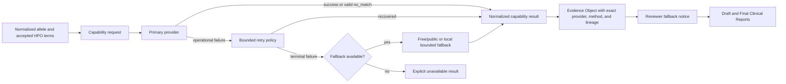

# Provider Resilience Configuration and Operations Runbook

**Scope:** Stages 63-78 provider resilience layer

**Last verified:** 2026-08-09

**Audience:** Developers and demonstration operators

## 1. Operational contract

The application preserves each evidence capability when a free/public primary
provider has an operational outage and a scientifically bounded fallback is
available. A fallback never changes provider identity, method, or upstream lineage.

The following states are operational failures and may activate a fallback:

- connection, DNS, or TLS failure normalized as `unavailable`;
- `timeout`;
- `forbidden` (`HTTP 403`);
- `rate_limited` (`HTTP 429`);
- `server_error` (`HTTP 5xx`); and
- `invalid_response` for a malformed or unusable response.

`no_match` and `not_found` are valid missingness. They are terminal evidence states,
not negative evidence, and do not activate a fallback. `configuration_error` is
reported explicitly and does not cause a fallback to invent data.

## 2. Implemented fallback matrix

| Capability | Primary | Operational fallback | Scientific boundary |
|---|---|---|---|
| Variant annotation | Ensembl VEP | VariantValidator | Preserves validation and HGVS/gene/transcript mapping only; missing VEP consequence/plugin fields stay missing. |
| Aggregated variant context | MyVariant.info | Ensembl Variation | Accepts exact assembly/coordinate/ref/alt overlap only; Ensembl fields are not relabelled as MyVariant output. |
| ClinVar evidence | NCBI ClinVar | MyVariant ClinVar-derived fields | One shared ClinVar lineage, never two independent evidence votes. |
| CSpec context | ClinGen CSpec | Exact local last-known-good cache entry | Metadata and freshness only; CSpec remains context-only and no rules are executed. |
| Phenotype-gene context | Phen2Gene | Local direct HPO-gene overlap | Direct accepted-HPO associations only; no semantic similarity, ancestor propagation, graph database, or ML. |
| Disease/HPO context | MyDisease.info | Local HPO disease annotations | Context-only degraded mode; it does not assert a gene-disease association. |
| Population frequency | gnomAD | Ensembl Variation | Exact rsID/allele-aware population context with separate source labels. |
| Variant literature | LitVar2 | Europe PMC, then PubMed | Bounded search, identifier-priority deduplication, and canonical links. |

GeneBe, ClinGen/GenCC, and successful primary providers remain isolated sources.
Monarch is not required by any active fallback path.

## 3. Architecture



Provider circuits are scoped to one analysis. A persistent failure such as `403`
opens the relevant circuit so later variants skip the known-failing primary or
fallback call. Circuit state is never persisted as a global provider disablement.

## 4. Configuration

Copy `.env.example` to `.env`. Use the configured HTTPS provider URLs and keep secrets
only in `.env`; never commit that file.

The resilience layer uses existing bounded settings rather than a separate flag for
every fallback:

| Setting group | Purpose |
|---|---|
| `REQUEST_TIMEOUT` and provider-specific `*_TIMEOUT` values | Bound provider read time; shared wrappers also use a shorter connect deadline. |
| `ANNOTATION_MAX_RETRIES` | Bounds primary annotation retries. |
| `MYDISEASE_MAX_RETRIES` | Allows only the configured bounded MyDisease retry behavior. |
| `CONDITIONAL_ENRICHMENT_MAX_RETRIES` | Bounds gnomAD and literature retry behavior. |
| `ENABLE_GNOMAD_DEEP_LOOKUP` | Enables optional gnomAD conditional enrichment; Ensembl remains its operational fallback. |
| `ENABLE_LITERATURE_ENRICHMENT` | Enables optional literature enrichment and its fallback chain. |
| `CSPEC_LKG_CACHE_PATH` | Stores the atomic, schema-validated CSpec metadata cache. |
| HPO URL/template settings | Supply coordinated local ontology, gene, and disease datasets used by local degraded modes. |

The implemented fallbacks are safe defaults and are not independently relabelled as
primary data. Do not add unused environment flags: any future fallback toggle must be
validated in `config.py`, consumed by its provider client, and covered by regression
tests.

## 5. Pre-demo runbook

1. Confirm `.env` uses the intended genome assembly, provider endpoints, and both
   task-specific model settings.
2. Run the deterministic resilience acceptance gate:

   ```powershell
   .\.venv\Scripts\python.exe tests\run_stage78_resilience_acceptance.py
   ```

   This includes the mocked multi-variant degraded-mode scenario, the complete
   offline suite, and the Testing V3 coverage gate.

3. Run the manual reachability checker from the current network:

   ```powershell
   .\.venv\Scripts\python.exe tools\provider_reachability.py --json output\provider-reachability.json --csv output\provider-reachability.csv
   ```

4. Recheck a single provider when needed:

   ```powershell
   .\.venv\Scripts\python.exe tools\provider_reachability.py --provider gnomad --timeout 8
   ```

5. When a full production-client contract check is required and quota use is
   acceptable, run:

   ```powershell
   .\.venv\Scripts\python.exe tests\run_live_provider_validation.py --skip-llm
   ```

6. Start Streamlit only after reviewing operational failures. A reachability result
   is point-in-time network evidence, not a scientific provider-schema validation.

The reachability checker is manual and network-dependent. It must not be added to
deterministic CI.

## 6. Reading results

The reachability utility reports:

- `provider`;
- `dns_status`;
- `http_status`;
- `latency_ms`; and
- `failure_category`.

`HTTP 404` or `405` can confirm that a host answered while indicating that the base
path or `HEAD` method is not a production data operation. Use the live production-
client gate when endpoint schema behavior must be validated. A `403`, timeout, DNS,
TLS, connection, rate-limit, or `5xx` result predicts degraded-mode behavior but does
not prove that a fallback has matching evidence for the selected variant.

## 7. Troubleshooting

| Observation | Action |
|---|---|
| DNS failure | Verify system DNS/VPN/mobile-network routing, then rerun only the affected provider. |
| TLS failure | Check system time, certificate interception, proxy/VPN configuration, and trusted roots. |
| Timeout | Retry once from the intended demo network; do not raise application timeouts without measuring the full multi-variant effect. |
| `HTTP 403` | Treat the provider as unusable from the current network; expect the analysis-scoped circuit and labelled fallback. |
| `HTTP 429` | Wait for the provider window or honor a practical `Retry-After`; do not loop. |
| `HTTP 5xx` | Treat as transient provider failure and rely on bounded retry/fallback. |
| Primary and fallback unavailable | Continue with explicit missing capability state; never infer negative evidence. |
| Unexpected fallback source in a report | Inspect the Evidence Object capability result and provenance table before interpreting clinical content. |

## 8. Reviewer verification

For every degraded capability, verify that the Evidence Object and reports show:

- the actual fallback provider;
- `provider_role=fallback` and `fallback_used=true`;
- the primary provider and normalized primary failure;
- the fallback method;
- bounded source lineage and retrieval/cache freshness where applicable; and
- no duplicated or fabricated clinical evidence.

The final report must remain buildable when a capability is unavailable. Human review
and confirmation remain mandatory.
