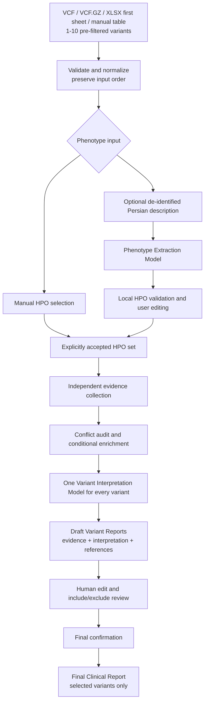

# Stage 45 Architecture Contract

**Status:** Accepted and frozen for implementation

**Decision source:** Professor review on 2026-08-08

**Implemented baseline:** Stage 44

**Implementation progress:** Stages 46-57 complete; Stage 58 is next

**Contract date:** 2026-08-08

## 1. Purpose and status boundary

This document is the authoritative contract for the post-professor-review
redesign. It freezes the target architecture before implementation begins.

The repository implements the redesign through Stage 57. Features assigned to
Stages 58–62 remain targets and are not implemented merely because Stage 45 is
complete.

## 2. Accepted product contract

The completed redesign will:

- accept 1–10 pre-filtered germline Mendelian variants from VCF, VCF.GZ, manual
  table, or Excel `.xlsx` input;
- read only worksheet index 0 from Excel and never inspect, persist, log, export,
  or transmit later worksheets;
- preserve normalized variant identity and original input order without ranking;
- retain manual HPO selection;
- optionally accept a short, de-identified Persian clinical description;
- use a user-selected **Phenotype Extraction Model** to suggest HPO terms;
- validate every model-suggested HPO identifier against the local ontology and
  require explicit user acceptance of the editable HPO set;
- use one user-selected **Variant Interpretation Model** for every variant;
- keep deterministic conflict auditing and conditional enrichment, while using
  conflict state as interpretation context rather than a model-routing decision;
- generate one evidence-and-interpretation **Draft Variant Report** per variant
  before final confirmation;
- preserve an immutable machine original and a bounded append-only edit history;
- let the reviewer set `include_in_final_report` independently for each variant;
- retain excluded variants and their complete audit state in the analysis;
- create one **Final Clinical Report** from only the confirmed, selected,
  reviewer-approved reports in original input order; and
- build clickable references deterministically from validated provider identifiers
  or trusted provider URLs, never from model-generated URLs.

## 3. Authoritative workflow



## 4. Frozen terminology

New analyses use these exact conceptual names:

| Term | Meaning |
|---|---|
| **Phenotype Extraction Model** | Converts de-identified Persian clinical text into structured HPO candidates. |
| **Variant Interpretation Model** | Produces an evidence-grounded interpretation for every variant. |
| **Draft Variant Report** | Machine-created, pre-confirmation report combining evidence and interpretation. |
| **Reviewed Variant Report** | Editable report state plus its immutable original and edit history. |
| `include_in_final_report` | Human reporting choice; never an algorithmic rank or priority. |
| **Final Clinical Report** | Confirmed export containing only selected Reviewed Variant Reports. |

The analysis-level model fields targeted for new schemas are:

```text
phenotype_extraction_model
variant_interpretation_model
```

## 5. Deprecated Stage 44 concepts

The following remain valid descriptions of legacy Stage 44 analyses and code, but
are obsolete for new analyses and must not shape the redesigned schemas or UI:

- `Output A` as an evidence-only user-facing report;
- `Output B` as an interpretation-only user-facing report;
- `LLM-1` as the low-cost/no-conflict interpretation route;
- `LLM-2` as the strong/conflict interpretation route;
- `no_conflict_model` and `conflict_model` selectors;
- conflict-driven interpretation-model selection; and
- confirmation before any variant interpretation.

Removing dual-model routing does not remove conflict auditing. The audit continues
to control conditional enrichment, describe uncertainty, and supply bounded context
to the single selected Variant Interpretation Model.

## 6. Lifecycle and schema direction

The target lifecycle has three phases:

1. **Analysis:** validate input and phenotype state, collect evidence, audit
   conflicts, conditionally enrich, interpret each variant, and persist Draft
   Variant Reports.
2. **Review:** edit reports, compare them with immutable originals, select variants,
   and confirm the complete reviewed set. Any later edit or selection change
   invalidates confirmation.
3. **Finalization:** validate confirmation and compose exports from the persisted
   reviewed state without a new LLM call.

New persistence keeps analysis-level phenotype/model state, complete per-variant
evidence and review state, inclusion decisions, final confirmation, selected variant
IDs, and export metadata in SQLite schema `3` and pipeline schema `2.9`.

## 7. Legacy-analysis compatibility

Stage 44 SQLite schema-2 analyses are legacy records. They may remain readable if a
bounded implementation is practical, but they must never be silently reinterpreted
as the new report lifecycle.

The implemented Stage 57 compatibility boundary is:

- migrate only validated Stage 56 report-lifecycle snapshots through the bounded
  schema-2 to schema-3 path;
- preserve older records unchanged and identify them as legacy Stage 44 analyses; and
- return a clear unsupported-legacy-resume state wherever the new workflow cannot
  represent them faithfully, without silently mapping Output A/B to current reports.

## 8. Safety invariants

The redesign must preserve:

- exact assembly-aware allele validation;
- explicit missingness (`not_found`/`no_match` is not negative evidence);
- provider independence, provenance, lineage, and failure isolation;
- local validation of all HPO terms;
- bounded minimum-data LLM payloads;
- exclusion of raw VCF rows, sample columns, genotypes, and identifiers from LLM
  payloads;
- immutable machine originals and confirmation invalidation after edits;
- retention of excluded variants in the audit trail;
- original variant ordering;
- backend-controlled canonical references; and
- the non-diagnostic, non-treatment, human-review-required boundary.

## 9. Stage ownership

| Stage | Planned responsibility |
|---:|---|
| 46 | Excel first-sheet input and centralized 10-variant cap |
| 47–48 | Phenotype-extraction LLM contract, local validation, and human editing |
| 49 | UI layout and task-specific model controls |
| 50–51 | Single interpretation model and interpretation-before-review pipeline |
| 52–54 | Draft/Reviewed Variant Reports, edit history, and inclusion decisions |
| 55–56 | Canonical references and Final Clinical Report composition |
| 57–58 | Persistence/recovery migration and privacy reverification |
| 59–61 | Testing V3, acceptance gate, and separate live validation |
| 62 | Final documentation, demo, and professor re-review |

No Stage 46–62 behavior is claimed as implemented until its own acceptance criteria
and relevant verification gates pass.

## 10. Stage 51 implementation record

Stage 51 replaced the active Stage 44 two-phase execution path for new analyses:

- analysis now collects and enriches evidence, then calls one selected Variant
  Interpretation Model for every variant before review;
- evidence, interpretation, conflict context, warnings, provenance, and explicit
  per-variant model failures remain available together during final human review;
- a reviewer may edit evidence and confirm every variant without triggering another
  model call;
- finalization validates the persisted reviewed state and completes without legacy
  `LLM-1`/`LLM-2` routing or `Output B` generation;
- interrupted-analysis recovery retains the selected model and reruns the complete
  analysis phase, including draft interpretations; and
- persisted pipeline payloads now use schema `2.4`; older schema-2 payloads receive
  an explicit unsupported-legacy-resume error instead of silent reinterpretation.

Stage 52 combines those ordered records into a coherent Draft Variant Report V2.
Stage 53 preserves its immutable machine original while allowing bounded edits to a
separate reviewed copy with append-only history.

## 11. Stage 52 implementation record

- Draft Variant Report schema `2.0` combines normalized identity, phenotype context,
  source-aware evidence, deterministic conflict state, interpretation, references,
  provenance, and limitations.
- One report is built for every variant in original order, including an explicit
  interpretation-unavailable section when a model task fails.
- Pipeline schema `2.5` persists and validates each report against its originating
  Evidence Object and Variant Interpretation Result.
- The Streamlit review renders a professional report structure before exposing the
  existing evidence-editor and audit controls.
- Stage 52 does not implement report editing, include/exclude state, canonical link
  expansion, or Final Clinical Report composition; those remain Stages 53–56.

## 12. Stage 53 implementation record

- Only reviewer summary, interpretation narrative, conflict-assessment wording, and
  reviewer notes are editable.
- Identity, provider evidence, conflict facts, references, provenance, model metadata,
  and machine originals remain immutable.
- Every changed field records sequence, path, old/new values, UTC timestamp, and
  available bounded reviewer context.
- Validation deterministically replays append-only history; resets add reverse changes
  instead of deleting audit records.
- PHI defenses run before report state is persisted, and any edit invalidates prior
  confirmation for that variant.
- Stages 55–56 own canonical references and Final Clinical Report composition.

## 13. Stage 54 implementation record

- Every Draft Variant Report carries `include_in_final_report`, defaulting to true,
  as a reviewer reporting choice rather than an algorithmic rank or priority.
- Each inclusion change appends a bounded record containing sequence, old/new boolean
  values, UTC timestamp, and optional reviewer/session context.
- Validation replays selection history from the default state and rejects untracked,
  reordered, malformed, or contradictory decisions.
- Excluded reports remain fully recoverable with evidence, interpretation, edits,
  provenance, conflict state, and exclusion history.
- The selected-report projection preserves original variant order; the ten-variant
  acceptance case selects exactly three reports without deleting the other seven.
- Any selection change invalidates final confirmation. An included-report edit also
  invalidates it; an edit to an already excluded report retains confirmation because
  selected report content is unchanged.
- Pipeline schema `2.6` persisted the Stage 54 state. Stage 56 now composes the
  Final Clinical Report after complete confirmation.

## 14. Stage 55 implementation record

- A normalized canonical-reference contract assigns stable `R1`, `R2`, and later
  IDs while retaining source, identifier type/value, optional title, canonical URL,
  and explicit validated/unavailable link status.
- Deterministic builders cover PMID, PMCID, DOI, ClinVar accession, Europe PMC,
  ClinGen, and CSpec records. Known-provider links require HTTPS, no credentials or
  fragments, allowlisted domains, and CSpec identifier/path agreement.
- Untrusted, malformed, mismatched, or unavailable URLs cannot become clickable;
  the report retains an explicit no-validated-link fallback instead.
- The Variant Interpretation Model receives a bounded catalog without URLs and may
  cite only supplied bracket IDs. Fabricated, malformed, or evidence-absent IDs fail
  validation, including citations added during human report editing.
- Draft Variant Report schema `2.1` maps citation IDs to canonical objects. Pipeline
  schema `2.7` and Variant Interpretation Result schema `1.1` persist the hardened
  state.
- Streamlit, legacy Markdown, and generic Word/PDF rendering expose allowlisted
  canonical links. Text fallback retains the canonical URL as readable text.
- Stage 56 composes one Final Clinical Report from the confirmed selected subset.

## 15. Stage 56 implementation record

- Final Clinical Report schema `2.0` is composed deterministically from Draft Variant
  Reports whose audited `include_in_final_report` state is true after confirmation
  coverage is valid for every variant.
- Selected reports retain original input order and the exact reviewer-edited content.
  Excluded reports remain in pipeline state but are absent from final findings,
  detailed sections, and references.
- The artifact includes report metadata, de-identified phenotype context, main and
  detailed findings, grouped canonical references, method/source notes, limitations,
  a fixed non-diagnostic disclaimer, and bounded audit/provenance metadata.
- Finalization makes no new LLM request. Pipeline schema `2.8` recomposes the artifact
  during validation so stale, tampered, reordered, or unconfirmed content fails closed.
- Streamlit displays the completed report and provides in-memory text, PDF, and Word
  exports with numbered clickable allowlisted references.
- Stage 57 implements SQLite schema V3, artifact metadata persistence, bounded
  migration behavior, and restart recovery of the redesigned lifecycle.

## 16. Stage 57 implementation record

- SQLite schema `3` adds normalized analysis-context, variant-review, and
  finalization projections beside the canonical validated pipeline snapshot.
- Pipeline schema `2.9` persists input type, accepted HPO terms, phenotype and
  interpretation model selections, and bounded phenotype-extraction provenance.
- Each variant projection retains Evidence Object, conflict and interpretation
  results, immutable machine original, editable reviewed report, append-only edit
  history, inclusion/selection history, interpretation failure, and canonical
  references. Finalization retains confirmation state/time, selected canonical
  variant IDs, the Final Clinical Report, and bounded in-memory artifact metadata.
- Valid Stage 56 schema-2 lifecycle snapshots receive a bounded migration. Older
  Stage 44 Output A/B records remain explicitly unsupported and are never silently
  reinterpreted.
- A recovery checkpoint linked to a persisted draft reloads SQLite state after
  refresh or restart without rerunning successful interpretation. Editing,
  selection, confirmation, and export state remain recoverable.
- Stage 58 is the next bounded increment and will reverify privacy and safety.

## 17. Stage 45 acceptance record

- The new workflow is recorded as one authoritative contract.
- Obsolete Stage 44 concepts are explicitly deprecated for new analyses.
- New model, report, selection, and final-report terminology is fixed.
- Legacy persisted analyses have an explicit compatibility boundary.
- At the Stage 45 checkpoint, implementation remained unchanged and Stage 46 was
  the next bounded increment. Current progress is maintained in the project
  declaration.
