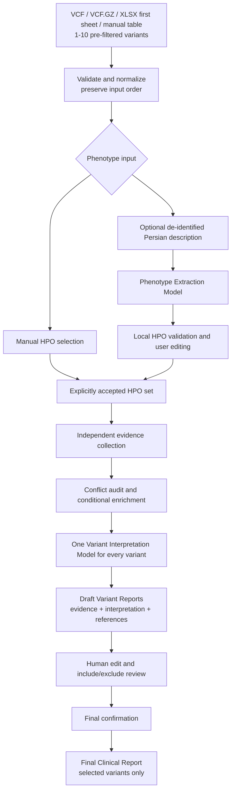

# Stage 45 Architecture Contract

**Status:** Accepted and frozen for implementation

**Decision source:** Professor review on 2026-08-08

**Implemented baseline:** Stage 44

**Implementation progress:** Stages 46-49 complete; Stage 50 is next

**Contract date:** 2026-08-08

## 1. Purpose and status boundary

This document is the authoritative contract for the post-professor-review
redesign. It freezes the target architecture before implementation begins.

The repository still implements the Stage 44 workflow today. Features described
as targets below are not implemented merely because Stage 45 is complete. Each
must be delivered and verified in its assigned Stage 46–62 increment.

## 2. Accepted product contract

The completed redesign will:

- accept 1–10 pre-filtered germline Mendelian variants from VCF, VCF.GZ, manual
  table, or Excel `.xlsx` input;
- read only worksheet index 0 from Excel and never inspect, persist, log, export,
  or transmit later worksheets;
- preserve normalized variant identity and original input order without ranking;
- retain manual HPO selection;
- optionally accept a short, de-identified Persian clinical description;
- use a user-selected **Phenotype Extraction Model** to suggest HPO terms;
- validate every model-suggested HPO identifier against the local ontology and
  require explicit user acceptance of the editable HPO set;
- use one user-selected **Variant Interpretation Model** for every variant;
- keep deterministic conflict auditing and conditional enrichment, while using
  conflict state as interpretation context rather than a model-routing decision;
- generate one evidence-and-interpretation **Draft Variant Report** per variant
  before final confirmation;
- preserve an immutable machine original and a bounded append-only edit history;
- let the reviewer set `include_in_final_report` independently for each variant;
- retain excluded variants and their complete audit state in the analysis;
- create one **Final Clinical Report** from only the confirmed, selected,
  reviewer-approved reports in original input order; and
- build clickable references deterministically from validated provider identifiers
  or trusted provider URLs, never from model-generated URLs.

## 3. Authoritative workflow



## 4. Frozen terminology

New analyses use these exact conceptual names:

| Term | Meaning |
|---|---|
| **Phenotype Extraction Model** | Converts de-identified Persian clinical text into structured HPO candidates. |
| **Variant Interpretation Model** | Produces an evidence-grounded interpretation for every variant. |
| **Draft Variant Report** | Machine-created, pre-confirmation report combining evidence and interpretation. |
| **Reviewed Variant Report** | Editable report state plus its immutable original and edit history. |
| `include_in_final_report` | Human reporting choice; never an algorithmic rank or priority. |
| **Final Clinical Report** | Confirmed export containing only selected Reviewed Variant Reports. |

The analysis-level model fields targeted for new schemas are:

```text
phenotype_extraction_model
variant_interpretation_model
```

## 5. Deprecated Stage 44 concepts

The following remain valid descriptions of legacy Stage 44 analyses and code, but
are obsolete for new analyses and must not shape the redesigned schemas or UI:

- `Output A` as an evidence-only user-facing report;
- `Output B` as an interpretation-only user-facing report;
- `LLM-1` as the low-cost/no-conflict interpretation route;
- `LLM-2` as the strong/conflict interpretation route;
- `no_conflict_model` and `conflict_model` selectors;
- conflict-driven interpretation-model selection; and
- confirmation before any variant interpretation.

Removing dual-model routing does not remove conflict auditing. The audit continues
to control conditional enrichment, describe uncertainty, and supply bounded context
to the single selected Variant Interpretation Model.

## 6. Lifecycle and schema direction

The target lifecycle has three phases:

1. **Analysis:** validate input and phenotype state, collect evidence, audit
   conflicts, conditionally enrich, interpret each variant, and persist Draft
   Variant Reports.
2. **Review:** edit reports, compare them with immutable originals, select variants,
   and confirm the complete reviewed set. Any later edit or selection change
   invalidates confirmation.
3. **Finalization:** validate confirmation and compose exports from the persisted
   reviewed state without a new LLM call.

New persistence must keep analysis-level phenotype/model state, complete per-variant
evidence and review state, inclusion decisions, final confirmation, selected variant
IDs, and export metadata. Stage 57 will choose and implement the exact schema version.

## 7. Legacy-analysis compatibility

Stage 44 SQLite schema-2 analyses are legacy records. They may remain readable if a
bounded implementation is practical, but they must never be silently reinterpreted
as the new report lifecycle.

Before Stage 57 migration code is implemented, the safe default is:

- preserve existing records unchanged;
- identify them explicitly as legacy Stage 44 analyses; and
- return a clear unsupported-legacy-resume state wherever the new workflow cannot
  represent them faithfully.

## 8. Safety invariants

The redesign must preserve:

- exact assembly-aware allele validation;
- explicit missingness (`not_found`/`no_match` is not negative evidence);
- provider independence, provenance, lineage, and failure isolation;
- local validation of all HPO terms;
- bounded minimum-data LLM payloads;
- exclusion of raw VCF rows, sample columns, genotypes, and identifiers from LLM
  payloads;
- immutable machine originals and confirmation invalidation after edits;
- retention of excluded variants in the audit trail;
- original variant ordering;
- backend-controlled canonical references; and
- the non-diagnostic, non-treatment, human-review-required boundary.

## 9. Stage ownership

| Stage | Planned responsibility |
|---:|---|
| 46 | Excel first-sheet input and centralized 10-variant cap |
| 47–48 | Phenotype-extraction LLM contract, local validation, and human editing |
| 49 | UI layout and task-specific model controls |
| 50–51 | Single interpretation model and interpretation-before-review pipeline |
| 52–54 | Draft/Reviewed Variant Reports, edit history, and inclusion decisions |
| 55–56 | Canonical references and Final Clinical Report composition |
| 57–58 | Persistence/recovery migration and privacy reverification |
| 59–61 | Testing V3, acceptance gate, and separate live validation |
| 62 | Final documentation, demo, and professor re-review |

No Stage 46–62 behavior is claimed as implemented until its own acceptance criteria
and relevant verification gates pass.

## 10. Stage 45 acceptance record

- The new workflow is recorded as one authoritative contract.
- Obsolete Stage 44 concepts are explicitly deprecated for new analyses.
- New model, report, selection, and final-report terminology is fixed.
- Legacy persisted analyses have an explicit compatibility boundary.
- At the Stage 45 checkpoint, implementation remained unchanged and Stage 46 was
  the next bounded increment. Current progress is maintained in the project
  declaration.
